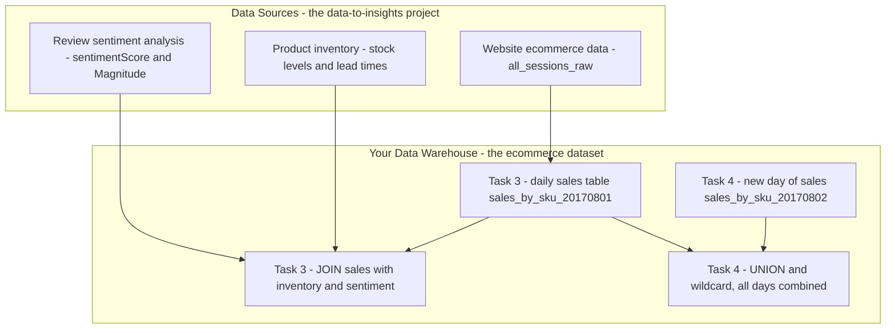
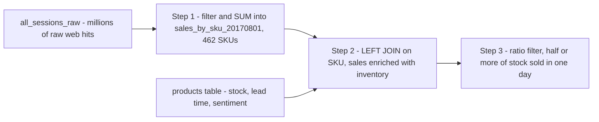
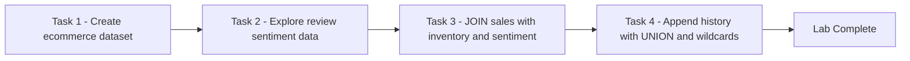

# Creating a Data Warehouse Through Joins and Unions (GSP413)

> **A beginner-friendly, step-by-step guide** — written so that even someone with a non-technical background can understand *what* we are doing, *why* we are doing it, and *how* each SQL query works.

> 🧭 **Learning path** (Build a Data Warehouse with BigQuery skill badge):
> **01 · GSP413 — this lab** → [02 · GSP414 — Creating Date-Partitioned Tables](../02-GSP414%20-%20Creating%20Date-Partitioned%20Tables%20in%20BigQuery/README.md) → [03 · GSP412 — Data Join Pitfalls](../03-GSP412%20-%20Troubleshooting%20and%20Solving%20Data%20Join%20Pitfalls/README.md) → [04 · GSP416 — JSON, Arrays & Structs](../04-GSP416%20-%20Working%20with%20JSON,%20Arrays,%20and%20Structs%20in%20BigQuery/README.md) → [05 · GSP340 — Challenge Lab](../05-GSP340%20-%20Challenge%20Lab/README.md)
>
> **Prerequisites:** just basic SQL (`SELECT`, `WHERE`, `GROUP BY`, `ORDER BY`) and comfort navigating the Google Cloud console — this is the first lab of the badge. Skills you learn here that later labs build on: **JOINs, UNIONs, and table wildcards with `_TABLE_SUFFIX`** (reused on the NOAA weather tables in GSP414, and everywhere in the Challenge Lab).

---

## 📋 Table of Contents

1. [The Big Picture — What Is This Lab About?](#1-the-big-picture--what-is-this-lab-about)
2. [Key Concepts Explained Simply](#2-key-concepts-explained-simply)
3. [Task 1 — Create a New Dataset](#3-task-1--create-a-new-dataset)
4. [Task 2 — Explore the Product Sentiment Dataset](#4-task-2--explore-the-product-sentiment-dataset)
5. [Task 3 — Join Datasets to Find Insights](#5-task-3--join-datasets-to-find-insights)
6. [Task 4 — Append Additional Records](#6-task-4--append-additional-records)
7. [Quiz Answers — All in One Place](#7-quiz-answers--all-in-one-place)
8. [Quick Reference — All Queries in One Place](#8-quick-reference--all-queries-in-one-place)
9. [Command-Line Alternatives (Cloud Shell)](#9-command-line-alternatives-cloud-shell)

---

## 1. The Big Picture — What Is This Lab About?

### The Scenario (in plain English)

You work for an **ecommerce company** (the Google Merchandise Store). Three different teams each hold a piece of the puzzle:

- The **website team** knows *what customers bought* (millions of Google Analytics records).
- The **inventory team** knows *how much stock is left* and *how long restocking takes*.
- The **data science team** analysed all product reviews and knows *how customers feel* about each product (sentiment scores).

Your job is to **combine all three sources into one data warehouse in BigQuery**, so questions like *"which fast-selling, well-loved products are about to run out of stock?"* can be answered with a single query.

### The Overall Data Flow



**Think of it like running a shop:**
- Task 1 = setting up an empty filing cabinet (the dataset)
- Task 2 = reading the customer-feedback report the analysts handed you
- Task 3 = matching yesterday's sales receipts against the stockroom list to see what to reorder
- Task 4 = stapling today's receipts onto the pile so history stays complete

---

## 2. Key Concepts Explained Simply

| Term | Simple Explanation |
|---|---|
| **BigQuery** | Google's giant online spreadsheet system. It stores billions of rows and answers SQL questions in seconds — no servers to manage, pay only for what you query. |
| **Dataset** | A **folder** inside BigQuery that holds related tables (here: `ecommerce`). |
| **Public Dataset** | Free, ready-made data hosted by Google (here: the `data-to-insights` project). It doesn't appear in your left-hand panel, but you can still query it by its full name. |
| **Sentiment Score** | A number from the Natural Language API saying *how positive or negative* customer reviews are. High = loved, low = disliked. |
| **Sentiment Magnitude** | *How strongly* people felt — a product can have mild praise (low magnitude) or passionate praise (high magnitude). |
| **JOIN** | **Matching rows between two tables** using a shared value — like matching two guest lists by name. Here we match on `productSKU`. |
| **LEFT JOIN** | Keep **every** row from the left table, even if the right table has no match (missing values become NULL). |
| **UNION ALL** | **Stacking** two tables with the same columns on top of each other — like stapling two pages of the same form together. Keeps duplicates. |
| **UNION (DISTINCT)** | Same stacking, but duplicate rows are removed. |
| **Table Wildcard (`*`)** | Query many similarly-named tables at once: `sales_by_sku_2017*` reads *all* tables whose names start with that prefix. |
| **`_TABLE_SUFFIX`** | A special hidden column that tells you *which* wildcard table each row came from — usable as a filter. |
| **`IFNULL(x, 0)`** | "If the value is missing, treat it as 0." Prevents missing quantities from breaking a SUM. |
| **`SAFE_DIVIDE(a, b)`** | Division that returns NULL instead of crashing when `b` is 0. |

### JOIN vs UNION — the one-picture summary

```
JOIN  = combine SIDEWAYS (add more columns)     UNION = combine DOWNWARDS (add more rows)

sales table   products table                    Aug 01 sales
┌────┬─────┐  ┌────┬───────┬───────┐            ┌────────────┐
│SKU │ qty │+ │SKU │ stock │ score │            │ 462 rows   │
└────┴─────┘  └────┴───────┴───────┘            ├────────────┤   ← stacked
      └── match on SKU ──┘                      │ Aug 02     │
┌────┬─────┬───────┬───────┐                    │ 1 row      │
│SKU │ qty │ stock │ score │                    └────────────┘
└────┴─────┴───────┴───────┘                    same columns, more rows
wider table, same rows
```

---

## 3. Task 1 — Create a New Dataset

### 🎯 What we must achieve

Create a dataset named `ecommerce` to store all the tables we'll build.

### Steps (point-and-click)

1. In the left pane, click the **⋮ (three dots)** next to your project name (`qwiklabs-gcp-xxxx`).
2. Select **Create dataset**.
3. Set **Dataset ID** = `ecommerce`.
4. Set **Data Location** = `us (multiple regions in United States)`.
5. Leave everything else at defaults and click **Create dataset**.

> ⚠️ The location matters — the public `data-to-insights` data lives in **US**, and BigQuery cannot join tables across regions.

✅ Click **Check my progress**.

---

## 4. Task 2 — Explore the Product Sentiment Dataset

### 🎯 What we must achieve

The data science team ran every product review through the Natural Language API and produced an **average sentiment score and magnitude per product**. We copy their table so we can browse it, then query it for the most-loved and least-loved products.

> 📌 The marketing team's data lives in the **`data-to-insights`** project. Public datasets are **not displayed by default** in the explorer panel — but queries can still reference them directly.

### Step 1 — Copy the table so you can browse it

```sql
CREATE OR REPLACE TABLE ecommerce.products AS
SELECT
  *
FROM
  `data-to-insights.ecommerce.products`
```

| Piece | Meaning |
|---|---|
| `CREATE OR REPLACE TABLE ecommerce.products` | "Make a table called `products` in **my** `ecommerce` dataset; overwrite it if it already exists." |
| `AS SELECT * FROM ...` | "Fill it with a full copy of the public table." |

> Note: this copy is only for browsing. The remaining lab queries read from `data-to-insights` directly.

### Step 2 — Examine with Preview and Schema tabs

Open **ecommerce → products**, then:

- **Preview tab** → look at actual rows.
  **Q: How many Aluminum Handy Emergency Flashlights have been ordered?** → **85**
- **Schema tab** → look at the column blueprint.
  **Q: What data type are `sentimentScore` and `sentimentMagnitude`?** → **FLOAT** (decimal numbers)

### Step 3 — Top 5 products with the most POSITIVE sentiment

```sql
SELECT
  SKU,
  name,
  sentimentScore,
  sentimentMagnitude
FROM
  `data-to-insights.ecommerce.products`
ORDER BY
  sentimentScore DESC
LIMIT 5
```

| Piece | Meaning |
|---|---|
| `ORDER BY sentimentScore DESC` | "Sort with the **highest** (most positive) score first." |
| `LIMIT 5` | "Only show the top 5 rows." |

**Q: What product has the highest sentiment?** → **G Noise-reducing Bluetooth Headphones** 🎧

### Step 4 — Top 5 products with the most NEGATIVE sentiment (NULLs removed)

```sql
SELECT
  SKU,
  name,
  sentimentScore,
  sentimentMagnitude
FROM
  `data-to-insights.ecommerce.products`
WHERE sentimentScore IS NOT NULL
ORDER BY
  sentimentScore
LIMIT 5
```

| Piece | Meaning |
|---|---|
| `WHERE sentimentScore IS NOT NULL` | **Crucial!** Products with *no reviews* have a NULL score. Without this filter, NULLs would clutter the results and hide the genuinely disliked products. |
| `ORDER BY sentimentScore` (no `DESC`) | Ascending order — **lowest** (most negative) score first. |

**Q: What is the product with the lowest sentiment?** → **Mens Vintage Henley** 👕

✅ Click **Check my progress**.

---

## 5. Task 3 — Join Datasets to Find Insights

### 🎯 What we must achieve

**Scenario:** It's the first of the month. The inventory team says the `orderedQuantity` field in their dataset is **out of date**. They need you to compute the *real* total sales per product for **08/01/2017** and compare that against current stock levels — to see **which products need resupplying first**.

### 🖼️ What's happening visually



### Step 1 — Calculate daily sales volume by productSKU

Requirements: new table `sales_by_sku_20170801`, sourced from `all_sessions_raw`, distinct results, `productSKU` + total quantity (`SUM` with `IFNULL`), only sales on `20170801`, biggest sellers first.

```sql
-- pull what sold on 08/01/2017
CREATE OR REPLACE TABLE ecommerce.sales_by_sku_20170801 AS
SELECT
  productSKU,
  SUM(IFNULL(productQuantity, 0)) AS total_ordered
FROM
  `data-to-insights.ecommerce.all_sessions_raw`
WHERE date = '20170801'
GROUP BY productSKU
ORDER BY total_ordered DESC  -- 462 SKUs sold
```

| Piece | Meaning |
|---|---|
| `SUM(IFNULL(productQuantity, 0))` | "Add up all quantities; if a row has no quantity recorded, count it as 0 instead of breaking the sum." |
| `WHERE date = '20170801'` | "Only look at August 1st, 2017." (The date is stored as a string `YYYYMMDD`.) |
| `GROUP BY productSKU` | "Collapse the millions of individual web hits into **one row per product**." |

**Q: How many distinct product SKUs were sold?** → **462**
**Q: True or false — `GGOEGOAQ012899` is the top selling product SKU?** → **True**

### Step 2 — Join sales data with inventory data

Enrich the sales table with `name`, `stockLevel`, `restockingLeadTime`, `sentimentScore`, and `sentimentMagnitude` from the products table. The lab gives a partial query — the missing piece is the **ON condition** (what the two tables have in common: the SKU).

```sql
-- join against product inventory to get name
SELECT DISTINCT
  website.productSKU,
  website.total_ordered,
  inventory.name,
  inventory.stockLevel,
  inventory.restockingLeadTime,
  inventory.sentimentScore,
  inventory.sentimentMagnitude
FROM
  ecommerce.sales_by_sku_20170801 AS website
  LEFT JOIN `data-to-insights.ecommerce.products` AS inventory
  ON website.productSKU = inventory.SKU
ORDER BY total_ordered DESC
```

| Piece | Meaning |
|---|---|
| `AS website` / `AS inventory` | Friendly nicknames for the two tables so columns are unambiguous. |
| `LEFT JOIN` | "Keep **every** sold product, even if inventory has no record of it (those get NULLs)." An INNER JOIN would silently drop unmatched sales. |
| `ON website.productSKU = inventory.SKU` | **The line we had to add** — match rows where the SKUs are identical. |

### Step 3 — Add the sell-through ratio and filter

Add `(total_ordered / stockLevel)` aliased as `ratio`, using `SAFE_DIVIDE` so a stock level of 0 doesn't crash the query, and keep only products that already burned through **50% or more** of their inventory.

```sql
-- calculate ratio and filter
SELECT DISTINCT
  website.productSKU,
  website.total_ordered,
  inventory.name,
  inventory.stockLevel,
  inventory.restockingLeadTime,
  inventory.sentimentScore,
  inventory.sentimentMagnitude,
  SAFE_DIVIDE(website.total_ordered, inventory.stockLevel) AS ratio
FROM
  ecommerce.sales_by_sku_20170801 AS website
  LEFT JOIN `data-to-insights.ecommerce.products` AS inventory
  ON website.productSKU = inventory.SKU
-- gone through more than 50% of inventory for the month
WHERE SAFE_DIVIDE(website.total_ordered, inventory.stockLevel) >= .50
ORDER BY total_ordered DESC
```

| Piece | Meaning |
|---|---|
| `SAFE_DIVIDE(a, b)` | Normal division, but returns NULL instead of an error when `b` is 0 — some products have `stockLevel = 0`. |
| `WHERE ... >= .50` | "Only show products where a single day's sales already ate **half or more** of the remaining stock" → these need reordering *now*. |

**Q: What is the name of the top selling product and what percent of its inventory has been sold already?**
→ **Leather Journal-Black with 250 product orders out of 354 in stock** (≈ 71% sold in one day! 📈)

✅ Click **Check my progress**.

---

## 6. Task 4 — Append Additional Records

### 🎯 What we must achieve

The international team made **in-store** sales on **08/02/2017**. We must record them in a *new* daily table, then learn how to read *all* daily tables together as one.

### Step 1 — Create a new empty table for 08/02/2017

Schema: `productSKU` as `STRING`, `total_ordered` as `INT64`.

```sql
CREATE OR REPLACE TABLE ecommerce.sales_by_sku_20170802
(
  productSKU STRING,
  total_ordered INT64
);
```

> Unlike Task 3's table, this one is created **empty** — we define only the blueprint (schema), then insert rows manually.

Confirm you now have **two date-sharded sales tables** — use the dropdown next to the `sales_by_sku` table name, or refresh the browser.

### Step 2 — Insert the sales record from the sales team

```sql
INSERT INTO ecommerce.sales_by_sku_20170802
(productSKU, total_ordered)
VALUES('GGOEGHPA002910', 101)
```

Preview the table to confirm the record appears.

### Step 3 — Append the history together

Two common ways to combine same-schema tables:

- **UNION** — an SQL operator that appends rows from different result sets.
- **Table wildcards** — query many tables with one concise statement (standard SQL only).

**Option A — UNION ALL:**

```sql
SELECT * FROM ecommerce.sales_by_sku_20170801
UNION ALL
SELECT * FROM ecommerce.sales_by_sku_20170802
```

> 📝 `UNION` (distinct) removes duplicate rows; **`UNION ALL` keeps everything**.
>
> ⚠️ **Pitfall:** with 365 daily tables you'd be chaining 365 `UNION` statements. There's a better way ↓

**Option B — Table wildcard (all of 2017 in one line):**

```sql
SELECT * FROM `ecommerce.sales_by_sku_2017*`
```

**Option B + filter — just one day via `_TABLE_SUFFIX`:**

```sql
SELECT * FROM `ecommerce.sales_by_sku_2017*`
WHERE _TABLE_SUFFIX = '0802'
```

| Piece | Meaning |
|---|---|
| `sales_by_sku_2017*` | "Read **every** table whose name starts with `sales_by_sku_2017` — all 2017 daily tables at once." (Note the backticks are required.) |
| `_TABLE_SUFFIX = '0802'` | "Of those, only the table whose name ends in `0802`" → just August 2nd. The suffix is whatever the `*` matched. |

> 💡 An even better long-term design is a **date-partitioned table** (see the [GSP340 Challenge Lab](../05-GSP340%20-%20Challenge%20Lab/README.md)) that automatically files daily data into the correct partition — one table, no wildcards needed.

**Q: A UNION ALL join does not include duplicate records — True or False?** → **False** (`UNION ALL` keeps duplicates; plain `UNION` removes them.)

✅ Click **Check my progress**. 🏁 **Lab complete!**

---

## 7. Quiz Answers — All in One Place

| # | Question | Answer |
|---|---|---|
| 1 | How many Aluminum Handy Emergency Flashlights have been ordered? | **85** |
| 2 | What data type are `sentimentScore` and `sentimentMagnitude`? | **FLOAT** |
| 3 | What product has the highest sentiment? | **G Noise-reducing Bluetooth Headphones** |
| 4 | What is the product with the lowest sentiment? | **Mens Vintage Henley** |
| 5 | How many distinct product SKUs were sold on 08/01/2017? | **462** |
| 6 | True/False: `GGOEGOAQ012899` is the top selling product SKU. | **True** |
| 7 | Top selling product and % of inventory sold? | **Leather Journal-Black — 250 orders out of 354 in stock** |
| 8 | True/False: A `UNION ALL` join does not include duplicate records. | **False** |

---

## 8. Quick Reference — All Queries in One Place

**Task 1** — Create dataset `ecommerce` via the console (Data Location = `us`).

**Task 2** — Copy and explore the sentiment table:
```sql
CREATE OR REPLACE TABLE ecommerce.products AS
SELECT * FROM `data-to-insights.ecommerce.products`;

-- top 5 most positive
SELECT SKU, name, sentimentScore, sentimentMagnitude
FROM `data-to-insights.ecommerce.products`
ORDER BY sentimentScore DESC LIMIT 5;

-- top 5 most negative (NULLs removed)
SELECT SKU, name, sentimentScore, sentimentMagnitude
FROM `data-to-insights.ecommerce.products`
WHERE sentimentScore IS NOT NULL
ORDER BY sentimentScore LIMIT 5;
```

**Task 3** — Daily sales table, then join + ratio:
```sql
CREATE OR REPLACE TABLE ecommerce.sales_by_sku_20170801 AS
SELECT productSKU, SUM(IFNULL(productQuantity, 0)) AS total_ordered
FROM `data-to-insights.ecommerce.all_sessions_raw`
WHERE date = '20170801'
GROUP BY productSKU
ORDER BY total_ordered DESC;

SELECT DISTINCT
  website.productSKU, website.total_ordered,
  inventory.name, inventory.stockLevel, inventory.restockingLeadTime,
  inventory.sentimentScore, inventory.sentimentMagnitude,
  SAFE_DIVIDE(website.total_ordered, inventory.stockLevel) AS ratio
FROM ecommerce.sales_by_sku_20170801 AS website
LEFT JOIN `data-to-insights.ecommerce.products` AS inventory
  ON website.productSKU = inventory.SKU
WHERE SAFE_DIVIDE(website.total_ordered, inventory.stockLevel) >= .50
ORDER BY total_ordered DESC;
```

**Task 4** — New table, insert, then append:
```sql
CREATE OR REPLACE TABLE ecommerce.sales_by_sku_20170802
(
  productSKU STRING,
  total_ordered INT64
);

INSERT INTO ecommerce.sales_by_sku_20170802
(productSKU, total_ordered)
VALUES('GGOEGHPA002910', 101);

-- append with UNION ALL
SELECT * FROM ecommerce.sales_by_sku_20170801
UNION ALL
SELECT * FROM ecommerce.sales_by_sku_20170802;

-- append with table wildcard
SELECT * FROM `ecommerce.sales_by_sku_2017*`;

-- wildcard filtered to one day
SELECT * FROM `ecommerce.sales_by_sku_2017*`
WHERE _TABLE_SUFFIX = '0802';
```

---

## 9. Command-Line Alternatives (Cloud Shell)

Everything this lab does with console clicks can also be done from **Cloud Shell** (the >_ icon in the console's top bar) — the `gcloud` and `bq` tools come pre-installed. Knowing both ways matters: the UI is great for learning, but the CLI is what you script, automate, and get tested on.

### Universal setup commands (work in any lab)

```bash
# who am I / which project am I in?
gcloud auth list
gcloud config list project

# select (switch to) a project
gcloud config set project PROJECT_ID

# see which service APIs are enabled, and enable one
gcloud services list --enabled
gcloud services enable bigquery.googleapis.com

# grant a role to a user on the project (IAM "approval")
gcloud projects add-iam-policy-binding PROJECT_ID \
  --member="user:someone@example.com" --role="roles/bigquery.dataViewer"
```

### UI step → CLI equivalent for this lab

| Console (UI) step | Cloud Shell command |
|---|---|
| Task 1: Create dataset `ecommerce` (⋮ → Create dataset, Location `us`) | `bq mk --dataset --location=US $GOOGLE_CLOUD_PROJECT:ecommerce` |
| Run any query in the editor | `bq query --use_legacy_sql=false 'SELECT ... FROM ...'` |
| Task 2: Copy the products table | `bq query --use_legacy_sql=false 'CREATE OR REPLACE TABLE ecommerce.products AS SELECT * FROM \`data-to-insights.ecommerce.products\`'` |
| Preview tab (see sample rows) | `bq head -n 10 ecommerce.products` |
| Schema tab (see field types) | `bq show --schema --format=prettyjson ecommerce.products` |
| List tables in the dataset | `bq ls ecommerce` |
| Task 4: Preview the inserted record | `bq query --use_legacy_sql=false 'SELECT * FROM ecommerce.sales_by_sku_20170802'` |

> 💡 All the CREATE TABLE / INSERT / UNION / wildcard queries in [solutions.sql](solutions.sql) run unchanged inside `bq query --use_legacy_sql=false '...'` — the SQL is identical; only the "Run button" changes.

---

### 🏁 Summary of the Journey



**Key lessons learned:**
1. **JOIN combines sideways** (more columns from another table); **UNION combines downwards** (more rows of the same shape).
2. `LEFT JOIN` keeps every row from the primary table — use it when losing unmatched rows would hide real sales.
3. `IFNULL` and `SAFE_DIVIDE` are your seatbelts against messy real-world data (missing quantities, zero stock).
4. Table wildcards + `_TABLE_SUFFIX` beat chaining hundreds of `UNION` statements across date-sharded tables.
5. The *best* long-term design for daily data is a **date-partitioned table** — the exact technique practised in the [GSP340 Challenge Lab](../05-GSP340%20-%20Challenge%20Lab/README.md).
