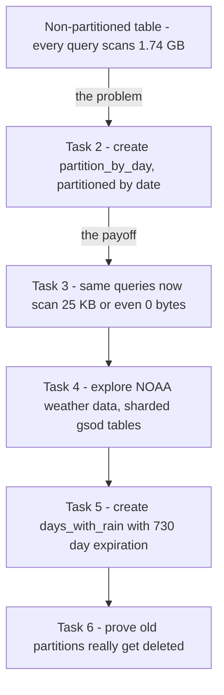

# Creating Date-Partitioned Tables in BigQuery (GSP414)

> **A beginner-friendly, step-by-step guide** — written so that even someone with a non-technical background can understand *what* we are doing, *why* we are doing it, and *how* each SQL query works.

---

## 📋 Table of Contents

1. [Where This Lab Fits — Prerequisites & Learning Path](#1-where-this-lab-fits--prerequisites--learning-path)
2. [The Big Picture — What Is This Lab About?](#2-the-big-picture--what-is-this-lab-about)
3. [Key Concepts Explained Simply](#3-key-concepts-explained-simply)
4. [Task 1 — Create a New Dataset](#4-task-1--create-a-new-dataset)
5. [Task 2 — Create Tables with Date Partitions](#5-task-2--create-tables-with-date-partitions)
6. [Task 3 — Review Results from Queries on a Partitioned Table](#6-task-3--review-results-from-queries-on-a-partitioned-table)
7. [Task 4 — Explore the NOAA Weather Data](#7-task-4--explore-the-noaa-weather-data)
8. [Task 5 — Your Turn: Create an Auto-Expiring Partitioned Table](#8-task-5--your-turn-create-an-auto-expiring-partitioned-table)
9. [Task 6 — Confirm Partition Expiration Is Working](#9-task-6--confirm-partition-expiration-is-working)
10. [Quiz Answers — All in One Place](#10-quiz-answers--all-in-one-place)
11. [Quick Reference — All Queries in One Place](#11-quick-reference--all-queries-in-one-place)
12. [Command-Line Alternatives (Cloud Shell)](#12-command-line-alternatives-cloud-shell)

---

## 1. Where This Lab Fits — Prerequisites & Learning Path

This is **lab 2 of the "Build a Data Warehouse with BigQuery" skill badge** ([course 624](https://www.cloudskillsboost.google/course_templates/624)).

| # | Lab | What it teaches | Folder |
|---|---|---|---|
| 01 | Creating a Data Warehouse Through Joins and Unions (GSP413) | JOINs, UNIONs, table wildcards | [01-GSP413](../01-GSP413%20-%20Creating%20a%20Data%20Warehouse%20Through%20Joins%20and%20Unions/README.md) |
| **02** | **Creating Date-Partitioned Tables in BigQuery (GSP414)** | **Partitioning, partition pruning, auto-expiration** | **this folder** |
| 03 | Troubleshooting and Solving Data Join Pitfalls (GSP412) | Join types, non-unique keys, cross joins | [03-GSP412](../03-GSP412%20-%20Troubleshooting%20and%20Solving%20Data%20Join%20Pitfalls/README.md) |
| 04 | Working with JSON, Arrays, and Structs in BigQuery (GSP416) | Semi-structured data, ARRAY, STRUCT, UNNEST | [04-GSP416](../04-GSP416%20-%20Working%20with%20JSON,%20Arrays,%20and%20Structs%20in%20BigQuery/README.md) |
| 05 | Build a Data Warehouse with BigQuery: Challenge Lab (GSP340) | Everything combined, no hand-holding | [05-GSP340](../05-GSP340%20-%20Challenge%20Lab/README.md) |

### What you should already know (from lab 01)

- How to **create a dataset** and run queries in the BigQuery console.
- The `data-to-insights.ecommerce.all_sessions_raw` table (millions of Google Analytics rows, `date` stored as a `YYYYMMDD` **string**).
- **Table wildcards** and `_TABLE_SUFFIX` — lab 01 used them on your own `sales_by_sku_2017*` tables; this lab uses them on NOAA's `gsod*` weather tables.
- `CREATE OR REPLACE TABLE ... AS SELECT` (creating a table from a query result).

### Why this lab matters for the Challenge Lab

Task 1 of the [GSP340 Challenge Lab](../05-GSP340%20-%20Challenge%20Lab/README.md) asks you to build a partitioned table with `partition_expiration_days = 2175` **with no instructions** — this lab is exactly where you practise that skill (here with 730 days).

---

## 2. The Big Picture — What Is This Lab About?

### The Scenario (in plain English)

[BigQuery](http://bigquery.cloud.google.com/) charges you (and makes you wait) based on **how much data a query reads**, not how many rows it returns. If your table holds five years of history but you only ever ask about *last week*, scanning all five years on every query is pure waste.

The fix is a **date-partitioned table**: BigQuery physically files the rows into one "drawer" per day. Ask for July 8th and it opens *one drawer* instead of rummaging through the whole cabinet.

In this lab you will *see the waste happen* (a query that returns **0 rows** but still scans **1.74 GB**), then fix it with partitions (the same query drops to **0 bytes**), and finally build a partitioned table that **auto-deletes old data** after 730 days.

### The Overall Journey



**Think of it like a warehouse of paper receipts:**
- Without partitions = one giant unsorted pile; finding "July 8th" means checking every single receipt.
- With partitions = one labelled box per day; grab the right box, ignore the rest.
- With expiration = boxes older than 2 years are shredded automatically — less storage to pay for, and privacy rules are respected.

---

## 3. Key Concepts Explained Simply

| Term | Simple Explanation |
|---|---|
| **Partitioned Table** | A table **physically split into segments by date/timestamp** — like a filing cabinet with one drawer per day. Improves performance and cuts cost by reducing the bytes a query reads. |
| **Partition Pruning** | The magic payoff: BigQuery knows *which drawers exist* before running the query, so it **skips irrelevant partitions entirely** — sometimes scanning 0 bytes. |
| **Query Validator** | The little note in the editor ("This query will process 1.74 GB when run") shown **before** you run — your cost preview. |
| **`LIMIT` misconception** | `LIMIT 5` shrinks the *output*, **not** the amount of data *scanned*. Only partitioning (or selecting fewer columns) reduces the scan. |
| **`PARSE_DATE("%Y%m%d", date)`** | Converts a date stored as a *string* like `"20170708"` into a real `DATE` value — required because you can only PARTITION BY a `DATE` or `TIMESTAMP` column, not a string. |
| **Sharded Tables** | The *old-school* alternative: many separate tables named `gsod1929, gsod1930, ... gsod2018` (one per year). Works, but clumsier than partitions — you query them with a wildcard. |
| **Table Wildcard + `_TABLE_SUFFIX`** | `` `noaa_gsod.gsod*` `` reads all the sharded tables at once; `WHERE _TABLE_SUFFIX >= '2018'` keeps only the recent ones. (Same trick as lab 01.) |
| **Partition Expiration** | A "shelf life" per drawer: `partition_expiration_days = 730` deletes each daily partition once it is 730 days (2 years) old — a **rolling window**. Used for cost control and data-privacy compliance. |
| **Correlated Subquery / `ANY_VALUE`** | The weather query looks up each station's name with a mini-SELECT inside the SELECT; `ANY_VALUE` picks one name when a station has several. |
| **`DATE_DIFF(CURRENT_DATE(), date, DAY)`** | "How many days old is this row?" — used in Task 6 to prove no partition is older than 730 days. |

### Why partition by date? (Visual)

```
WITHOUT partitioning:                WITH date partitioning:
┌─────────────────────────┐          ┌──────┬──────┬──────┬──────┐
│  One giant pile of      │          │Jul 07│Jul 08│Jul 09│ ...  │
│  millions of rows.      │          │drawer│drawer│drawer│      │
│  Every query scans      │          └──────┴──────┴──────┴──────┘
│  EVERYTHING. 1.74 GB.   │          Query for "Jul 08"? → open ONE
└─────────────────────────┘          drawer only. 25 KB. Fast & cheap.
```

---

## 4. Task 1 — Create a New Dataset

### 🎯 What we must achieve

Create a dataset named `ecommerce` to store the tables you'll build.

### Steps (point-and-click)

1. In the **Explorer** pane, next to your project ID, click **View actions** (⋮).
2. Click **Create dataset**.
3. Set **Dataset ID** = `ecommerce`.
4. Leave the other options (Data Location, Default table expiration) at their defaults.
5. Click **Create dataset**.

✅ Click **Check my progress**.

---

## 5. Task 2 — Create Tables with Date Partitions

### 🎯 What we must achieve

First *feel the pain* of a non-partitioned table (full scans no matter what), then create `ecommerce.partition_by_day` partitioned on a proper DATE column.

### Step 1 — Query the NON-partitioned table for 2017 visitors

```sql
#standardSQL
SELECT DISTINCT
  fullVisitorId,
  date,
  city,
  pageTitle
FROM `data-to-insights.ecommerce.all_sessions_raw`
WHERE date = '20170708'
LIMIT 5
```

Before running, the Query Validator says: **"This query will process 1.74 GB when run."** Click **Run** — it returns 5 results.

### Step 2 — Same query for 2018 (a date that doesn't exist in the data)

```sql
#standardSQL
SELECT DISTINCT
  fullVisitorId,
  date,
  city,
  pageTitle
FROM `data-to-insights.ecommerce.all_sessions_raw`
WHERE date = '20180708'
LIMIT 5
```

Click **Run** — it returns **0 results**… but **still processes 1.74 GB**! 😱

**Why?** The query engine has no idea whether any 2018 rows exist until it has *looked at every single record* to test the `WHERE` condition. And `LIMIT 5` doesn't help — it only trims the output, never the scan.

> **📝 Quiz — Why did the previous query return 0 records but still scan 1.74 GB?**
> ✅ *Before the query runs, the query engine does not know whether 2018 data exists to satisfy the WHERE clause condition and it needs to scan through all records in a non-partitioned table.*

### Common use-cases for date-partitioned tables

Scanning everything is especially wasteful when you only care about a recent window, such as:

- All transactions for the **last year**
- All visitor interactions within the **last 7 days**
- All products sold in the **last month**

### Step 3 — Create the partitioned table

```sql
#standardSQL
CREATE OR REPLACE TABLE ecommerce.partition_by_day
PARTITION BY date_formatted
OPTIONS(
  description="a table partitioned by date"
) AS

SELECT DISTINCT
  PARSE_DATE("%Y%m%d", date) AS date_formatted,
  fullvisitorId
FROM `data-to-insights.ecommerce.all_sessions_raw`
```

### 🔍 Line-by-line explanation

| Piece | Meaning |
|---|---|
| `PARTITION BY date_formatted` | "File the rows into one drawer per day, using this column." Only `DATE` and `TIMESTAMP` columns can be used. |
| `OPTIONS(description=...)` | A human-readable note attached to the table — good documentation habit. |
| `PARSE_DATE("%Y%m%d", date)` | **The key trick:** the source `date` column is a *string* like `"20170708"`. `PARSE_DATE` converts it into a real `DATE` (`2017-07-08`) so partitioning is possible. |

### Step 4 — Verify

Open **ecommerce → partition_by_day → Details tab** and confirm:

- **Partitioned by:** Day
- **Partitioning on:** `date_formatted`

> ⚠️ **Note:** On the lab account, partitions auto-expire 90 days from the date value (a lab-account quirk). That's why the remaining queries run against *pre-created* partitioned tables in `data-to-insights`.

✅ Click **Check my progress**.

---

## 6. Task 3 — Review Results from Queries on a Partitioned Table

### 🎯 What we must achieve

Run the same style of date-filtered queries — now against a **partitioned** table — and watch the bytes-scanned collapse.

### Query 1 — A date that exists

```sql
#standardSQL
SELECT *
FROM `data-to-insights.ecommerce.partition_by_day`
WHERE date_formatted = '2016-08-01'
```

→ Processes **25 KB** — a tiny fraction of the 1.74 GB from before. Partition pruning opened exactly one drawer.

### Query 2 — A date that does NOT exist

```sql
#standardSQL
SELECT *
FROM `data-to-insights.ecommerce.partition_by_day`
WHERE date_formatted = '2018-07-08'
```

→ **"This query will process 0 B when run."** Zero bytes!

**Why?** BigQuery keeps a *catalogue of which partitions exist*. It can see there is no 2018-07-08 drawer **before running anything**, so it scans nothing at all. Compare that with Task 2, where the engine had to read 1.74 GB to discover the same fact.

> **📝 Quiz — Why was there 0 bytes processed?**
> ✅ *The query engine knows which date partitions exist before the query is run (and there are no 2018 partitions).*

```
NON-partitioned (Task 2):            PARTITIONED (Task 3):
"Is there 2018 data?"                "Is there a 2018 drawer?"
→ read ALL 1.74 GB to find out       → check the drawer labels: no
→ answer: no. 💸                     → scan 0 bytes. ⚡
```

---

## 7. Task 4 — Explore the NOAA Weather Data

### 🎯 What we must achieve

Switch datasets: explore NOAA's public **GSOD** (Global Surface Summary of the Day) weather data, which is stored as **manually sharded tables** (`gsod1929` … `gsod2018` — one table per year, *not* partitioned). This is the "before" picture that Task 5 will improve on.

### Steps

1. In the **Explorer** pane, click **+ Add data → Public datasets**.
2. Search **GSOD NOAA**, select the dataset, click **View Dataset**.
3. Scroll through the tables in `noaa_gsod` — notice the one-table-per-year sharding.

### The exploration query

Goal: recent days (2018 onward) that actually had precipitation.

```sql
#standardSQL
SELECT
  DATE(CAST(year AS INT64), CAST(mo AS INT64), CAST(da AS INT64)) AS date,
  (SELECT ANY_VALUE(name) FROM `bigquery-public-data.noaa_gsod.stations` AS stations
   WHERE stations.usaf = stn) AS station_name,  -- Stations may have multiple names
  prcp
FROM `bigquery-public-data.noaa_gsod.gsod*` AS weather
WHERE prcp < 99.9  -- Filter unknown values
  AND prcp > 0     -- Filter stations/days with no precipitation
  AND _TABLE_SUFFIX >= '2018'
ORDER BY date DESC -- Where has it rained/snowed recently
LIMIT 10
```

### 🔍 Line-by-line explanation

| Piece | Meaning |
|---|---|
| `DATE(CAST(year AS INT64), ...)` | The year/month/day arrive as *strings* in three separate columns — CAST them to numbers, then assemble a real `DATE`. |
| `(SELECT ANY_VALUE(name) FROM ... stations ...)` | A mini-lookup ("correlated subquery") that fetches each station's human-readable name; `ANY_VALUE` picks one when a station has several names on file. |
| `prcp < 99.9` | In this dataset, `99.9` is code for "unknown" — filter those out. |
| `prcp > 0` | Keep only days where it actually rained/snowed. |
| `` `gsod*` `` + `_TABLE_SUFFIX >= '2018'` | The wildcard reads all yearly shard tables; the suffix filter keeps only 2018 onward — exactly the technique from [lab 01](../01-GSP413%20-%20Creating%20a%20Data%20Warehouse%20Through%20Joins%20and%20Unions/README.md). |

> ⚠️ Even with `LIMIT 10`, this scans about **1.83 GB** — sharded tables don't give you partition pruning. That's the problem Task 5 solves.

Click **Run** and confirm the dates are formatted properly and `prcp` shows non-zero values.

---

## 8. Task 5 — Your Turn: Create an Auto-Expiring Partitioned Table

### 🎯 What we must achieve

Turn the Task 4 query into a partitioned table with a **rolling 2-year window**:

- Table name: `ecommerce.days_with_rain`
- `PARTITION BY` the `date` field
- `partition_expiration_days = 730`
- Description: *"weather stations with precipitation, partitioned by day"*

**Why auto-expire?** Two real-world reasons: **data-privacy statutes** (you're often required to delete old personal data) and **storage cost** (in production you pay for every byte you keep).

### The query

```sql
#standardSQL
CREATE OR REPLACE TABLE ecommerce.days_with_rain
PARTITION BY date
OPTIONS (
  partition_expiration_days=730,
  description="weather stations with precipitation, partitioned by day"
) AS

SELECT
  DATE(CAST(year AS INT64), CAST(mo AS INT64), CAST(da AS INT64)) AS date,
  (SELECT ANY_VALUE(name) FROM `bigquery-public-data.noaa_gsod.stations` AS stations
   WHERE stations.usaf = stn) AS station_name,  -- Stations may have multiple names
  prcp
FROM `bigquery-public-data.noaa_gsod.gsod*` AS weather
WHERE prcp < 99.9  -- Filter unknown values
  AND prcp > 0     -- Filter
  AND _TABLE_SUFFIX >= '2018'
```

### 🔍 What's new versus Task 2's table

| Piece | Meaning |
|---|---|
| `partition_expiration_days=730` | Each daily drawer is automatically shredded once it's 730 days (2 years) old — the table becomes a **rolling window** that maintains itself. |
| (same SELECT as Task 4) | The table is filled from the sharded weather data — from now on, queries hit the *partitioned* copy instead. |

> 💡 In production you'd match the expiration to your retention/privacy policy (e.g., 60 or 90 days). The lab uses 730 because this public weather dataset is historical — a shorter window would leave the table empty.
>
> 💡 The [GSP340 Challenge Lab](../05-GSP340%20-%20Challenge%20Lab/README.md) asks for exactly this pattern with `partition_expiration_days = 2175`.

✅ Click **Check my progress**.

### Confirm the rolling window with a rainfall query

This query tracks average rainfall for the NOAA station in **Wakayama, Japan** (a famously rainy spot), and computes each row's age:

```sql
#standardSQL
# avg monthly precipitation
SELECT
  AVG(prcp) AS average,
  station_name,
  date,
  CURRENT_DATE() AS today,
  DATE_DIFF(CURRENT_DATE(), date, DAY) AS partition_age,
  EXTRACT(MONTH FROM date) AS month
FROM ecommerce.days_with_rain
WHERE station_name = 'WAKAYAMA' #Japan
GROUP BY station_name, date, today, month, partition_age
ORDER BY date DESC; # most recent days first
```

| Piece | Meaning |
|---|---|
| `DATE_DIFF(CURRENT_DATE(), date, DAY)` | "How many days between today and this row's date?" — i.e. the **age of the partition** the row lives in. |
| `EXTRACT(MONTH FROM date)` | Pulls just the month number out of the date. |

---

## 9. Task 6 — Confirm Partition Expiration Is Working

### 🎯 What we must achieve

Prove that **no partition is older than 730 days** — flip the sort so the *oldest* rows come first.

```sql
#standardSQL
# avg monthly precipitation

SELECT
  AVG(prcp) AS average,
  station_name,
  date,
  CURRENT_DATE() AS today,
  DATE_DIFF(CURRENT_DATE(), date, DAY) AS partition_age,
  EXTRACT(MONTH FROM date) AS month
FROM ecommerce.days_with_rain
WHERE station_name = 'WAKAYAMA' #Japan
GROUP BY station_name, date, today, month, partition_age
ORDER BY partition_age DESC
```

The only change is **`ORDER BY partition_age DESC`** — oldest first. The top row's `partition_age` should be **at or below 730**, proving expired drawers really are gone. 🏁 **Lab complete!**

---

## 10. Quiz Answers — All in One Place

| # | Question | Answer |
|---|---|---|
| 1 | Why did the 2018 query on the non-partitioned table return 0 records but still scan 1.74 GB? | **Before the query runs, the engine doesn't know whether 2018 data exists to satisfy the WHERE clause — it must scan all records in a non-partitioned table.** |
| 2 | Why was 0 bytes processed on the partitioned table? | **The query engine knows which date partitions exist before the query runs (and there are no 2018 partitions).** |

---

## 11. Quick Reference — All Queries in One Place

**Task 1** — Create dataset `ecommerce` via the console (defaults are fine).

**Task 2** — Feel the full-scan pain, then partition:
```sql
-- both scan 1.74 GB regardless of results
SELECT DISTINCT fullVisitorId, date, city, pageTitle
FROM `data-to-insights.ecommerce.all_sessions_raw`
WHERE date = '20170708' LIMIT 5;   -- 5 rows

SELECT DISTINCT fullVisitorId, date, city, pageTitle
FROM `data-to-insights.ecommerce.all_sessions_raw`
WHERE date = '20180708' LIMIT 5;   -- 0 rows, same 1.74 GB!

-- the fix
CREATE OR REPLACE TABLE ecommerce.partition_by_day
PARTITION BY date_formatted
OPTIONS(description="a table partitioned by date") AS
SELECT DISTINCT
  PARSE_DATE("%Y%m%d", date) AS date_formatted,
  fullvisitorId
FROM `data-to-insights.ecommerce.all_sessions_raw`;
```

**Task 3** — Watch partition pruning work:
```sql
SELECT * FROM `data-to-insights.ecommerce.partition_by_day`
WHERE date_formatted = '2016-08-01';   -- 25 KB

SELECT * FROM `data-to-insights.ecommerce.partition_by_day`
WHERE date_formatted = '2018-07-08';   -- 0 B
```

**Task 4** — Explore sharded NOAA weather data:
```sql
SELECT
  DATE(CAST(year AS INT64), CAST(mo AS INT64), CAST(da AS INT64)) AS date,
  (SELECT ANY_VALUE(name) FROM `bigquery-public-data.noaa_gsod.stations` AS stations
   WHERE stations.usaf = stn) AS station_name,
  prcp
FROM `bigquery-public-data.noaa_gsod.gsod*` AS weather
WHERE prcp < 99.9 AND prcp > 0
  AND _TABLE_SUFFIX >= '2018'
ORDER BY date DESC
LIMIT 10;
```

**Task 5** — Auto-expiring partitioned table:
```sql
CREATE OR REPLACE TABLE ecommerce.days_with_rain
PARTITION BY date
OPTIONS (
  partition_expiration_days=730,
  description="weather stations with precipitation, partitioned by day"
) AS
SELECT
  DATE(CAST(year AS INT64), CAST(mo AS INT64), CAST(da AS INT64)) AS date,
  (SELECT ANY_VALUE(name) FROM `bigquery-public-data.noaa_gsod.stations` AS stations
   WHERE stations.usaf = stn) AS station_name,
  prcp
FROM `bigquery-public-data.noaa_gsod.gsod*` AS weather
WHERE prcp < 99.9 AND prcp > 0
  AND _TABLE_SUFFIX >= '2018';
```

**Tasks 5–6** — Verify the rolling window:
```sql
SELECT
  AVG(prcp) AS average,
  station_name,
  date,
  CURRENT_DATE() AS today,
  DATE_DIFF(CURRENT_DATE(), date, DAY) AS partition_age,
  EXTRACT(MONTH FROM date) AS month
FROM ecommerce.days_with_rain
WHERE station_name = 'WAKAYAMA'
GROUP BY station_name, date, today, month, partition_age
ORDER BY partition_age DESC;   -- oldest first; max age must be <= 730
```

---

## 12. Command-Line Alternatives (Cloud Shell)

Everything this lab does with console clicks can also be done from **Cloud Shell** — the `gcloud` and `bq` tools come pre-installed.

### Universal setup commands (work in any lab)

```bash
gcloud config set project PROJECT_ID          # select a project
gcloud services enable bigquery.googleapis.com  # enable a service API
gcloud projects add-iam-policy-binding PROJECT_ID \
  --member="user:someone@example.com" --role="roles/bigquery.user"   # grant IAM role
```

### UI step → CLI equivalent for this lab

| Console (UI) step | Cloud Shell command |
|---|---|
| Task 1: Create dataset `ecommerce` | `bq mk --dataset $GOOGLE_CLOUD_PROJECT:ecommerce` |
| **Query Validator** ("This query will process 1.74 GB") | `bq query --use_legacy_sql=false --dry_run 'SELECT ...'` — a dry run reports bytes-to-scan **without running or paying** |
| Run a query | `bq query --use_legacy_sql=false 'SELECT ...'` |
| Task 2: Details tab → confirm "Partitioned by: Day" | `bq show --format=prettyjson ecommerce.partition_by_day` — look for the `timePartitioning` block |
| Task 4: + Add data → search public datasets | No exact CLI twin — just query the fully-qualified name: `bq ls bigquery-public-data:noaa_gsod` lists its tables |
| Task 5: Create table with partition expiration | Same SQL via `bq query`; or set expiry on an existing table: `bq update --time_partitioning_expiration 63072000 ecommerce.days_with_rain` (seconds: 730 days) |

> 💡 The `--dry_run` flag is this lab's superpower on the CLI — Tasks 2–3's whole lesson (1.74 GB vs 25 KB vs 0 B) can be demonstrated without spending a single byte of quota.

---

### 🏁 Summary of the Journey


**Key lessons learned:**
1. **BigQuery bills by bytes scanned, not rows returned** — `LIMIT` does *not* reduce cost.
2. A non-partitioned table forces a **full scan** even for a query that returns nothing.
3. **Partition pruning** lets the engine skip drawers it knows are irrelevant — down to **0 bytes** when the partition doesn't exist.
4. Only `DATE`/`TIMESTAMP` columns can partition a table — use **`PARSE_DATE`** (or `DATE(CAST(...))`) to convert strings first.
5. **`partition_expiration_days`** builds a self-cleaning rolling window — for storage cost *and* privacy compliance.
6. **Sharded tables** (`gsod1929…gsod2018`) are the legacy pattern; partitioned tables are the modern replacement.
