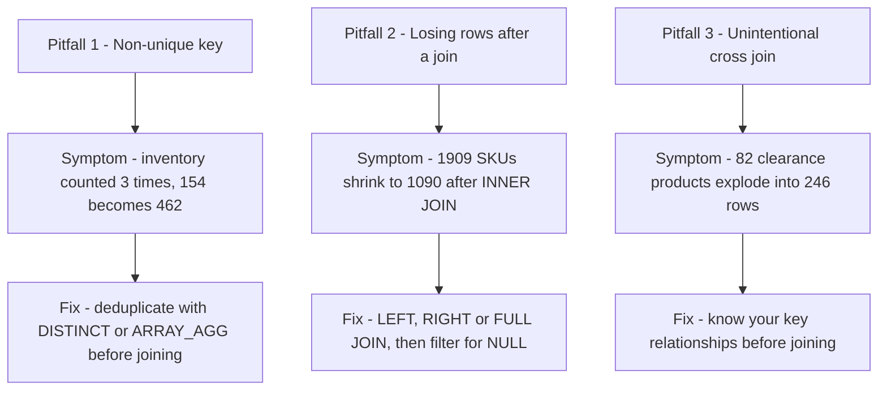
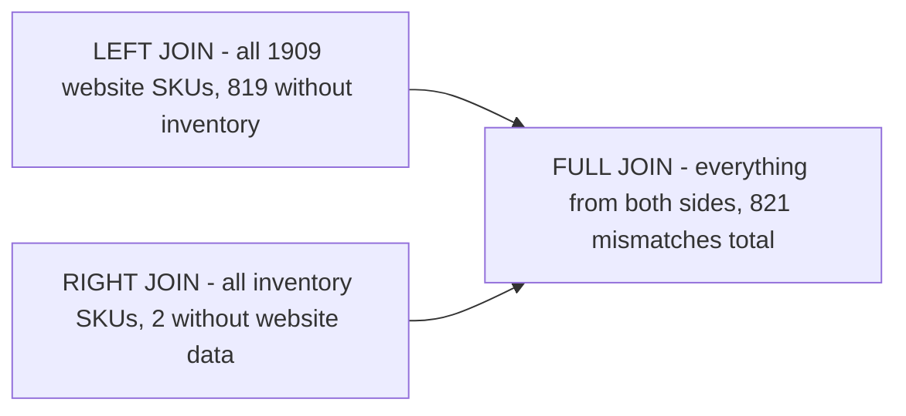

# Troubleshooting and Solving Data Join Pitfalls (GSP412)

> **A beginner-friendly, step-by-step guide** — written so that even someone with a non-technical background can understand *what* we are doing, *why* we are doing it, and *how* each SQL query works.

---

## 📋 Table of Contents

1. [Where This Lab Fits — Prerequisites & Learning Path](#1-where-this-lab-fits--prerequisites--learning-path)
2. [The Big Picture — What Is This Lab About?](#2-the-big-picture--what-is-this-lab-about)
3. [Key Concepts Explained Simply](#3-key-concepts-explained-simply)
4. [Task 1 — Create a New Dataset](#4-task-1--create-a-new-dataset)
5. [Task 2 — Pin the Lab Project in BigQuery](#5-task-2--pin-the-lab-project-in-bigquery)
6. [Task 3 — Examine the Fields](#6-task-3--examine-the-fields)
7. [Task 4 — Identify a Key Field in Your Ecommerce Dataset](#7-task-4--identify-a-key-field-in-your-ecommerce-dataset)
8. [Task 5 — Pitfall: Non-Unique Key](#8-task-5--pitfall-non-unique-key)
9. [Task 6 — Join Pitfall Solutions](#9-task-6--join-pitfall-solutions)
10. [Quiz Answers — All in One Place](#10-quiz-answers--all-in-one-place)
11. [Quick Reference — All Queries in One Place](#11-quick-reference--all-queries-in-one-place)
12. [Command-Line Alternatives (Cloud Shell)](#12-command-line-alternatives-cloud-shell)

---

## 1. Where This Lab Fits — Prerequisites & Learning Path

This is **lab 3 of the "Build a Data Warehouse with BigQuery" skill badge** ([course 624](https://www.cloudskillsboost.google/course_templates/624)).

| # | Lab | What it teaches | Folder |
|---|---|---|---|
| 01 | Creating a Data Warehouse Through Joins and Unions (GSP413) | JOINs, UNIONs, table wildcards | [01-GSP413](../01-GSP413%20-%20Creating%20a%20Data%20Warehouse%20Through%20Joins%20and%20Unions/README.md) |
| 02 | Creating Date-Partitioned Tables in BigQuery (GSP414) | Partitioning, pruning, auto-expiration | [02-GSP414](../02-GSP414%20-%20Creating%20Date-Partitioned%20Tables%20in%20BigQuery/README.md) |
| **03** | **Troubleshooting and Solving Data Join Pitfalls (GSP412)** | **Join types, non-unique keys, lost rows, cross joins** | **this folder** |
| 04 | Working with JSON, Arrays, and Structs in BigQuery (GSP416) | Semi-structured data, ARRAY, STRUCT, UNNEST | [04-GSP416](../04-GSP416%20-%20Working%20with%20JSON,%20Arrays,%20and%20Structs%20in%20BigQuery/README.md) |
| 05 | Build a Data Warehouse with BigQuery: Challenge Lab (GSP340) | Everything combined, no hand-holding | [05-GSP340](../05-GSP340%20-%20Challenge%20Lab/README.md) |

### What you should already know (from labs 01–02)

- How to **create a dataset** and run queries in the BigQuery console.
- The `data-to-insights.ecommerce` tables (`all_sessions_raw` and `products`) — the *same two tables you joined in lab 01*. This lab shows what can **go wrong** with that join.
- Basic `JOIN ... ON`, `GROUP BY`, and `SELECT DISTINCT`.

### Why this lab matters for the Challenge Lab

The [GSP340 Challenge Lab](../05-GSP340%20-%20Challenge%20Lab/README.md) fails with *"UPDATE/MERGE must match at most one source row for each target row"* if your join source has duplicates — the exact many-to-one pitfall this lab teaches you to detect (with `COUNT(DISTINCT ...)`) and fix (with `DISTINCT` / `GROUP BY`).

---

## 2. The Big Picture — What Is This Lab About?

### The Scenario (in plain English)

Your team hands you a new **product inventory** dataset, and you want to join it with your **website analytics** data — the same thing you did happily in lab 01. But this time you look closer and discover the data is *messy*: the "unique" product SKU… isn't unique. Joining on a dirty key silently **corrupts your numbers** — inventory shows triple, products vanish, row counts explode.

This lab is a guided tour of the **three classic join disasters** and how to fix each one:



**Think of it like merging two contact lists:**
- Pitfall 1 = the same person appears three times in one list, so after merging, their phone bill gets counted three times.
- Pitfall 2 = people who are only in one list silently disappear from the merged result.
- Pitfall 3 = you accidentally pair *everyone* with *everyone* — 82 people × 3 coupons = 246 letters mailed.

### The four JOIN types (from the lab overview)

| Join type | What it does |
|---|---|
| **CROSS JOIN** | Combines **each** row of the first dataset with **each** row of the second — every combination appears in the output. |
| **INNER JOIN** | Requires the key to exist in **both** tables — records appear only when there's a match on both sides. (This is the **default** when you just write `JOIN`.) |
| **LEFT JOIN** | Every row of the **left** table appears, whether or not the right table has a match. |
| **RIGHT JOIN** | The reverse — every row of the **right** table appears, whether or not the left table has a match. |

---

## 3. Key Concepts Explained Simply

| Term | Simple Explanation |
|---|---|
| **Key / Join Key** | The shared column used to match rows between tables (here: the product **SKU**). A good key identifies **one and only one** thing. |
| **SKU** | *Stock Keeping Unit* — the inventory world's ID for one sellable product variant (each size/colour is its own SKU). |
| **Data Relationships (1:1, 1:N, N:N)** | How many rows on each side share a key. One-to-one is safe; one-to-many multiplies rows; **many-to-many silently explodes** your results. |
| **`COUNT(DISTINCT x)`** | "How many *different* values of x are there?" — the #1 tool for testing whether a key is unique. |
| **`STRING_AGG(x, ...)`** | Squashes many values into one comma-separated string — handy for *seeing* all the product names that share one SKU. |
| **`ARRAY_AGG(x)`** | Same idea but produces a real **array** (BigQuery natively supports nested arrays); `ARRAY_AGG(DISTINCT x LIMIT 1)` is a neat dedup trick. |
| **`HAVING`** | Like `WHERE`, but applied **after** `GROUP BY` — "only show groups where SKU_count > 1". |
| **`WITH ... AS ( ... )` (CTE)** | Names a sub-query so you can treat it like a temporary table — used here to sum inventory in a readable way. |
| **FULL JOIN** | LEFT + RIGHT combined: **all** records from **both** tables, matched where possible, NULL where not. |
| **`IS NULL` filter after an outer join** | The detective's trick: rows where the *other* table's key is NULL are exactly the rows that had **no match**. |
| **Unintentional cross join** | When a "normal" join hits duplicate keys on both sides, every copy matches every copy — rows multiply like a cross join you never asked for. |

---

## 4. Task 1 — Create a New Dataset

### 🎯 What we must achieve

Create a dataset named `ecommerce` to store the tables you'll create later (the promotion table in Task 6).

### Steps (point-and-click)

1. Click the **⋮ (three dots)** next to your Project ID → **Create dataset**.
2. Set **Dataset ID** = `ecommerce`.
3. Leave the other options at their defaults and click **Create dataset**.

✅ Click **Check my progress**.

---

## 5. Task 2 — Pin the Lab Project in BigQuery

### 🎯 What we must achieve

The inventory dataset lives in the **`data-to-insights`** project. Public projects aren't shown by default, so *star* it to make it appear in your Explorer pane.

### Steps

1. In the left pane, click **Explorer → + Add data → Star a project by name**.
2. Paste `data-to-insights` and click **Star**.

The `data-to-insights` project now appears in the Explorer section.

---

## 6. Task 3 — Examine the Fields

Navigate to **data-to-insights → ecommerce → all_sessions_raw**, then open the **Schema** tab to browse the fields. The two you'll live in for the rest of the lab:

- `v2ProductName` — the product's display name on the website
- `productSKU` — the product's inventory ID (your join key candidate)

---

## 7. Task 4 — Identify a Key Field in Your Ecommerce Dataset

### 🎯 What we must achieve

Before joining on SKU, test whether it's actually a **unique** key. Spoiler: it isn't.

### Step 1 — Count product names + SKUs together

```sql
#standardSQL
# how many products are on the website?
SELECT DISTINCT
  productSKU,
  v2ProductName
FROM `data-to-insights.ecommerce.all_sessions_raw`
```

→ **2,273** rows of products and SKUs.

### Step 2 — Count DISTINCT SKUs alone

```sql
#standardSQL
# find the count of unique SKUs
SELECT DISTINCT
  productSKU
FROM `data-to-insights.ecommerce.all_sessions_raw`
```

→ Only **1,909** distinct SKUs!

**Why fewer?** The first query also returned Product Name — so 2,273 vs 1,909 means **multiple product names share the same SKU**. That's a red flag 🚩 for a join key.

### Step 3 — Which product names have more than one SKU?

```sql
SELECT
  v2ProductName,
  COUNT(DISTINCT productSKU) AS SKU_count,
  STRING_AGG(DISTINCT productSKU LIMIT 5) AS SKU
FROM `data-to-insights.ecommerce.all_sessions_raw`
WHERE productSKU IS NOT NULL
GROUP BY v2ProductName
HAVING SKU_count > 1
ORDER BY SKU_count DESC
```

| Piece | Meaning |
|---|---|
| `COUNT(DISTINCT productSKU)` | "How many different SKUs does this product name have?" |
| `STRING_AGG(DISTINCT productSKU LIMIT 5)` | "Show me up to 5 of them, comma-separated, so I can eyeball them." |
| `HAVING SKU_count > 1` | "Only keep product names with **more than one** SKU." (`HAVING` filters *after* grouping.) |

→ **Yes**, many names map to multiple SKUs. The worst offender: **Waze Women's Typography Short Sleeve Tee** (12 SKUs). That's actually *legitimate* — each size/colour option is sold as its own SKU.

### Step 4 — The reverse: which SKUs have more than one product name?

```sql
SELECT
  productSKU,
  COUNT(DISTINCT v2ProductName) AS product_count,
  STRING_AGG(DISTINCT v2ProductName LIMIT 5) AS product_name
FROM `data-to-insights.ecommerce.all_sessions_raw`
WHERE v2ProductName IS NOT NULL
GROUP BY productSKU
HAVING product_count > 1
ORDER BY product_count DESC
```

→ **Yes** — and this direction is the *dangerous* one. The names are *similar but not identical* (renames, special characters). One SKU ↔ many names = your key is **not unique**.

> 💡 Try replacing `STRING_AGG()` with `ARRAY_AGG()` — BigQuery natively supports nested array values. See the [Work with arrays guide](https://cloud.google.com/bigquery/docs/arrays).

✅ Click **Check my progress**.

---

## 8. Task 5 — Pitfall: Non-Unique Key

### 🎯 What we must achieve

Watch the non-unique SKU **corrupt an inventory calculation** — the frisbee incident. 🥏

### Step 1 — One SKU, three names

```sql
SELECT DISTINCT
  v2ProductName,
  productSKU
FROM `data-to-insights.ecommerce.all_sessions_raw`
WHERE productSKU = 'GGOEGPJC019099'
```

| v2ProductName | productSKU |
|---|---|
| 7&quot; Dog Frisbee | GGOEGPJC019099 |
| 7" Dog Frisbee | GGOEGPJC019099 |
| Google 7-inch Dog Flying Disc Blue | GGOEGPJC019099 |

Three names for one product — one has an HTML-escaped quote character, one was renamed. *Mostly the same except for a few characters.*

### Step 2 — Is the SKU unique on the inventory side?

```sql
SELECT
  SKU,
  name,
  stockLevel
FROM `data-to-insights.ecommerce.products`
WHERE SKU = 'GGOEGPJC019099'
```

→ **Yes, just one record**: the frisbee, with **154** in stock. So the relationship is website (3 rows) → inventory (1 row): **many-to-one**.

### Step 3 — Join them and watch the duplication

```sql
SELECT DISTINCT
  website.v2ProductName,
  website.productSKU,
  inventory.stockLevel
FROM `data-to-insights.ecommerce.all_sessions_raw` AS website
JOIN `data-to-insights.ecommerce.products` AS inventory
  ON website.productSKU = inventory.SKU
WHERE productSKU = 'GGOEGPJC019099'
```

→ Inventory data appears, **but `stockLevel` 154 shows up three times** — once for each website product name.

```
website (3 name-rows)          inventory (1 row)        join result
7"  Dog Frisbee ───┐
7&quot; Dog Frisbee ┼── all match SKU ──▶ 154   =   154 appears x3
Google 7-inch Disc ┘
```

### Step 4 — Sum it and get the wrong answer

```sql
WITH inventory_per_sku AS (
  SELECT DISTINCT
    website.v2ProductName,
    website.productSKU,
    inventory.stockLevel
  FROM `data-to-insights.ecommerce.all_sessions_raw` AS website
  JOIN `data-to-insights.ecommerce.products` AS inventory
    ON website.productSKU = inventory.SKU
  WHERE productSKU = 'GGOEGPJC019099'
)
SELECT
  productSKU,
  SUM(stockLevel) AS total_inventory
FROM inventory_per_sku
GROUP BY productSKU
```

→ **462, not 154!** (154 × 3 = triple-counted inventory.) This is an **unintentional cross join** — the duplicate keys made every website copy match the inventory row.

✅ Click **Check my progress**.

---

## 9. Task 6 — Join Pitfall Solutions

### Solution 1 — Deduplicate BEFORE you join (ARRAY_AGG)

Collapse the many names into one row per SKU by pushing the names into an array:

```sql
SELECT
  productSKU,
  ARRAY_AGG(DISTINCT v2ProductName) AS push_all_names_into_array
FROM `data-to-insights.ecommerce.all_sessions_raw`
WHERE productSKU = 'GGOEGAAX0098'
GROUP BY productSKU
```

And if you want exactly one name, LIMIT the array:

```sql
SELECT
  productSKU,
  ARRAY_AGG(DISTINCT v2ProductName LIMIT 1) AS push_all_names_into_array
FROM `data-to-insights.ecommerce.all_sessions_raw`
WHERE productSKU = 'GGOEGAAX0098'
GROUP BY productSKU
```

Now there's **one row per SKU** — safe to join.

### Pitfall 2 — Losing data records after a join

Join the distinct website SKUs against inventory:

```sql
#standardSQL
SELECT DISTINCT
  website.productSKU
FROM `data-to-insights.ecommerce.all_sessions_raw` AS website
JOIN `data-to-insights.ecommerce.products` AS inventory
  ON website.productSKU = inventory.SKU
```

→ Only **1,090** records come back — but the website has **1,909** distinct SKUs. **819 SKUs vanished!**

**Why?** Plain `JOIN` = **INNER JOIN**: it only keeps SKUs that exist **on both sides**. Website-only SKUs are silently dropped.

### Solution 2 — Pick the right join type, then hunt NULLs

**LEFT JOIN** keeps all 1,909 website SKUs (unmatched ones get NULL inventory):

```sql
#standardSQL
# the secret is in the JOIN type
SELECT DISTINCT
  website.productSKU AS website_SKU,
  inventory.SKU AS inventory_SKU
FROM `data-to-insights.ecommerce.all_sessions_raw` AS website
LEFT JOIN `data-to-insights.ecommerce.products` AS inventory
  ON website.productSKU = inventory.SKU
```

→ All 1,909 rows return; **many `inventory_SKU` values are NULL** (True).

**Filter for the NULLs** to count exactly what's missing:

```sql
#standardSQL
# find product SKUs in website table but not in product inventory table
SELECT DISTINCT
  website.productSKU AS website_SKU,
  inventory.SKU AS inventory_SKU
FROM `data-to-insights.ecommerce.all_sessions_raw` AS website
LEFT JOIN `data-to-insights.ecommerce.products` AS inventory
  ON website.productSKU = inventory.SKU
WHERE inventory.SKU IS NULL
```

→ **819 products** are missing from the inventory dataset. Confirm with a spot check:

```sql
#standardSQL
# you can even pick one and confirm
SELECT * FROM `data-to-insights.ecommerce.products`
WHERE SKU = 'GGOEGATJ060517'
# query returns zero results
```

**Why might inventory be missing SKUs?** ✅ *All of the above:* digital products with no warehouse stock, discontinued products from past orders, and genuinely missing data worth tracking.

**The reverse question — in inventory but not on the website? RIGHT JOIN:**

```sql
#standardSQL
# reverse the join
SELECT DISTINCT
  website.productSKU AS website_SKU,
  inventory.SKU AS inventory_SKU
FROM `data-to-insights.ecommerce.all_sessions_raw` AS website
RIGHT JOIN `data-to-insights.ecommerce.products` AS inventory
  ON website.productSKU = inventory.SKU
WHERE website.productSKU IS NULL
```

→ **Yes — 2 SKUs** are in inventory but missing from the website. Add `inventory.*` to see what they are:

```sql
#standardSQL
# what are these products?
SELECT DISTINCT
  website.productSKU AS website_SKU,
  inventory.*
FROM `data-to-insights.ecommerce.all_sessions_raw` AS website
RIGHT JOIN `data-to-insights.ecommerce.products` AS inventory
  ON website.productSKU = inventory.SKU
WHERE website.productSKU IS NULL
```

| SKU | name | Why it's not in web analytics |
|---|---|---|
| GGOBJGOWUSG69402 | USB wired soundbar | Sold **in store only** — never viewed online |
| GGADFBSBKS42347 | PC gaming speakers | **Brand new** (0 orders, no sentiment) — never sold, so no web analytics yet |

> 📝 You'll rarely see RIGHT JOINs in production — teams just write a LEFT JOIN with the tables swapped.

**Both directions at once? FULL JOIN:**

```sql
#standardSQL
SELECT DISTINCT
  website.productSKU AS website_SKU,
  inventory.SKU AS inventory_SKU
FROM `data-to-insights.ecommerce.all_sessions_raw` AS website
FULL JOIN `data-to-insights.ecommerce.products` AS inventory
  ON website.productSKU = inventory.SKU
WHERE website.productSKU IS NULL OR inventory.SKU IS NULL
```

→ **819 + 2 = 821** mismatched SKUs. *LEFT JOIN + RIGHT JOIN = FULL JOIN* — all records from both tables, then filter the mismatches on either side.



### Pitfall 3 — Unintentional CROSS JOIN

Create a one-row table holding a site-wide 5% discount:

```sql
#standardSQL
CREATE OR REPLACE TABLE ecommerce.site_wide_promotion AS
SELECT .05 AS discount;
```

Apply it to every Clearance product with a CROSS JOIN (note: **no ON condition** — every row pairs with every row):

```sql
SELECT DISTINCT
  productSKU,
  v2ProductCategory,
  discount
FROM `data-to-insights.ecommerce.all_sessions_raw` AS website
CROSS JOIN ecommerce.site_wide_promotion
WHERE v2ProductCategory LIKE '%Clearance%'
```

→ **82 products** on clearance × 1 discount row = 82 rows. Fine so far.

**Now sabotage it** — insert two more discount rows:

```sql
INSERT INTO ecommerce.site_wide_promotion (discount)
VALUES (.04),
       (.03);

SELECT discount FROM ecommerce.site_wide_promotion;
-- 3 records now
```

Re-run the same CROSS JOIN query → **246 rows instead of 82** (82 × 3). Zoom in on one SKU to see why:

```sql
#standardSQL
SELECT DISTINCT
  productSKU,
  v2ProductCategory,
  discount
FROM `data-to-insights.ecommerce.all_sessions_raw` AS website
CROSS JOIN ecommerce.site_wide_promotion
WHERE v2ProductCategory LIKE '%Clearance%'
  AND productSKU = 'GGOEGOLC013299'
```

→ The one product appears **3 times**, once per discount value. With 3 rows to cross join on, the whole dataset is multiplied by 3.

> ⚠️ **This isn't limited to CROSS JOINs.** A *normal* join over a many-to-many relationship does the same thing implicitly — and can return millions or billions of rows unintentionally. **The solution: know your data relationships before you join, and never assume keys are unique.**

✅ Click **Check my progress**. 🏁 **Lab complete!**

---

## 10. Quiz Answers — All in One Place

| # | Question | Answer |
|---|---|---|
| 1 | How many rows of product data are returned (SKU + name)? | **2,273 products and SKUs** |
| 2 | How many DISTINCT SKUs are returned? | **1,909 distinct SKUs** |
| 3 | Why fewer DISTINCT SKUs than SKU+name rows? | **The first query also returned Product Name — multiple Product Names can have the same SKU.** |
| 4 | Do some product names have more than one SKU? | **Yes** |
| 5 | Which product has the most SKUs? | **Waze Women's Typography Short Sleeve Tee** |
| 6 | Single SKUs with multiple product names — what do you notice? | **Yes — most names are similar but not exactly the same.** |
| 7 | The three frisbee product names are…? | **Mostly the same except for a few characters.** |
| 8 | Is the SKU unique in the product inventory dataset? | **Yes, just one record is returned.** |
| 9 | How many dog frisbees in inventory? | **154** |
| 10 | What happens after joining website × inventory on SKU? | **Inventory appears but stockLevel shows three times (once per name record).** |
| 11 | Does the frisbee show a stock level of 154 after SUM? | **No — 462 (154 × 3, triple-counted!).** |
| 12 | How many records after the INNER JOIN — all 1,909? | **No, just 1,090 records.** |
| 13 | True/False: many inventory SKU values are NULL after the LEFT JOIN. | **True** |
| 14 | How many products missing from inventory? | **819** |
| 15 | Why might inventory be missing SKUs? | **All of the above** (digital products, discontinued products, genuine missing data) |
| 16 | SKUs in inventory but missing from the website? | **Yes — 2** (in-store-only soundbar; brand-new gaming speakers with 0 orders) |
| 17 | Total mismatches via FULL JOIN? | **821 (819 + 2)** |
| 18 | How many products on clearance? | **82** |
| 19 | Rows after cross-joining with 3 discount records? | **246 (82 × 3)** |

---

## 11. Quick Reference — All Queries in One Place

**Task 1** — Create dataset `ecommerce` via the console. **Task 2** — Star the `data-to-insights` project.

**Task 4** — Test key uniqueness:
```sql
-- 2,273 rows: SKU + name pairs
SELECT DISTINCT productSKU, v2ProductName
FROM `data-to-insights.ecommerce.all_sessions_raw`;

-- 1,909 rows: distinct SKUs alone
SELECT DISTINCT productSKU
FROM `data-to-insights.ecommerce.all_sessions_raw`;

-- names with multiple SKUs (sizes/colours - legitimate)
SELECT v2ProductName, COUNT(DISTINCT productSKU) AS SKU_count,
       STRING_AGG(DISTINCT productSKU LIMIT 5) AS SKU
FROM `data-to-insights.ecommerce.all_sessions_raw`
WHERE productSKU IS NOT NULL
GROUP BY v2ProductName HAVING SKU_count > 1 ORDER BY SKU_count DESC;

-- SKUs with multiple names (the dangerous direction)
SELECT productSKU, COUNT(DISTINCT v2ProductName) AS product_count,
       STRING_AGG(DISTINCT v2ProductName LIMIT 5) AS product_name
FROM `data-to-insights.ecommerce.all_sessions_raw`
WHERE v2ProductName IS NOT NULL
GROUP BY productSKU HAVING product_count > 1 ORDER BY product_count DESC;
```

**Task 5** — The triple-counting pitfall:
```sql
-- 3 names, 1 SKU
SELECT DISTINCT v2ProductName, productSKU
FROM `data-to-insights.ecommerce.all_sessions_raw`
WHERE productSKU = 'GGOEGPJC019099';

-- inventory side is clean: 1 row, 154 in stock
SELECT SKU, name, stockLevel
FROM `data-to-insights.ecommerce.products`
WHERE SKU = 'GGOEGPJC019099';

-- join duplicates stockLevel x3; SUM gives 462 instead of 154
WITH inventory_per_sku AS (
  SELECT DISTINCT website.v2ProductName, website.productSKU, inventory.stockLevel
  FROM `data-to-insights.ecommerce.all_sessions_raw` AS website
  JOIN `data-to-insights.ecommerce.products` AS inventory
    ON website.productSKU = inventory.SKU
  WHERE productSKU = 'GGOEGPJC019099'
)
SELECT productSKU, SUM(stockLevel) AS total_inventory
FROM inventory_per_sku GROUP BY productSKU;
```

**Task 6** — The fixes:
```sql
-- dedup names into an array (one row per SKU)
SELECT productSKU, ARRAY_AGG(DISTINCT v2ProductName LIMIT 1) AS names
FROM `data-to-insights.ecommerce.all_sessions_raw`
WHERE productSKU = 'GGOEGAAX0098' GROUP BY productSKU;

-- LEFT JOIN + IS NULL: 819 website SKUs missing from inventory
SELECT DISTINCT website.productSKU AS website_SKU, inventory.SKU AS inventory_SKU
FROM `data-to-insights.ecommerce.all_sessions_raw` AS website
LEFT JOIN `data-to-insights.ecommerce.products` AS inventory
  ON website.productSKU = inventory.SKU
WHERE inventory.SKU IS NULL;

-- RIGHT JOIN + IS NULL: 2 inventory SKUs missing from website
SELECT DISTINCT website.productSKU AS website_SKU, inventory.*
FROM `data-to-insights.ecommerce.all_sessions_raw` AS website
RIGHT JOIN `data-to-insights.ecommerce.products` AS inventory
  ON website.productSKU = inventory.SKU
WHERE website.productSKU IS NULL;

-- FULL JOIN: all 821 mismatches at once
SELECT DISTINCT website.productSKU AS website_SKU, inventory.SKU AS inventory_SKU
FROM `data-to-insights.ecommerce.all_sessions_raw` AS website
FULL JOIN `data-to-insights.ecommerce.products` AS inventory
  ON website.productSKU = inventory.SKU
WHERE website.productSKU IS NULL OR inventory.SKU IS NULL;

-- cross join demo: 82 rows -> 246 after inserting 2 extra discount rows
CREATE OR REPLACE TABLE ecommerce.site_wide_promotion AS
SELECT .05 AS discount;

INSERT INTO ecommerce.site_wide_promotion (discount)
VALUES (.04), (.03);

SELECT DISTINCT productSKU, v2ProductCategory, discount
FROM `data-to-insights.ecommerce.all_sessions_raw` AS website
CROSS JOIN ecommerce.site_wide_promotion
WHERE v2ProductCategory LIKE '%Clearance%';
```

---

## 12. Command-Line Alternatives (Cloud Shell)

Everything this lab does with console clicks can also be done from **Cloud Shell** — the `gcloud` and `bq` tools come pre-installed.

### Universal setup commands (work in any lab)

```bash
gcloud config set project PROJECT_ID            # select a project
gcloud services enable bigquery.googleapis.com  # enable a service API
gcloud projects add-iam-policy-binding PROJECT_ID \
  --member="user:someone@example.com" --role="roles/bigquery.jobUser"  # grant IAM role
```

### UI step → CLI equivalent for this lab

| Console (UI) step | Cloud Shell command |
|---|---|
| Task 1: Create dataset `ecommerce` | `bq mk --dataset $GOOGLE_CLOUD_PROJECT:ecommerce` |
| Task 2: **Star** the `data-to-insights` project | No CLI needed — starring is just a UI bookmark. On the CLI you always use fully-qualified names: `bq ls data-to-insights:ecommerce` |
| Task 3: Schema tab — examine the fields | `bq show --schema --format=prettyjson data-to-insights:ecommerce.all_sessions_raw` |
| Run any query (key-uniqueness checks, joins) | `bq query --use_legacy_sql=false 'SELECT ...'` |
| Task 6: Create the promotion table | `bq query --use_legacy_sql=false 'CREATE OR REPLACE TABLE ecommerce.site_wide_promotion AS SELECT .05 AS discount'` |
| Task 6: INSERT the extra discount rows | `bq query --use_legacy_sql=false 'INSERT INTO ecommerce.site_wide_promotion (discount) VALUES (.04),(.03)'` |
| Check row counts (82 vs 246 result sizes) | add `--format=csv` and pipe to `wc -l`, e.g. `bq query --use_legacy_sql=false --format=csv 'SELECT ...' \| wc -l` |

> 💡 CLI bonus for *this* lab's theme: `bq query --dry_run` also warns you about cost **before** an accidental many-to-many join scans (or returns) billions of rows.

---

### 🏁 Summary of the Journey


**Key lessons learned:**
1. **Never assume a key is unique** — test it first with `COUNT(DISTINCT ...)` / `GROUP BY ... HAVING count > 1`.
2. Duplicate keys turn an innocent join into an **unintentional cross join** — sums and counts get silently multiplied (154 → 462).
3. **Deduplicate before joining**: `SELECT DISTINCT`, or `ARRAY_AGG(DISTINCT x LIMIT 1)` to keep one row per key.
4. Plain `JOIN` is an **INNER JOIN** and silently drops non-matching rows (1,909 → 1,090). Use **LEFT / RIGHT / FULL JOIN** + a `WHERE ... IS NULL` filter to *find* what's missing instead of losing it.
5. **LEFT + RIGHT = FULL JOIN** — the one-query way to audit mismatches on both sides (819 + 2 = 821).
6. Know your relationships (1:1, 1:N, N:N) *before* joining — the same lesson that saves you in the [Challenge Lab's](../05-GSP340%20-%20Challenge%20Lab/README.md) `UPDATE ... FROM` tasks.
