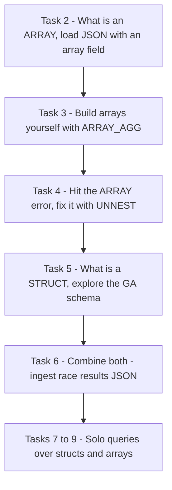
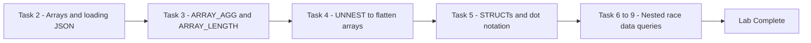

# Working with JSON, Arrays, and Structs in BigQuery (GSP416)

> **A beginner-friendly, step-by-step guide** — written so that even someone with a non-technical background can understand *what* we are doing, *why* we are doing it, and *how* each SQL query works.

---

## 📋 Table of Contents

1. [Where This Lab Fits — Prerequisites & Learning Path](#1-where-this-lab-fits--prerequisites--learning-path)
2. [The Big Picture — What Is This Lab About?](#2-the-big-picture--what-is-this-lab-about)
3. [Key Concepts Explained Simply](#3-key-concepts-explained-simply)
4. [Task 1 — Create a New Dataset](#4-task-1--create-a-new-dataset)
5. [Task 2 — Practice Working with Arrays in SQL](#5-task-2--practice-working-with-arrays-in-sql)
6. [Task 3 — Create Your Own Arrays with ARRAY_AGG](#6-task-3--create-your-own-arrays-with-array_agg)
7. [Task 4 — Query Tables Containing Arrays (UNNEST)](#7-task-4--query-tables-containing-arrays-unnest)
8. [Task 5 — Introduction to STRUCTs](#8-task-5--introduction-to-structs)
9. [Task 6 — Practice with STRUCTs and Arrays](#9-task-6--practice-with-structs-and-arrays)
10. [Tasks 7–9 — Lab Questions](#10-tasks-79--lab-questions)
11. [Quiz Answers — All in One Place](#11-quiz-answers--all-in-one-place)
12. [Quick Reference — All Queries in One Place](#12-quick-reference--all-queries-in-one-place)
13. [Command-Line Alternatives (Cloud Shell)](#13-command-line-alternatives-cloud-shell)

---

## 1. Where This Lab Fits — Prerequisites & Learning Path

This is **lab 4 of the "Build a Data Warehouse with BigQuery" skill badge** ([course 624](https://www.cloudskillsboost.google/course_templates/624)).

| # | Lab | What it teaches | Folder |
|---|---|---|---|
| 01 | Creating a Data Warehouse Through Joins and Unions (GSP413) | JOINs, UNIONs, table wildcards | [01-GSP413](../01-GSP413%20-%20Creating%20a%20Data%20Warehouse%20Through%20Joins%20and%20Unions/README.md) |
| 02 | Creating Date-Partitioned Tables in BigQuery (GSP414) | Partitioning, pruning, auto-expiration | [02-GSP414](../02-GSP414%20-%20Creating%20Date-Partitioned%20Tables%20in%20BigQuery/README.md) |
| 03 | Troubleshooting and Solving Data Join Pitfalls (GSP412) | Join types, non-unique keys, cross joins | [03-GSP412](../03-GSP412%20-%20Troubleshooting%20and%20Solving%20Data%20Join%20Pitfalls/README.md) |
| **04** | **Working with JSON, Arrays, and Structs in BigQuery (GSP416)** | **Semi-structured data, ARRAY, STRUCT, UNNEST** | **this folder** |
| 05 | Build a Data Warehouse with BigQuery: Challenge Lab (GSP340) | Everything combined, no hand-holding | [05-GSP340](../05-GSP340%20-%20Challenge%20Lab/README.md) |

### What you should already know (from labs 01–03)

- Creating datasets and tables, and starring the `data-to-insights` / `bigquery-public-data` projects (lab 03 taught the starring flow).
- `ARRAY_AGG(DISTINCT x LIMIT n)` — lab 03 used it to deduplicate product names; this lab explains what that array *actually is* and how to work with it.
- **CROSS JOIN** — lab 03 showed the *dangerous* uncorrelated kind; this lab uses the *safe, correlated* kind to unpack arrays.
- Normalization vs denormalization (splitting vs merging tables).

### Why this lab matters for the Challenge Lab

Task 2 of the [GSP340 Challenge Lab](../05-GSP340%20-%20Challenge%20Lab/README.md) asks you to add a **RECORD (STRUCT) column** with sub-fields to a table — exactly the STRUCT concept practised here (RECORD = STRUCT, REPEATED = ARRAY).

---

## 2. The Big Picture — What Is This Lab About?

### The Scenario (in plain English)

Traditional databases split data into many small tables and JOIN them back together (**normalization**). Data warehouses often do the opposite (**denormalization**): pile everything into one huge reporting table. But a naive giant table wastes space repeating values.

BigQuery's answer: keep one table, but let a single row hold **lists** (ARRAYs) and **groups of related fields** (STRUCTs). One row per shopping session can contain *all* the pages viewed (an array) and *all* the device info (a struct) — no JOINs needed, no repetition.

The trade-off: the SQL syntax for reaching *inside* these nested values is tricky. This lab teaches you the two magic tools — **dot notation** for STRUCTs and **UNNEST()** for ARRAYs.

### The Overall Journey



**Think of it like a filing cabinet upgrade:**
- A normal column = one sticky note per folder.
- An **ARRAY** = a *list* stapled inside the folder (deep granularity).
- A **STRUCT** = a labelled *sub-folder* with its own sticky notes inside (wide schema).
- **UNNEST()** = taking the stapled list out and spreading its items on the desk as separate rows so you can count/sum them.

---

## 3. Key Concepts Explained Simply

| Term | Simple Explanation |
|---|---|
| **Semi-structured data** | Data that isn't flat rows-and-columns — e.g. **JSON** with nested lists and objects. BigQuery can ingest and query it natively. |
| **Normalization** | Splitting one table into many (Fruit Items + People) to avoid repetition — the transactional-database way (e.g. MySQL). |
| **Denormalization** | The reverse: merging many tables into one big reporting table — the data-warehouse way. Nested fields make this efficient. |
| **ARRAY** | Simply a **list of items in brackets** `[ ]`, living inside a single row. All elements **must share one data type** (all strings *or* all numbers — never mixed). |
| **REPEATED** | BigQuery's schema label for an array field (Mode = REPEATED). |
| **STRUCT** | A **container of related fields** (same or different types) with its own alias — conceptually *a table pre-joined into your main table*. Accessed with dot notation: `runner.name`. |
| **RECORD** | BigQuery's schema label for a STRUCT (Type = RECORD). STRUCTs can nest other STRUCTs. |
| **`ARRAY_AGG(x)`** | Rolls many row values *up* into one array. Extras: `DISTINCT` (dedup), `ORDER BY` (sort), `LIMIT` (cap size). |
| **`ARRAY_LENGTH(a)`** | Counts the elements in an array. |
| **`UNNEST(a)`** | The opposite of ARRAY_AGG: **flattens an array back into rows**. Always appears *after the table name* in the FROM clause. |
| **Correlated CROSS JOIN** | `FROM table AS t, UNNEST(t.arr)` — the comma is an implicit cross join, but it only pairs each row with **its own** array elements (no cartesian explosion, unlike lab 03's pitfall). |
| **Granularity** | The "level of detail" of a field. A race has 1 row; its participants have 8. Mixing levels without UNNEST causes errors — the "blank" cells you see in results are just higher-granularity fields. |
| **JSONL / Newline-delimited JSON** | The file format BigQuery ingests: one JSON object per line. |

### ARRAY vs STRUCT — the one-picture summary

```
ARRAY = go DEEP (a list in one cell)      STRUCT = go WIDE (grouped sub-fields)

Row | Person    | Fruit (ARRAY)           Row | runner.name | runner.split
----+-----------+----------------         ----+-------------+-------------
 1  | sally     | [raspberry,              1  | Rudisha     | 23.4
    |           |  blackberry,                   └── dot notation reaches
    |           |  strawberry, cherry]               inside the container
 2  | frederick | [orange, apple]

2 rows, but 6 fruit values!              STRUCT of ARRAYs = both at once:
                                         runner.splits = [23.4, 26.3, ...]
```

---

## 4. Task 1 — Create a New Dataset

1. Click the **⋮ (three dots)** next to your Project ID → **Create dataset**.
2. Set **Dataset ID** = `fruit_store`; leave other options at defaults.
3. Click **Create dataset**.

---

## 5. Task 2 — Practice Working with Arrays in SQL

### 🎯 What we must achieve

Understand what an array *is*, prove arrays are type-strict, and ingest a JSON file containing an array field.

### Why one giant flat table is a problem

> **📝 Quiz — What are some potential issues if you stored all your data in one giant table?**
> ✅ **All of the above** — rows get too large for traditional databases; one change (like a customer email) ripples across many rows; repeated less-granular fields cause reporting errors.

The repeated-field (array) approach stores different granularities in one table *without* repetition — sally's row holds **4 fruit values in a single row**:

> **📝 Quiz — What looks strange about the repeated-field table?**
> ✅ *There are multiple field values for Fruit in a single row.*

### Try it — build an array literal

```sql
#standardSQL
SELECT
  ['raspberry', 'blackberry', 'strawberry', 'cherry'] AS fruit_array
```

Works — one row, four values. Now break it:

```sql
#standardSQL
SELECT
  ['raspberry', 'blackberry', 'strawberry', 'cherry', 1234567] AS fruit_array
```

→ **Error:** `Array elements of types {INT64, STRING} do not have a common supertype`

> **📝 Quiz — Why the error?**
> ✅ *Data in an array `[ ]` must all be the same type.* (All strings **or** all numbers — never mixed.)

Query the finished table and click the **JSON** tab on the results to see the nested structure:

```sql
#standardSQL
SELECT person, fruit_array, total_cost FROM `data-to-insights.advanced.fruit_store`;
```

### Loading semi-structured JSON into BigQuery

Create table **`fruit_details`** in the `fruit_store` dataset:

| Setting | Value |
|---|---|
| Create table from | **Google Cloud Storage** |
| File | `spls/gsp416/data-insights-course/labs/optimizing-for-performance/shopping_cart.json` |
| File format | **JSONL (Newline delimited JSON)** |
| Table name | `fruit_details` |
| Schema | ✅ **Auto detect** |

In the resulting schema, `fruit_array` is marked **REPEATED** — that's BigQuery's name for an array.

**Recap:** BigQuery natively supports arrays · array values must share a data type · arrays = REPEATED fields.

✅ Click **Check my progress**.

---

## 6. Task 3 — Create Your Own Arrays with ARRAY_AGG

### 🎯 What we must achieve

No arrays in your table? Make them: roll 111 rows of one visitor's session into 2 tidy array rows.

### Step 1 — The flat starting point

```sql
SELECT
  fullVisitorId,
  date,
  v2ProductName,
  pageTitle
FROM `data-to-insights.ecommerce.all_sessions`
WHERE visitId = 1501570398
ORDER BY date
```

→ **111 rows** for a single visitor (one row per product × page interaction).

### Step 2 — Aggregate into arrays

```sql
SELECT
  fullVisitorId,
  date,
  ARRAY_AGG(v2ProductName) AS products_viewed,
  ARRAY_AGG(pageTitle) AS pages_viewed
FROM `data-to-insights.ecommerce.all_sessions`
WHERE visitId = 1501570398
GROUP BY fullVisitorId, date
ORDER BY date
```

→ **2 rows — one for each day** the visitor was active. All 111 values still exist, just packed into arrays.

### Step 3 — Count the elements with ARRAY_LENGTH

```sql
SELECT
  fullVisitorId,
  date,
  ARRAY_AGG(v2ProductName) AS products_viewed,
  ARRAY_LENGTH(ARRAY_AGG(v2ProductName)) AS num_products_viewed,
  ARRAY_AGG(pageTitle) AS pages_viewed,
  ARRAY_LENGTH(ARRAY_AGG(pageTitle)) AS num_pages_viewed
FROM `data-to-insights.ecommerce.all_sessions`
WHERE visitId = 1501570398
GROUP BY fullVisitorId, date
ORDER BY date
```

→ On **20170801** this user viewed **109 pages**.

### Step 4 — Deduplicate with DISTINCT

```sql
SELECT
  fullVisitorId,
  date,
  ARRAY_AGG(DISTINCT v2ProductName) AS products_viewed,
  ARRAY_LENGTH(ARRAY_AGG(DISTINCT v2ProductName)) AS distinct_products_viewed,
  ARRAY_AGG(DISTINCT pageTitle) AS pages_viewed,
  ARRAY_LENGTH(ARRAY_AGG(DISTINCT pageTitle)) AS distinct_pages_viewed
FROM `data-to-insights.ecommerce.all_sessions`
WHERE visitId = 1501570398
GROUP BY fullVisitorId, date
ORDER BY date
```

→ Only **8 DISTINCT pages** — the user just kept revisiting the same handful of pages 109 times.

**Recap — useful array tricks:** `ARRAY_LENGTH(<array>)` counts · `ARRAY_AGG(DISTINCT <field>)` dedups · `ARRAY_AGG(<field> ORDER BY <field>)` sorts · `ARRAY_AGG(<field> LIMIT 5)` caps.

✅ Click **Check my progress**.

---

## 7. Task 4 — Query Tables Containing Arrays (UNNEST)

### 🎯 What we must achieve

Query Google Analytics' *real* public dataset — which stores products, pages, and transactions **natively as arrays** — and learn why you need `UNNEST()`.

### Step 1 — Explore the raw table

```sql
SELECT
  *
FROM `bigquery-public-data.google_analytics_sample.ga_sessions_20170801`
WHERE visitId = 1501570398
```

Scroll right to `hits.product.v2ProductName` — and notice lots of seemingly "blank" cells.

> **📝 Quiz — Why do so many values look blank?**
> ✅ *The fields that appear to be missing data are actually at a higher level of granularity than other fields.* (One session row vs many hit rows displayed flattened underneath it.)

### Step 2 — Hit the classic ARRAY error

```sql
SELECT
  visitId,
  hits.page.pageTitle
FROM `bigquery-public-data.google_analytics_sample.ga_sessions_20170801`
WHERE visitId = 1501570398
```

→ **Error:** `Cannot access field page on a value with type ARRAY<STRUCT<hitNumber INT64, time INT64, hour INT64, ...>>`

You can't reach *into* an array directly — the pageTitles are stored in one row as `['homepage','product page','checkout']` and must be broken back into separate rows first.

### Step 3 — The fix: UNNEST()

```sql
SELECT DISTINCT
  visitId,
  h.page.pageTitle
FROM `bigquery-public-data.google_analytics_sample.ga_sessions_20170801`,
UNNEST(hits) AS h
WHERE visitId = 1501570398
LIMIT 10
```

| Piece | Meaning |
|---|---|
| `UNNEST(hits) AS h` | "Unpack the `hits` array into rows, call each unpacked element `h`." |
| position in the query | `UNNEST()` **always follows the table name in the FROM clause** — think of it as a pre-joined table. |
| `h.page.pageTitle` | Once unpacked, dot notation into the struct works fine. |

✅ Click **Check my progress**.

---

## 8. Task 5 — Introduction to STRUCTs

### 🎯 What we must achieve

Understand the second nested type: the **STRUCT** (why `hits.page.pageTitle` has all those dots), and explore how heavily Google Analytics uses them.

A STRUCT is like **a separate table pre-joined into your main table**. It can have one or many fields, of the same or different types, with its own alias.

### Explore the GA schema

1. **Explorer → + Add data → Star a project by name** → enter `bigquery-public-data` → **Star**.
2. Open **bigquery-public-data → google_analytics_sample → ga_sessions_20170801**.
3. Use your browser's find (Ctrl+F) on the **Schema** tab:

> **📝 Quiz — Search for RECORD: how many STRUCTs are in this dataset?** → **32**
> **📝 Quiz — Names of some STRUCT fields?** → **All of the above** (`totals`, `trafficSource`, `trafficSource.adwordsClickInfo`, `device`)
> **📝 Quiz — How can trafficSource AND trafficSource.adwordsClickInfo both be STRUCTs?** → **A STRUCT can have another STRUCT as one of its fields (you can nest STRUCTs).**
> **📝 Quiz — Search for REPEATED: how many ARRAYs?** → **11**

### The payoff — 32 "tables" with zero JOINs

```sql
SELECT
  visitId,
  totals.*,
  device.*
FROM `bigquery-public-data.google_analytics_sample.ga_sessions_20170801`
WHERE visitId = 1501570398
LIMIT 10
```

The `.*` syntax returns **all fields of that STRUCT** — as if `totals` were a separate joined table.

**Why store big reporting tables as STRUCTs + ARRAYs?**
1. **Performance** — no 32-way JOINs.
2. **Granularity on demand** — arrays give deep detail when needed; BigQuery stores columns individually, so you don't pay for what you don't query.
3. **One-stop context** — no hunting for JOIN keys across tables.

---

## 9. Task 6 — Practice with STRUCTs and Arrays

### 🎯 What we must achieve

Build STRUCTs by hand, then ingest a race-results JSON file whose schema **combines a STRUCT with an ARRAY inside it**.

### Step 1 — A struct literal (runner with one split time)

```sql
#standardSQL
SELECT STRUCT("Rudisha" as name, 23.4 as split) as runner
```

| runner.name | runner.split |
|---|---|
| Rudisha | 23.4 |

The **dot notation** appears because `name` and `split` are nested inside `runner`.

> **📝 Quiz — How to store multiple split times (same type) in one record?**
> ✅ *Store each split time as an element in an ARRAY of splits.*

```sql
#standardSQL
SELECT STRUCT("Rudisha" as name, [23.4, 26.3, 26.4, 26.1] as splits) AS runner
```

**Recap:** Structs are containers of multiple fields/types; **arrays can be a field inside a struct**.

### Step 2 — Ingest the race results JSON

1. Create a new dataset titled **`racing`**.
2. **Create Table** with:

| Setting | Value |
|---|---|
| Create table from | **Google Cloud Storage** |
| File | `spls/gsp416/data-insights-course/labs/optimizing-for-performance/race_results.json` |
| File format | **JSONL (Newline delimited JSON)** |
| Table name | `race_results` |
| Schema | **Edit as text** → paste below |

```json
[
    {
        "name": "race",
        "type": "STRING",
        "mode": "NULLABLE"
    },
    {
        "name": "participants",
        "type": "RECORD",
        "mode": "REPEATED",
        "fields": [
            {
                "name": "name",
                "type": "STRING",
                "mode": "NULLABLE"
            },
            {
                "name": "splits",
                "type": "FLOAT",
                "mode": "REPEATED"
            }
        ]
    }
]
```

**Reading the schema:**
- **Which field is the STRUCT?** → `participants` — because its Type is **RECORD**.
- **Which field is the ARRAY?** → `participants.splits` — Mode **REPEATED**, a float array *nested inside* the participants struct.

✅ Click **Check my progress**.

### Step 3 — Query nested and repeated fields

```sql
#standardSQL
SELECT * FROM racing.race_results
```

→ **1 row** (one race — 800M — holding all 8 runners inside it).

Try to reach into the struct directly:

```sql
#standardSQL
SELECT race, participants.name
FROM racing.race_results
```

→ **Error:** `Cannot access field name on a value with type ARRAY<STRUCT<name STRING, splits ARRAY<FLOAT64>>>`

Two granularities clash: 1 race row vs 8 participant rows. The struct is *like* a table inside your table — so treat it like one and JOIN it:

> **📝 Quiz — Which two-word SQL command correlates the race with each racer?** → **CROSS JOIN**

```sql
#standardSQL
SELECT race, participants.name
FROM racing.race_results
CROSS JOIN
race_results.participants  # full STRUCT name (dataset prefix required)
```

→ 8 rows: Rudisha, Makhloufi, Murphy, Bosse, Rotich, Lewandowski, Kipketer, Berian — all tagged `800M`. 🎉

**Simplify** with an alias + comma (a comma implicitly cross joins):

```sql
#standardSQL
SELECT race, participants.name
FROM racing.race_results AS r, r.participants
```

> ❓ *Wouldn't a CROSS JOIN pair every racer with every race (cartesian product)?*
> **No** — this is a **correlated** cross join: it only unpacks elements belonging to *their own* row. (Contrast with the *uncorrelated* cross-join disaster in [lab 03](../03-GSP412%20-%20Troubleshooting%20and%20Solving%20Data%20Join%20Pitfalls/README.md)!)

**Recap of STRUCTs:** a STRUCT is a container of fields of any types, with an alias, conceptually a pre-joined table — and STRUCTs/ARRAYs must be **unpacked with UNNEST()** before you can operate on their elements.

---

## 10. Tasks 7–9 — Lab Questions

### Task 7 — COUNT the racers

```sql
#standardSQL
SELECT COUNT(p.name) AS racer_count
FROM racing.race_results AS r, UNNEST(r.participants) AS p
```

→ **8 racers.** (UNNEST the struct array first, *then* count.) ✅ **Check my progress.**

### Task 8 — Total race time for runners whose names begin with R

Both levels need unpacking: the `participants` struct array **and** each runner's `splits` array.

```sql
#standardSQL
SELECT
  p.name,
  SUM(split_times) as total_race_time
FROM racing.race_results AS r
, UNNEST(r.participants) AS p
, UNNEST(p.splits) AS split_times
WHERE p.name LIKE 'R%'
GROUP BY p.name
ORDER BY total_race_time ASC;
```

| name | total_race_time |
|---|---|
| Rudisha | 102.19999999999999 |
| Rotich | 103.6 |

| Piece | Meaning |
|---|---|
| double UNNEST | First unpack runners out of the race, then unpack split times out of each runner — rows go 1 → 8 → 32. |
| `WHERE p.name LIKE 'R%'` | Names starting with R. |
| `SUM(split_times) ... GROUP BY p.name` | Add up each runner's four lap times. |

✅ **Check my progress.**

### Task 9 — Who ran the fastest lap (23.2 seconds)?

Filter *inside* the array values — same double-UNNEST, then a WHERE on the flattened lap times:

```sql
#standardSQL
SELECT
  p.name,
  split_time
FROM racing.race_results AS r
, UNNEST(r.participants) AS p
, UNNEST(p.splits) AS split_time
WHERE split_time = 23.2;
```

| name | split_time |
|---|---|
| **Kipketer** | 23.2 |

✅ **Check my progress.** 🏁 **Lab complete!**

---

## 11. Quiz Answers — All in One Place

| # | Question | Answer |
|---|---|---|
| 1 | Issues with storing everything in one giant (flat) table? | **All of the above** |
| 2 | What looks strange about the repeated-field table? | **Multiple field values for Fruit in a single row** |
| 3 | Why did the mixed string/number array error? | **Data in an array must all be the same type** |
| 4 | Rows returned for visitId 1501570398 (flat)? | **111** |
| 5 | Rows after ARRAY_AGG? | **2 — one for each day** |
| 6 | Pages visited by this user on 20170801? | **109** |
| 7 | DISTINCT pages visited on 20170801? | **8** |
| 8 | Why do GA results look "blank" in places? | **Those fields are at a higher level of granularity** |
| 9 | How many STRUCTs (RECORD type) in the GA schema? | **32** |
| 10 | Names of some STRUCT fields? | **All of the above** (totals, trafficSource, trafficSource.adwordsClickInfo, device) |
| 11 | How can trafficSource and trafficSource.adwordsClickInfo both be STRUCTs? | **STRUCTs can be nested inside STRUCTs** |
| 12 | How many ARRAYs (REPEATED mode) in the GA schema? | **11** |
| 13 | How to store multiple split times in one record? | **As elements in an ARRAY of splits** |
| 14 | Rows in `racing.race_results`? | **1** |
| 15 | Two-word command to correlate race with racers? | **CROSS JOIN** |
| 16 | Which field is the STRUCT? | **participants (Type = RECORD)** |
| 17 | Which field is the ARRAY? | **participants.splits (Mode = REPEATED)** |
| 18 | Total racers (Task 7)? | **8** |
| 19 | R-named runners' total times (Task 8)? | **Rudisha ≈ 102.2, Rotich 103.6** |
| 20 | Who ran the 23.2 s lap (Task 9)? | **Kipketer** |

---

## 12. Quick Reference — All Queries in One Place

**Task 2** — Arrays 101:
```sql
SELECT ['raspberry', 'blackberry', 'strawberry', 'cherry'] AS fruit_array;

SELECT person, fruit_array, total_cost
FROM `data-to-insights.advanced.fruit_store`;
-- + load shopping_cart.json from GCS into fruit_store.fruit_details (auto-detect schema)
```

**Task 3** — Build arrays with ARRAY_AGG:
```sql
SELECT
  fullVisitorId,
  date,
  ARRAY_AGG(DISTINCT v2ProductName) AS products_viewed,
  ARRAY_LENGTH(ARRAY_AGG(DISTINCT v2ProductName)) AS distinct_products_viewed,
  ARRAY_AGG(DISTINCT pageTitle) AS pages_viewed,
  ARRAY_LENGTH(ARRAY_AGG(DISTINCT pageTitle)) AS distinct_pages_viewed
FROM `data-to-insights.ecommerce.all_sessions`
WHERE visitId = 1501570398
GROUP BY fullVisitorId, date
ORDER BY date;
```

**Task 4** — UNNEST arrays before querying them:
```sql
SELECT DISTINCT
  visitId,
  h.page.pageTitle
FROM `bigquery-public-data.google_analytics_sample.ga_sessions_20170801`,
UNNEST(hits) AS h
WHERE visitId = 1501570398
LIMIT 10;
```

**Task 5** — STRUCTs: no JOINs needed:
```sql
SELECT visitId, totals.*, device.*
FROM `bigquery-public-data.google_analytics_sample.ga_sessions_20170801`
WHERE visitId = 1501570398
LIMIT 10;
```

**Task 6** — STRUCT + ARRAY literals; query nested race data:
```sql
SELECT STRUCT("Rudisha" as name, [23.4, 26.3, 26.4, 26.1] as splits) AS runner;

-- after loading race_results.json into racing.race_results:
SELECT race, participants.name
FROM racing.race_results AS r, r.participants;
```

**Tasks 7–9** — The lab questions:
```sql
-- 7: count racers (8)
SELECT COUNT(p.name) AS racer_count
FROM racing.race_results AS r, UNNEST(r.participants) AS p;

-- 8: total time for R-named runners, fastest first
SELECT p.name, SUM(split_times) as total_race_time
FROM racing.race_results AS r
, UNNEST(r.participants) AS p
, UNNEST(p.splits) AS split_times
WHERE p.name LIKE 'R%'
GROUP BY p.name
ORDER BY total_race_time ASC;

-- 9: who ran the 23.2s lap (Kipketer)
SELECT p.name, split_time
FROM racing.race_results AS r
, UNNEST(r.participants) AS p
, UNNEST(p.splits) AS split_time
WHERE split_time = 23.2;
```

---

## 13. Command-Line Alternatives (Cloud Shell)

Everything this lab does with console clicks can also be done from **Cloud Shell** — the `gcloud` and `bq` tools come pre-installed. This lab's JSON-loading steps are *especially* nicer on the CLI.

### Universal setup commands (work in any lab)

```bash
gcloud config set project PROJECT_ID            # select a project
gcloud services enable bigquery.googleapis.com  # enable a service API
gcloud projects add-iam-policy-binding PROJECT_ID \
  --member="user:someone@example.com" --role="roles/bigquery.dataEditor"  # grant IAM role
```

### UI step → CLI equivalent for this lab

| Console (UI) step | Cloud Shell command |
|---|---|
| Task 1: Create dataset `fruit_store` | `bq mk --dataset $GOOGLE_CLOUD_PROJECT:fruit_store` |
| Task 2: Create table from GCS JSON, **auto-detect schema** | `bq load --source_format=NEWLINE_DELIMITED_JSON --autodetect fruit_store.fruit_details gs://spls/gsp416/data-insights-course/labs/optimizing-for-performance/shopping_cart.json` |
| Task 5: Star `bigquery-public-data` | Not needed on CLI — query fully-qualified names directly; browse with `bq ls bigquery-public-data:google_analytics_sample` |
| Count RECORD/REPEATED fields in the GA schema | `bq show --schema --format=prettyjson bigquery-public-data:google_analytics_sample.ga_sessions_20170801 \| grep -c '"type": "RECORD"'` (and `'"mode": "REPEATED"'`) |
| Task 6: Create dataset `racing` | `bq mk --dataset $GOOGLE_CLOUD_PROJECT:racing` |
| Task 6: Load race JSON with a **manual schema** ("Edit as text") | Save the schema JSON to `race_schema.json`, then: `bq load --source_format=NEWLINE_DELIMITED_JSON racing.race_results gs://spls/gsp416/data-insights-course/labs/optimizing-for-performance/race_results.json race_schema.json` |
| Preview the loaded table | `bq head racing.race_results` |
| All UNNEST queries (Tasks 7–9) | Unchanged inside `bq query --use_legacy_sql=false '...'` |

> 💡 `bq load` is the command behind the console's whole "Create table from GCS" dialog — source format, schema file, and table name as three arguments.

---

### 🏁 Summary of the Journey



**Key lessons learned:**
1. **ARRAY = deep** (a list in one cell, one shared type); **STRUCT = wide** (grouped sub-fields, mixed types, dot notation). RECORD/REPEATED are their schema labels.
2. **`ARRAY_AGG` rolls rows up into arrays; `UNNEST` flattens them back down** — and UNNEST always sits after the table name in FROM.
3. The comma in `FROM t AS r, UNNEST(r.arr)` is a **correlated cross join** — it only pairs rows with *their own* array elements (safe, unlike lab 03's uncorrelated version).
4. "Blank" cells in nested results usually mean **different granularity**, not missing data.
5. Denormalizing with STRUCTs + ARRAYs = the performance of one table with the organization of many — no JOIN keys to manage.
6. To reach values buried two levels deep (array inside struct), **UNNEST twice** — struct array first, inner array second.
