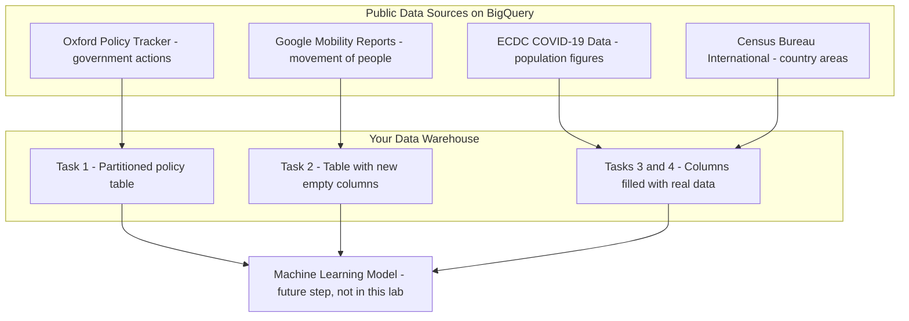
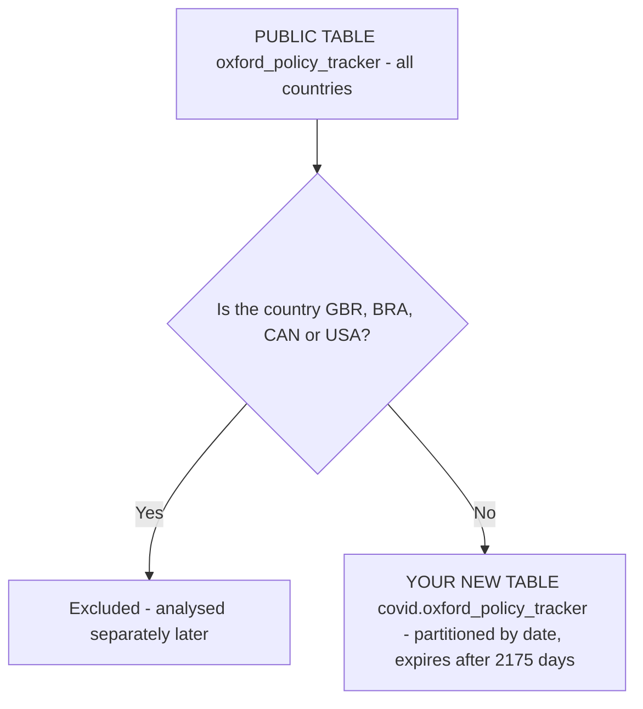
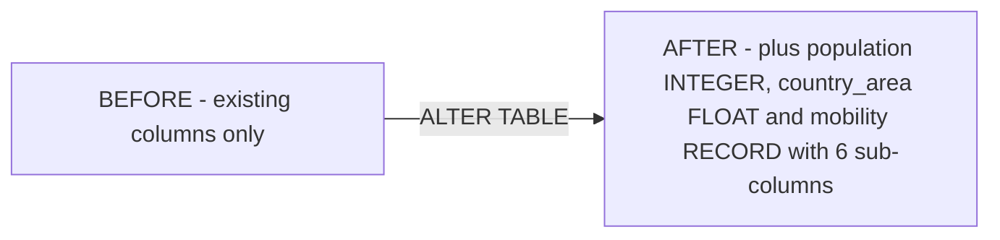
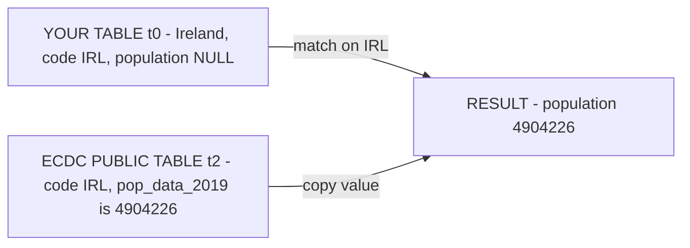
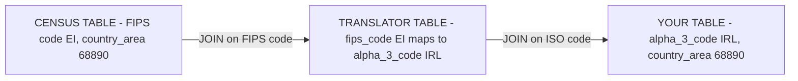
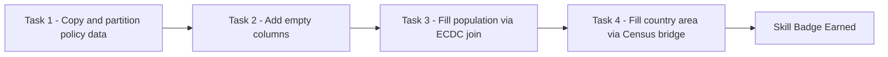

# Build a Data Warehouse with BigQuery: Challenge Lab (GSP340)

> **A beginner-friendly, step-by-step guide** — written so that even someone with a non-technical background can understand *what* we are doing, *why* we are doing it, and *how* each SQL query works.

> 🧭 **Learning path** (Build a Data Warehouse with BigQuery skill badge):
> [01 · GSP413 — Joins and Unions](../01-GSP413%20-%20Creating%20a%20Data%20Warehouse%20Through%20Joins%20and%20Unions/README.md) → [02 · GSP414 — Date-Partitioned Tables](../02-GSP414%20-%20Creating%20Date-Partitioned%20Tables%20in%20BigQuery/README.md) → [03 · GSP412 — Data Join Pitfalls](../03-GSP412%20-%20Troubleshooting%20and%20Solving%20Data%20Join%20Pitfalls/README.md) → [04 · GSP416 — JSON, Arrays & Structs](../04-GSP416%20-%20Working%20with%20JSON,%20Arrays,%20and%20Structs%20in%20BigQuery/README.md) → **05 · GSP340 — this Challenge Lab**
>
> **Prerequisites:** complete the earlier labs first — this challenge gives *no step-by-step instructions*. You need: `CREATE TABLE ... AS SELECT` and JOINs (from **GSP413**), `PARTITION BY` with `partition_expiration_days` (from **GSP414** — Task 1 here uses the exact same pattern with 2175 days instead of 730), deduplicating join sources with `DISTINCT` / `GROUP BY` (from **GSP412** — that's what prevents the "must match at most one source row" error in Tasks 3–4), and RECORD/STRUCT columns (from **GSP416** — Task 2 here adds a STRUCT column with six sub-fields).

---

## 📋 Table of Contents

1. [The Big Picture — What Is This Lab About?](#1-the-big-picture--what-is-this-lab-about)
2. [Key Concepts Explained Simply](#2-key-concepts-explained-simply)
3. [Task 1 — Create a Date-Partitioned Table](#3-task-1--create-a-date-partitioned-table)
4. [Task 2 — Add New Columns to a Table](#4-task-2--add-new-columns-to-a-table)
5. [Task 3 — Fill In the Population Column](#5-task-3--fill-in-the-population-column)
6. [Task 4 — Fill In the Country Area Column](#6-task-4--fill-in-the-country-area-column)
7. [Common Errors & How We Fixed Them](#7-common-errors--how-we-fixed-them)
8. [Quick Reference — All Queries in One Place](#8-quick-reference--all-queries-in-one-place)

---

## 1. The Big Picture — What Is This Lab About?

### The Scenario (in plain English)

Imagine you work for an **international public health organization** during the COVID-19 pandemic. The Data Science team wants to build a **machine learning model** that can *predict how many new COVID cases each country will report per day*.

But a machine learning model is like a student — it can only learn from the study material you give it. Your job is to **prepare that study material**: a single, clean, well-organized table containing all the "features" (input signals) the model needs, such as:

- What restrictions each government imposed (school closures, lockdowns, etc.)
- How many people live in each country (population)
- How big each country is (area)
- How people's movement changed (mobility — trips to shops, parks, workplaces, etc.)

### The Overall Data Flow



**Think of it like cooking a big meal:**
- Task 1 = getting the main ingredient and storing it properly (in date-labelled containers)
- Task 2 = putting empty bowls on the counter for the other ingredients
- Tasks 3 & 4 = actually filling those bowls with ingredients from the pantry

---

## 2. Key Concepts Explained Simply

Before diving in, here are the technical terms you'll meet — explained without jargon.

| Term | Simple Explanation |
|---|---|
| **BigQuery** | Google's giant online spreadsheet system. It can store billions of rows and answer questions about them in seconds using SQL. |
| **Dataset** | A **folder** inside BigQuery that holds related tables. (e.g., the folder `covid` holds our COVID tables.) |
| **Table** | Like one **sheet in Excel** — rows and columns of data. |
| **SQL** | The language we use to ask BigQuery questions or give it instructions ("create this", "update that"). |
| **Partitioned Table** | A table that is **physically split into sections by date** — like a filing cabinet with one drawer per day. When you ask "show me March 5th", BigQuery opens only *that* drawer instead of searching the whole cabinet. This makes queries **faster and cheaper**. |
| **Partition Expiry** | An automatic "shelf life". After a set number of days, old drawers (partitions) are automatically thrown away. We use **2175 days**. |
| **Schema** | The **blueprint of a table** — the list of column names and the type of data each holds (numbers, text, dates…). |
| **RECORD / STRUCT** | A **column that contains sub-columns** — like a folder inside a folder. Our `mobility` column contains six sub-columns (retail, grocery, parks, etc.). |
| **JOIN** | **Matching rows between two tables** using a shared value — like matching people in two guest lists by their name. |
| **UPDATE** | An instruction that **changes existing rows** in a table (here: filling in the empty columns). |
| **Public Dataset** | Free, ready-made data that Google hosts for everyone (COVID stats, census data, etc.). We *read* from these — we never modify them. |

### Why partition by date? (Visual)

```
WITHOUT partitioning:                WITH date partitioning:
┌─────────────────────────┐          ┌──────┬──────┬──────┬──────┐
│  One giant pile of      │          │Jan 01│Jan 02│Jan 03│ ...  │
│  millions of rows.      │          │drawer│drawer│drawer│      │
│  Every query scans      │          └──────┴──────┴──────┴──────┘
│  EVERYTHING. 💸 Slow.   │          Query for "Jan 02"? → open ONE
└─────────────────────────┘          drawer only. ⚡ Fast & cheap.
```

---

## 3. Task 1 — Create a Date-Partitioned Table

### 🎯 What we must achieve

1. Create a **new dataset** called `covid`.
2. Inside it, create a table `oxford_policy_tracker` that is:
   - **Partitioned by the `date` column**
   - Set to **expire partitions after 2175 days**
   - A **copy** of the public Oxford Policy Tracker table…
   - …but **excluding** four countries: 🇬🇧 UK (`GBR`), 🇧🇷 Brazil (`BRA`), 🇨🇦 Canada (`CAN`), 🇺🇸 USA (`USA`) — those get their own separate, deeper analysis later.

### 🖼️ What's happening visually



### Step 1 — Create the dataset (point-and-click)

1. In the **BigQuery Explorer** panel, click the **⋮ (three dots)** next to your project ID (e.g., `qwiklabs-gcp-00-6a4f298cff37`).
2. Select **Create dataset**.
3. Set **Dataset ID** = `covid`.
4. Set **Location type** = `US` (must match the source data's location, or queries will fail).
5. Click **Create dataset**.

> ⚠️ **Replace the project ID** in all queries below with *your own* lab project ID if it differs.

### Step 2 — Run the query

```sql
CREATE OR REPLACE TABLE `qwiklabs-gcp-00-6a4f298cff37.covid.oxford_policy_tracker`
PARTITION BY date
OPTIONS (
  partition_expiration_days = 2175
) AS
SELECT
  *
FROM
  `bigquery-public-data.covid19_govt_response.oxford_policy_tracker`
WHERE
  alpha_3_code NOT IN ('GBR', 'BRA', 'CAN', 'USA');
```

### 🔍 Line-by-line explanation

| Line | What it means in plain English |
|---|---|
| `CREATE OR REPLACE TABLE ...` | "Make a brand-new table at this address (project → dataset → table). If it already exists, overwrite it." |
| `PARTITION BY date` | "Split the table into daily drawers using the `date` column." |
| `OPTIONS (partition_expiration_days = 2175)` | "Automatically delete each daily drawer once it is 2175 days old." |
| `AS SELECT * FROM ...` | "Fill the new table by copying **every column and row** from the public source table…" |
| `WHERE alpha_3_code NOT IN ('GBR','BRA','CAN','USA')` | "…**except** rows where the 3-letter country code is UK, Brazil, Canada, or USA." |

✅ **Result:** A partitioned copy of the policy tracker, minus the four excluded countries. Click **Check my progress**.

---

## 4. Task 2 — Add New Columns to a Table

### 🎯 What we must achieve

The lab has pre-created a dataset `covid_data` containing the table `global_mobility_tracker_data`. We must **add new (empty) columns** to it — changing the *blueprint (schema)* only, not the data yet.

### 🖼️ Before vs. After



**The `mobility` column is special** — it's a **RECORD** (a column containing six sub-columns), like one labelled box on a shelf that itself contains six smaller labelled compartments. This keeps all the movement data neatly grouped together.

### The query

```sql
ALTER TABLE `qwiklabs-gcp-00-6a4f298cff37.covid_data.global_mobility_tracker_data`
ADD COLUMN population INT64,
ADD COLUMN country_area FLOAT64,
ADD COLUMN mobility STRUCT<
  avg_retail FLOAT64,
  avg_grocery FLOAT64,
  avg_parks FLOAT64,
  avg_transit FLOAT64,
  avg_workplace FLOAT64,
  avg_residential FLOAT64
>;
```

### 🔍 Explanation

| Piece | Meaning |
|---|---|
| `ALTER TABLE ... ADD COLUMN` | "Change the blueprint of this table by adding these new columns." No data is copied or deleted — the new columns are simply **empty (NULL)** for all existing rows. |
| `INT64` | BigQuery's name for a whole number (**INTEGER** in the task table). Good for population counts. |
| `FLOAT64` | BigQuery's name for a decimal number (**FLOAT** in the task table). Good for areas and averages. |
| `STRUCT< ... >` | BigQuery's SQL name for a **RECORD** — a column with named sub-fields inside it. |

> 💡 **Data-type name mapping** (why the query names differ from the task table):
>
> | Task says | BigQuery SQL says |
> |---|---|
> | INTEGER | `INT64` |
> | FLOAT | `FLOAT64` |
> | RECORD | `STRUCT` |
>
> They are the **same types** — just two naming conventions (the console/legacy names vs. GoogleSQL names).

> 🖱️ **Alternative:** You can also add these columns manually in the BigQuery console — open the table → **Schema** tab → **Edit schema** → **Add field**. The SQL way is just faster and repeatable.

✅ Click **Check my progress**.

---

## 5. Task 3 — Fill In the Population Column

### 🎯 What we must achieve

The table `covid_data.consolidate_covid_tracker_data` has an empty `population` column. We must fill it with **real 2019 population figures** from the **ECDC (European Centre for Disease Control)** public dataset.

A colleague gave us a **template query** (originally used for daily case counts). We adapt it for population.

### 🖼️ How the JOIN works (matching by country code)



Both tables use the **same 3-letter country code** (ISO alpha-3: `IRL`, `FRA`, `DEU`…), so matching rows is straightforward — like matching two contact lists using phone numbers.

### The query

```sql
UPDATE
  `qwiklabs-gcp-00-6a4f298cff37.covid_data.consolidate_covid_tracker_data` AS t0
SET
  t0.population = t2.pop_data_2019
FROM
  (SELECT DISTINCT country_territory_code, pop_data_2019
   FROM `bigquery-public-data.covid19_ecdc.covid_19_geographic_distribution_worldwide`) AS t2
WHERE t0.alpha_3_code = t2.country_territory_code;
```

### 🔍 Line-by-line explanation

| Piece | Meaning |
|---|---|
| `UPDATE ... AS t0` | "We are going to change rows in **our** table. Nickname it `t0`." |
| `SET t0.population = t2.pop_data_2019` | "Set our `population` column to the 2019 population value from the other table." |
| `FROM (SELECT DISTINCT ...) AS t2` | "Get a de-duplicated mini-list of (country code, population) pairs from the ECDC table. Nickname it `t2`." |
| `SELECT DISTINCT` | **Crucial!** The ECDC table has *one row per country per day* — the same country appears hundreds of times. `DISTINCT` collapses this to **one row per country**, because BigQuery's `UPDATE` requires exactly one matching source row per target row. |
| `WHERE t0.alpha_3_code = t2.country_territory_code` | "Match rows where the 3-letter country codes are identical." |

✅ Click **Check my progress**.

---

## 6. Task 4 — Fill In the Country Area Column

### 🎯 What we must achieve

Fill the empty `country_area` column in `consolidate_covid_tracker_data` using the **Census Bureau International** public dataset (`country_names_area` table).

### ⚠️ The Challenge: The tables don't speak the same language

Unlike Task 3, the Census table **does not have a 3-letter ISO country code**. Two common approaches exist:

- **Approach A (lab's hint):** Join on the full **country name** text (`country_name`), which exists in both tables.
- **Approach B (used here):** Use a **"translator" table** (`utility_us.country_code_iso`) that maps the Census table's FIPS codes to ISO 3-letter codes. This avoids name-spelling mismatches ("South Korea" vs "Korea, South").

### 🖼️ The two-step bridge



Think of it like this: the Census table speaks *French* (FIPS codes), your table speaks *English* (ISO codes), and the translator table is a bilingual dictionary connecting the two.

### The final (corrected) query

```sql
UPDATE
  `qwiklabs-gcp-00-6a4f298cff37.covid_data.consolidate_covid_tracker_data` AS t0
SET
  t0.country_area = t2.country_area
FROM (
  SELECT
    iso.alpha_3_code,
    MAX(census.country_area) AS country_area
  FROM
    `bigquery-public-data.census_bureau_international.country_names_area` AS census
  INNER JOIN
    `bigquery-public-data.utility_us.country_code_iso` AS iso
  ON
    census.country_code = iso.fips_code
  GROUP BY 1
) AS t2
WHERE
  t0.alpha_3_code = t2.alpha_3_code;
```

### 🔍 Line-by-line explanation

| Piece | Meaning |
|---|---|
| `INNER JOIN ... ON census.country_code = iso.fips_code` | "Match Census rows to translator rows using the FIPS code they both have." |
| `MAX(census.country_area) ... GROUP BY 1` | "If a country code accidentally matches **more than one** area value, keep just one (the maximum). Group everything down to **one row per country code**." *(See the error story below for why this was needed.)* |
| `SET t0.country_area = t2.country_area` | "Copy the area value into our table." |
| `WHERE t0.alpha_3_code = t2.alpha_3_code` | "Match on the ISO 3-letter code that the translator table gave us." |

✅ Click **Check my progress**.

---

## 7. Common Errors & How We Fixed Them

### ❌ Error: *"UPDATE/MERGE must match at most one source row for each target row"*

**When it happened:** Task 4, first attempt (before adding `MAX` + `GROUP BY`).

**What it means in plain English:**
An `UPDATE ... FROM` in BigQuery is like telling an assistant: *"For each row in my table, look up **the** matching value over there."* If the lookup finds **two or more** matching values for the same country, the assistant panics — *which one should I use?!* — and refuses to do anything.

```
YOUR TABLE                  LOOKUP RESULT (before fix)
┌────────────┐              ┌─────────────────────────┐
│ IRL │ ❓   │  ── match ──▶│ IRL │ 68,890            │   😱 TWO matches!
└────────────┘              │ IRL │ 68,883 (dup row)  │   Which one??
                            └─────────────────────────┘   → ERROR
```

**Why it happened:** the join between the Census table and the translator table produced **duplicate rows** for some country codes (the source tables contain some overlapping/duplicated entries).

**The fix:**
```sql
MAX(census.country_area) AS country_area   -- pick a single value
...
GROUP BY 1                                  -- collapse to ONE row per code
```
Now the lookup returns exactly **one** row per country → the assistant is happy → the `UPDATE` succeeds. ✅

> 💡 The same principle is why Task 3 needed `SELECT DISTINCT`: **always guarantee one source row per target row in an UPDATE…FROM.**

### ❌ Error: *"Not found: Dataset … was not found in location US"*

**Cause:** the `covid` dataset was created in the wrong region (e.g., EU) while the public source data lives in **US**.
**Fix:** delete and recreate the dataset with **Location type = US**. BigQuery cannot join tables across regions.

### ❌ "I can't see the pre-created `covid_data` dataset!"

**Cause:** the lab environment is still provisioning resources in the background.
**Fix:** wait 2–3 minutes and **refresh the browser page**. The dataset will appear.

### ❌ Progress check fails even though the query ran

Common causes:
- Wrong **project ID** in the query (must be *your* lab project).
- Dataset/table name typo (`covid` vs `covid_data` — Task 1 uses `covid`; Tasks 2–4 use the pre-created `covid_data`).
- Forgot the country exclusions in Task 1.
- Forgot `partition_expiration_days = 2175`.

---

## 8. Quick Reference — All Queries in One Place

> 🔁 Replace `qwiklabs-gcp-00-6a4f298cff37` with **your** project ID.

**Task 1** — Create dataset `covid` (via console), then:
```sql
CREATE OR REPLACE TABLE `qwiklabs-gcp-00-6a4f298cff37.covid.oxford_policy_tracker`
PARTITION BY date
OPTIONS (partition_expiration_days = 2175) AS
SELECT * FROM `bigquery-public-data.covid19_govt_response.oxford_policy_tracker`
WHERE alpha_3_code NOT IN ('GBR', 'BRA', 'CAN', 'USA');
```

**Task 2** — Add columns:
```sql
ALTER TABLE `qwiklabs-gcp-00-6a4f298cff37.covid_data.global_mobility_tracker_data`
ADD COLUMN population INT64,
ADD COLUMN country_area FLOAT64,
ADD COLUMN mobility STRUCT<
  avg_retail FLOAT64,
  avg_grocery FLOAT64,
  avg_parks FLOAT64,
  avg_transit FLOAT64,
  avg_workplace FLOAT64,
  avg_residential FLOAT64
>;
```

**Task 3** — Populate population:
```sql
UPDATE `qwiklabs-gcp-00-6a4f298cff37.covid_data.consolidate_covid_tracker_data` AS t0
SET t0.population = t2.pop_data_2019
FROM (
  SELECT DISTINCT country_territory_code, pop_data_2019
  FROM `bigquery-public-data.covid19_ecdc.covid_19_geographic_distribution_worldwide`
) AS t2
WHERE t0.alpha_3_code = t2.country_territory_code;
```

**Task 4** — Populate country area:
```sql
UPDATE `qwiklabs-gcp-00-6a4f298cff37.covid_data.consolidate_covid_tracker_data` AS t0
SET t0.country_area = t2.country_area
FROM (
  SELECT iso.alpha_3_code, MAX(census.country_area) AS country_area
  FROM `bigquery-public-data.census_bureau_international.country_names_area` AS census
  INNER JOIN `bigquery-public-data.utility_us.country_code_iso` AS iso
    ON census.country_code = iso.fips_code
  GROUP BY 1
) AS t2
WHERE t0.alpha_3_code = t2.alpha_3_code;
```

---

### 🏁 Summary of the Journey



**Key lessons learned:**
1. **Partitioning** = filing data into date drawers → faster, cheaper queries.
2. **RECORD/STRUCT** = a column that holds neatly grouped sub-columns.
3. **UPDATE…FROM** requires **exactly one source row per target row** — use `DISTINCT` or `GROUP BY` + aggregate (`MAX`) to guarantee it.
4. When two tables lack a common key, a **translator/bridge table** (or a shared text column like country name) can connect them.
