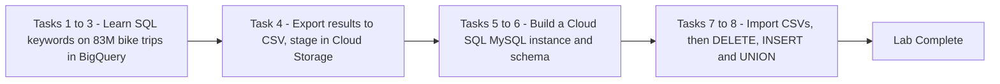

# Introduction to SQL for BigQuery and Cloud SQL (GSP281)

> **A beginner-friendly, step-by-step guide** — written so that even someone with a non-technical background can understand *what* we are doing, *why* we are doing it, and *how* each SQL query works.

---

## 📋 Table of Contents

1. [Where This Lab Fits — Prerequisites & Learning Path](#1-where-this-lab-fits--prerequisites--learning-path)
2. [The Big Picture — What Is This Lab About?](#2-the-big-picture--what-is-this-lab-about)
3. [Tools & Services Used in This Lab](#3-tools--services-used-in-this-lab)
4. [Key Concepts — SQL Keywords Explained Simply](#4-key-concepts--sql-keywords-explained-simply)
5. [Task 1 — Review the Basics of SQL](#5-task-1--review-the-basics-of-sql)
6. [Task 2 — Explore the BigQuery Console](#6-task-2--explore-the-bigquery-console)
7. [Task 3 — GROUP BY, COUNT, AS, and ORDER BY](#7-task-3--group-by-count-as-and-order-by)
8. [Task 4 — Export BigQuery Data to CSV Files](#8-task-4--export-bigquery-data-to-csv-files)
9. [Task 5 — Create a Cloud SQL Instance](#9-task-5--create-a-cloud-sql-instance)
10. [Task 6 — Create a Cloud SQL Database and Table](#10-task-6--create-a-cloud-sql-database-and-table)
11. [Task 7 — Upload CSV Files to Tables](#11-task-7--upload-csv-files-to-tables)
12. [Task 8 — Run Data Queries in Cloud SQL](#12-task-8--run-data-queries-in-cloud-sql)
13. [Quiz Answers — All in One Place](#13-quiz-answers--all-in-one-place)
14. [Quick Reference — All Queries in One Place](#14-quick-reference--all-queries-in-one-place)
15. [Command-Line Alternatives (Cloud Shell)](#15-command-line-alternatives-cloud-shell)

---

## 1. Where This Lab Fits — Prerequisites & Learning Path

This is **lab 1 of the "Derive Insights from BigQuery Data" skill badge** ([course 623](https://www.cloudskillsboost.google/course_templates/623)) — Week 2 of this study plan.

| # | Lab | What it teaches |
|---|---|---|
| **01** | **Introduction to SQL for BigQuery and Cloud SQL (GSP281)** | **SQL fundamentals, BigQuery console, Cloud SQL basics** |
| 02 | [BigQuery: Qwik Start - Console (GSP072)](../02-GSP072%20-%20BigQuery%20Qwik%20Start%20-%20Console/README.md) | Querying public tables via the web UI |
| 03 | [BigQuery: Qwik Start - Command Line (GSP071)](../03-GSP071%20-%20BigQuery%20Qwik%20Start%20-%20Command%20Line/README.md) | The `bq` command-line tool |
| 04 | [Explore an Ecommerce Dataset with SQL in BigQuery (GSP407)](../04-GSP407%20-%20Explore%20an%20Ecommerce%20Dataset%20with%20SQL%20in%20BigQuery/README.md) | Real-world exploratory analysis |
| 05 | [Troubleshooting Common SQL Errors with BigQuery (GSP408)](../05-GSP408%20-%20Troubleshooting%20Common%20SQL%20Errors%20with%20BigQuery/README.md) | Debugging syntax and logic errors |
| 06 | [Explore and Create Reports with Data Studio (GSP409)](../06-GSP409%20-%20Explore%20and%20Create%20Reports%20with%20Data%20Studio/README.md) | Visualizing BigQuery data |
| 07 | [Derive Insights from BigQuery Data: Challenge Lab (GSP787)](../07-GSP787%20-%20Challenge%20Lab/README.md) | Everything combined, no hand-holding |

### Prerequisites

**None** — this is an introductory lab that assumes little to no prior SQL experience. Familiarity with Cloud Storage and Cloud Shell is *recommended but not required* (this guide explains both as you meet them).

> ⚠️ **Very important lab tip:** log out of your personal/corporate Gmail account before starting, and run the lab in an **Incognito window** with the temporary student credentials only.

### Already know SQL?

The lab suggests these more advanced follow-ups if this feels too easy:
- [Weather Data in BigQuery](https://www.cloudskillsboost.google/focuses/609?parent=catalog)
- [Analyzing Natality Data Using Agent Platform and BigQuery](https://www.cloudskillsboost.google/catalog?keywords=natality)

> 💡 **Connection to Week 1:** if you completed the [Week 1 labs](../../Week%201%20-%20Build%20a%20Data%20Warehouse%20with%20BigQuery/01-GSP413%20-%20Creating%20a%20Data%20Warehouse%20Through%20Joins%20and%20Unions/README.md), the BigQuery half of this lab will feel familiar (SELECT/WHERE/GROUP BY appeared throughout). What's *new* here is the **Cloud SQL** half — a completely different database service — and the export pipeline connecting the two.

---

## 2. The Big Picture — What Is This Lab About?

### The Scenario (in plain English)

**SQL (Structured Query Language)** is the standard language for asking questions of structured data — from writing transaction records into relational databases to petabyte-scale analysis. This lab teaches you the core vocabulary in two very different "gyms":

- **First half — BigQuery:** learn the fundamental keywords (`SELECT`, `FROM`, `WHERE`, `GROUP BY`, `COUNT`, `AS`, `ORDER BY`) by interrogating a public dataset of **83.4 million London bikeshare trips**.
- **Second half — Cloud SQL:** export your query results as CSV files, stage them in a **Cloud Storage bucket**, load them into a **MySQL database you build yourself**, and practise the *data-manipulation* keywords (`CREATE`, `USE`, `DELETE`, `INSERT INTO`, `UNION`).

### The Overall Data Flow


**Think of it like a kitchen workflow:** BigQuery is the industrial warehouse where you pick your ingredients (query huge data), the CSV files are your shopping bags, the Cloud Storage bucket is the car boot that carries them home, and Cloud SQL is your home kitchen where you store, trim, and combine them.

### Why two database services?

| | **BigQuery** | **Cloud SQL** |
|---|---|---|
| Built for | **Analysis** (OLAP) — scanning billions of rows fast | **Transactions** (OLTP) — many small reads/writes |
| Scale | Petabytes | Gigabytes to terabytes |
| You manage | Nothing (serverless) | The instance (size, zones, versions) |
| Typical use | Dashboards, data science, reporting | Website/app backends, inventory, user accounts |
| SQL flavour | GoogleSQL | MySQL / PostgreSQL / SQL Server |

---

## 3. Tools & Services Used in This Lab

A quick introduction to every Google Cloud product you'll touch, with links for deeper reading:

| Tool / Service | What it is (in one breath) | Learn more |
|---|---|---|
| **BigQuery** | Google's fully-managed, serverless, petabyte-scale **data warehouse**. You write SQL; Google handles all the servers. Query huge datasets in seconds, pay per byte scanned. | [Docs](https://cloud.google.com/bigquery/docs) · [What is BigQuery?](https://cloud.google.com/bigquery/docs/introduction) |
| **Cloud SQL** | Fully-managed **relational database service** for MySQL, PostgreSQL, and SQL Server. Google handles patching, backups, and replication; you get a normal database endpoint. Accepts imports as `.sql` dumps or `.csv` files. | [Docs](https://cloud.google.com/sql/docs) · [MySQL overview](https://cloud.google.com/sql/docs/mysql/introduction) |
| **Cloud Storage** | Object storage for **any kind of file** (our CSVs here). Files live in *buckets* with globally-unique names. The standard "staging area" for moving data between services. | [Docs](https://cloud.google.com/storage/docs) · [Buckets explained](https://cloud.google.com/storage/docs/buckets) |
| **Cloud Shell** | A **free browser-based terminal** with a small Linux VM behind it — `gcloud`, `bq`, and `mysql` clients pre-installed. No local setup needed. | [Docs](https://cloud.google.com/shell/docs) |
| **gcloud CLI** | The command-line tool for Google Cloud. This lab uses `gcloud sql connect` to open a MySQL session against your instance. | [Docs](https://cloud.google.com/sdk/gcloud) |
| **MySQL** | The world's most popular open-source relational database — the engine running *inside* your Cloud SQL instance. Its prompt (`mysql>`) is where the second half of the lab happens. | [MySQL 8.0 reference](https://dev.mysql.com/doc/refman/8.0/en/) |
| **BigQuery public datasets** | Free datasets Google hosts for everyone (here: `bigquery-public-data.london_bicycles`). You query them in place — no copying needed. | [Public datasets](https://cloud.google.com/bigquery/public-data) |
| *(mentioned only)* **Cloud Vision** | The lab notes that *unstructured* data like images can't be queried with SQL — services like Cloud Vision handle those instead. | [Docs](https://cloud.google.com/vision/docs) |

---

## 4. Key Concepts — SQL Keywords Explained Simply

| Keyword / Term | Simple Explanation |
|---|---|
| **Structured data** | Data with clear rules and formatting — rows and columns, like a spreadsheet. SQL's home turf. (Unstructured data = images, audio… SQL can't touch those natively.) |
| **Table** | Rows and columns of data — one "sheet". |
| **Database** | A collection of one or more tables. |
| **`SELECT`** | *What* fields (columns) you want. |
| **`FROM`** | *Where* (which table) to pull them from. |
| **`WHERE`** | *Filter* — only rows matching a condition. |
| **`GROUP BY`** | *Collapse* rows sharing a value into unique entries — great for categories. |
| **`COUNT(*)`** | *How many* rows share the same criteria — a natural partner for GROUP BY. |
| **`AS`** | *Rename* — gives a column or table a friendly alias (e.g. `COUNT(*) AS num_starts`). |
| **`ORDER BY`** | *Sort* the results, ascending (default) or descending (`DESC`). |
| **`CREATE DATABASE / TABLE`** | *Build* a new database or table (with typed columns like `VARCHAR(255)` for text up to 255 chars, `INT` for whole numbers). |
| **`USE`** | *Point at* which database your next commands should run in (MySQL). |
| **`DELETE FROM ... WHERE`** | *Remove* all rows matching a condition. |
| **`INSERT INTO ... VALUES`** | *Add* a new row with the values you specify. |
| **`UNION`** | *Stack* the results of two SELECT queries into one result-set (met before in [Week 1 lab 01](../../Week%201%20-%20Build%20a%20Data%20Warehouse%20with%20BigQuery/01-GSP413%20-%20Creating%20a%20Data%20Warehouse%20Through%20Joins%20and%20Unions/README.md)!). |
| **Project → Dataset → Table** | BigQuery's hierarchy: projects contain datasets, datasets contain tables. |

---

## 5. Task 1 — Review the Basics of SQL

No console needed yet — just the mental model. Given an `example_table` with columns USER, PRICE, SHIPPED:

```sql
-- one column
SELECT USER FROM example_table

-- two columns (comma-separated)
SELECT USER, SHIPPED FROM example_table

-- filtered: only users whose packages shipped
SELECT USER FROM example_table WHERE SHIPPED='YES'
```

Read them aloud and they almost parse as English: *"Select the user from the example table where shipped is yes."* That's the trick to SQL — figure out your question first, then translate it.

> **📝 Quiz:** SELECT = specifies fields to pull · FROM = specifies the table · WHERE = filters for specific column values.

---

## 6. Task 2 — Explore the BigQuery Console

### 🎯 What we must achieve

Open BigQuery, star the public-data project, and run your first real queries on 83.4 million bike trips.

### Steps

1. **Navigation menu → BigQuery → Done.** The right side is the query **Editor** (+ Query history below); the left pane is the **Explorer**.
2. Your project is empty (nothing queryable yet). Add public data: **Explorer → + Add data → Star a project by name** → type `bigquery-public-data` → **Star**.
3. In Explorer, open **bigquery-public-data → Datasets → london_bicycles**. It has two tables: `cycle_hire` and `cycle_stations`.
4. Click **cycle_hire → Preview** tab. Bottom-right shows **83,434,866 rows** — every London bikeshare trip 2015–2017.

> 📌 Starring doesn't switch projects — your jobs still run (and bill) in *your* lab project; you're just reading someone else's public tables.

### First queries

```sql
SELECT end_station_name FROM `bigquery-public-data.london_bicycles.cycle_hire`;
```
→ all 83,434,866 rows, one column.

```sql
SELECT * FROM `bigquery-public-data.london_bicycles.cycle_hire` WHERE duration>=1200;
```
→ **26,441,016 rows**. `duration` is in seconds, so 1200 = 20 minutes; `SELECT *` returns every column. As a fraction (26.4M / 83.4M), **~30% of rides last 20+ minutes**.

> **📝 Quiz:** BigQuery = the fully-managed petabyte-scale data warehouse · Projects contain datasets, datasets contain tables = **True** · You can access publicly shared datasets from other projects = **True**.

---

## 7. Task 3 — GROUP BY, COUNT, AS, and ORDER BY

### 🎯 What we must achieve

Move from *reading* rows to *summarizing* them — the four keywords that power almost every report.

### GROUP BY — unique categories

```sql
SELECT start_station_name FROM `bigquery-public-data.london_bicycles.cycle_hire` GROUP BY start_station_name;
```
→ **954 rows** — the number of *distinct* starting stations (without GROUP BY you'd get all 83.4M rows back).

### COUNT — how many per category

```sql
SELECT start_station_name, COUNT(*) FROM `bigquery-public-data.london_bicycles.cycle_hire` GROUP BY start_station_name;
```
→ one row per station with the number of rides starting there.

### AS — name your columns

```sql
SELECT start_station_name, COUNT(*) AS num_starts FROM `bigquery-public-data.london_bicycles.cycle_hire` GROUP BY start_station_name;
```
→ the ugly `COUNT(*)` column header becomes `num_starts`. Small thing, huge sanity-saver on big queries.

### ORDER BY — sort three ways

```sql
-- alphabetical by station
SELECT start_station_name, COUNT(*) AS num FROM `bigquery-public-data.london_bicycles.cycle_hire` GROUP BY start_station_name ORDER BY start_station_name;

-- lowest ride-count first
SELECT start_station_name, COUNT(*) AS num FROM `bigquery-public-data.london_bicycles.cycle_hire` GROUP BY start_station_name ORDER BY num;

-- highest ride-count first
SELECT start_station_name, COUNT(*) AS num FROM `bigquery-public-data.london_bicycles.cycle_hire` GROUP BY start_station_name ORDER BY num DESC;
```

→ Winner: **"Hyde Park Corner, Hyde Park"** with **671,688** starts — yet that's still **< 1%** of all rides (671,688 / 83,434,866).

> **📝 Quiz:** GROUP BY = aggregates rows sharing criteria into unique entries · COUNT = counts rows sharing criteria · AS = creates an alias · ORDER BY = sorts results.

---

## 8. Task 4 — Export BigQuery Data to CSV Files

### 🎯 What we must achieve

Get two query results *out* of BigQuery (as CSVs) and *into* a Cloud Storage bucket — because **Cloud SQL only accepts imports as `.sql` dumps or `.csv` files**.

### Step 1 — Download two query results as CSV

With the `ORDER BY num DESC` start-station query still in your editor: **Save results → Local download → CSV** → save as `start_station_name.csv`.

Then run the twin query for *end* stations and download it as `end_station_name.csv`:

```sql
SELECT end_station_name, COUNT(*) AS num FROM `bigquery-public-data.london_bicycles.cycle_hire` GROUP BY end_station_name ORDER BY num DESC;
```

### Step 2 — Create a Cloud Storage bucket

1. **Navigation menu → Cloud Storage → Buckets → Create Bucket.**
2. Name it something **globally unique** — your lab **Project ID** works perfectly (bucket names are unique across *all* of Google Cloud, like domain names).
3. Keep defaults → **Create** (confirm the "Public access will be prevented" dialog).

✅ **Check my progress.**

### Step 3 — Upload the CSVs

In your new bucket: **Upload → Upload files** → select `start_station_name.csv` → repeat for `end_station_name.csv`. Both now appear in the bucket's Objects list (refresh if needed).

✅ **Check my progress.**

---

## 9. Task 5 — Create a Cloud SQL Instance

### 🎯 What we must achieve

Spin up your own managed MySQL server. Unlike serverless BigQuery, here *you* choose the size, version, and zones — this is the "instance" you manage.

### Settings

| Setting | Value |
|---|---|
| Get started (MySQL tab) | **Create Development Instance** |
| Cloud SQL edition | **Enterprise** |
| Edition preset | **Development** (4 vCPU, 16 GB RAM, 100 GB storage, single zone) ⚠️ *bigger presets get your lab terminated* |
| Database version | **MySQL 8.0** (default minor version) |
| Instance ID | `my-demo` |
| Password | `ChangeMe1!` |
| Zonal availability | **Multiple zones (Highly available)** |
| Primary zone | `europe-west1-d` (secondary: default) |

Click **Create instance** — it takes a few minutes; wait for the green checkmark.

> 💡 "Multiple zones" means Google keeps a standby copy in a second zone and fails over automatically — the kind of resilience you'd want for a production app database.

✅ **Check my progress.**

---

## 10. Task 6 — Create a Cloud SQL Database and Table

### 🎯 What we must achieve

Connect to your instance from Cloud Shell and build the `bike` database with two empty tables shaped to receive the CSVs.

### Step 1 — Connect

On the instance page → **Connect to this instance → Open Cloud Shell** → run the pre-populated command:

```bash
gcloud sql connect my-demo --user=root --quiet
```

Enter the password `ChangeMe1!` (the cursor won't move while typing — that's normal). You'll land at the `mysql>` prompt.

> If you get *"Operation failed because another operation was already in progress"*, the instance is still being created — wait and retry.

### Step 2 — Create the database and tables

```sql
CREATE DATABASE bike;
```
→ `Query OK, 1 row affected` ✅ **Check my progress.**

```sql
USE bike;
CREATE TABLE london1 (start_station_name VARCHAR(255), num INT);

USE bike;
CREATE TABLE london2 (end_station_name VARCHAR(255), num INT);
```

| Piece | Meaning |
|---|---|
| `USE bike` | "Run my next commands inside the `bike` database." |
| `VARCHAR(255)` | A variable-length text column holding up to 255 characters — station names. |
| `INT` | A whole-number column — the ride counts. |

Confirm both tables exist but are empty:

```sql
SELECT * FROM london1;
SELECT * FROM london2;
```
→ `Empty set` for both — no data loaded yet. **Leave Cloud Shell open.**

---

## 11. Task 7 — Upload CSV Files to Tables

### 🎯 What we must achieve

Import the bucket-staged CSVs into the MySQL tables.

For each file, on your Cloud SQL instance page click **Import**:

| Setting | File 1 | File 2 |
|---|---|---|
| File format | CSV | CSV |
| Cloud Storage file | your bucket → `start_station_name.csv` | your bucket → `end_station_name.csv` |
| Database | `bike` | `bike` |
| Table | `london1` | `london2` |

Back in Cloud Shell, verify:

```sql
SELECT * FROM london1;   -- 955 rows
SELECT * FROM london2;   -- 959 rows
```

> 🤔 954 distinct stations but 955 rows? The extra row is the **CSV header line** (`start_station_name,num`), which got imported as data. Task 8 deletes it.

---

## 12. Task 8 — Run Data Queries in Cloud SQL

### DELETE — remove the header rows

```sql
DELETE FROM london1 WHERE num=0;
DELETE FROM london2 WHERE num=0;
```

The header text "num" isn't a number, so it landed as `0` in the INT column — deleting `WHERE num=0` removes exactly those stowaway header rows. Note DELETE removes *all rows matching the condition*, not "the first row".

### INSERT INTO — add a row

```sql
INSERT INTO london1 (start_station_name, num) VALUES ("test destination", 1);
```

New row at the bottom of `london1`: columns listed in the first parentheses, values after `VALUES`.

### UNION — combine two result-sets

Find every station where **more than 100,000 rides start OR end**:

```sql
SELECT start_station_name AS top_stations, num FROM london1 WHERE num>100000
UNION
SELECT end_station_name, num FROM london2 WHERE num>100000
ORDER BY top_stations DESC;
```

| Piece | Meaning |
|---|---|
| first SELECT | Busy *starting* stations, with `start_station_name` aliased to `top_stations`. |
| second SELECT | Busy *ending* stations. |
| `UNION` | Stacks the two result-sets; the first query's column names (`top_stations`, `num`) win. |
| `ORDER BY top_stations DESC` | Sorts the combined list alphabetically, Z→A. |

**Insight:** 13 of the 14 top stations appear on *both* lists — London's busiest bikeshare points are busy in both directions. 🏁 **Lab complete!**

---

## 13. Quiz Answers — All in One Place

| # | Question | Answer |
|---|---|---|
| 1 | Keyword that specifies the fields to pull from your dataset | **SELECT** |
| 2 | Specifies what table(s) to pull data from | **FROM** |
| 3 | Filters tables for specific column values | **WHERE** |
| 4 | Fully-managed petabyte-scale data warehouse on Google Cloud | **BigQuery** |
| 5 | Projects contain datasets, and datasets contain tables | **True** |
| 6 | BigQuery can access datasets shared publicly from other projects | **True** |
| 7 | Aggregates rows sharing common criteria, returns unique entries | **GROUP BY** |
| 8 | Function that counts rows sharing common criteria | **COUNT** |
| 9 | Creates an alias of a table or column | **AS** |
| 10 | Sorts returned data ascending/descending by a criteria | **ORDER BY** |

**Key numbers:** 83,434,866 total trips · 26,441,016 trips ≥ 20 min (~30%) · 954 distinct start stations · Hyde Park Corner tops with 671,688 starts (< 1% of total) · london1 = 955 rows, london2 = 959 (headers included until DELETE).

---

## 14. Quick Reference — All Queries in One Place

**BigQuery half (Tasks 2–4):**
```sql
SELECT end_station_name FROM `bigquery-public-data.london_bicycles.cycle_hire`;

SELECT * FROM `bigquery-public-data.london_bicycles.cycle_hire` WHERE duration>=1200;

SELECT start_station_name FROM `bigquery-public-data.london_bicycles.cycle_hire` GROUP BY start_station_name;

SELECT start_station_name, COUNT(*) AS num FROM `bigquery-public-data.london_bicycles.cycle_hire`
GROUP BY start_station_name ORDER BY num DESC;   -- save as start_station_name.csv

SELECT end_station_name, COUNT(*) AS num FROM `bigquery-public-data.london_bicycles.cycle_hire`
GROUP BY end_station_name ORDER BY num DESC;     -- save as end_station_name.csv
```

**Console steps (Tasks 4–5, 7):** create bucket named after your Project ID → upload both CSVs → create Cloud SQL MySQL 8.0 instance `my-demo` (Enterprise / Development preset, multi-zone, primary `europe-west1-d`) → Import each CSV into `bike.london1` / `bike.london2`.

**Cloud SQL half (Tasks 6–8):**
```sql
-- connect first:  gcloud sql connect my-demo --user=root --quiet
CREATE DATABASE bike;

USE bike;
CREATE TABLE london1 (start_station_name VARCHAR(255), num INT);
CREATE TABLE london2 (end_station_name VARCHAR(255), num INT);

DELETE FROM london1 WHERE num=0;
DELETE FROM london2 WHERE num=0;

INSERT INTO london1 (start_station_name, num) VALUES ("test destination", 1);

SELECT start_station_name AS top_stations, num FROM london1 WHERE num>100000
UNION
SELECT end_station_name, num FROM london2 WHERE num>100000
ORDER BY top_stations DESC;
```

---

## 15. Command-Line Alternatives (Cloud Shell)

This lab clicks through **four different services** — which makes it the perfect one to redo entirely from **Cloud Shell**. Every UI step below has a command equivalent (`gcloud`, `bq`, and `gcloud storage` are pre-installed).

### Universal setup commands (work in any lab)

```bash
# who am I / which project?
gcloud auth list
gcloud config list project

# select (switch to) a project
gcloud config set project PROJECT_ID

# see enabled service APIs, and enable the ones this lab needs
gcloud services list --enabled
gcloud services enable bigquery.googleapis.com storage.googleapis.com sqladmin.googleapis.com

# grant a role to a user on the project (IAM)
gcloud projects add-iam-policy-binding PROJECT_ID \
  --member="user:someone@example.com" --role="roles/cloudsql.client"
```

### UI step → CLI equivalent for this lab

| Console (UI) step | Cloud Shell command |
|---|---|
| Run a BigQuery query (Tasks 2–3) | `bq query --use_legacy_sql=false 'SELECT start_station_name, COUNT(*) AS num FROM \`bigquery-public-data.london_bicycles.cycle_hire\` GROUP BY start_station_name ORDER BY num DESC'` |
| Task 4: Save results → Local download → CSV | `bq query --use_legacy_sql=false --format=csv --max_rows=1000 'SELECT ...' > start_station_name.csv` |
| Task 4: Create a Cloud Storage **bucket** | `gcloud storage buckets create gs://$GOOGLE_CLOUD_PROJECT --location=US` *(older tool: `gsutil mb gs://$GOOGLE_CLOUD_PROJECT`)* |
| Task 4: Upload files to the bucket | `gcloud storage cp start_station_name.csv end_station_name.csv gs://$GOOGLE_CLOUD_PROJECT/` |
| List what's in a bucket | `gcloud storage ls gs://$GOOGLE_CLOUD_PROJECT/` |
| Task 5: Create the Cloud SQL **instance** | `gcloud sql instances create my-demo --database-version=MYSQL_8_0 --edition=enterprise --cpu=4 --memory=16GB --zone=europe-west1-d --availability-type=REGIONAL --root-password='ChangeMe1!'` |
| Wait for the green checkmark | `gcloud sql instances describe my-demo --format='value(state)'` → `RUNNABLE` |
| Task 6: Connect to the instance | `gcloud sql connect my-demo --user=root --quiet` (same as the lab — this *is* the CLI way) |
| Task 6: Create the database | `gcloud sql databases create bike --instance=my-demo` *(or `CREATE DATABASE bike;` at the mysql> prompt, as in the lab)* |
| Task 7: **Import** CSV into a table | `gcloud sql import csv my-demo gs://$GOOGLE_CLOUD_PROJECT/start_station_name.csv --database=bike --table=london1` (repeat for `end_station_name.csv` → `london2`) |
| IAM detail behind that import | The import runs as the instance's **service account** — if it can't read your bucket, grant it access: `gcloud storage buckets add-iam-policy-binding gs://$GOOGLE_CLOUD_PROJECT --member="serviceAccount:$(gcloud sql instances describe my-demo --format='value(serviceAccountEmailAddress)')" --role="roles/storage.objectViewer"` |

> 💡 **The pattern to remember:** `gcloud <service> <thing> <verb>` — `gcloud sql instances create`, `gcloud sql databases create`, `gcloud storage buckets create`. Once you see the grammar, you can guess most commands (and `gcloud <anything> --help` fills the gaps).

---

### 💎 Beyond the Lab — Pro Tips

Extra details the lab doesn't tell you, worth knowing for real work and the certification exam:

- **Why can't WHERE use an alias?** SQL doesn't run in the order you write it. Logical execution order: `FROM → WHERE → GROUP BY → HAVING → SELECT → ORDER BY → LIMIT` — the `SELECT` (where `AS num` is born) runs *after* `WHERE`, which is why `WHERE num > 100` fails but `ORDER BY num` works.
- **Practice for free:** the [BigQuery Sandbox](https://cloud.google.com/bigquery/docs/sandbox) gives you BigQuery *without a billing account* — perfect for rerunning these queries outside lab time.
- **Cloud SQL bills by the hour while running** (unlike serverless BigQuery). On your own account, stop an idle instance with `gcloud sql instances patch my-demo --activation-policy=NEVER` — and know that the lab's "Multiple zones" HA choice roughly **doubles** the cost.
- **The header-row problem has a cleaner fix in BigQuery:** `bq load --skip_leading_rows=1 ...` skips CSV headers at load time. Cloud SQL's import has no such flag — that's the real reason this lab needed the `DELETE FROM ... WHERE num=0` trick.
- **`gcloud sql connect` quietly does an IAM-ish favor:** it temporarily allowlists your client IP on the instance for ~5 minutes — that's why the connection "just works" from Cloud Shell without firewall setup.
- **Exam classic — pick the right database:** frequent single-row reads/writes (shopping carts, user accounts) → **Cloud SQL**; scanning millions of rows for analysis → **BigQuery**. This exact trade-off appears in cert questions constantly.
- **`WHERE duration>=1200` scanned the whole table** — after Week 1's partitioning lab you know the fix: partition by date (or cluster by duration) so filters prune data instead of scanning 83M rows.

---

### 🏁 Summary of the Journey



**Key lessons learned:**
1. The seven reading keywords — `SELECT`, `FROM`, `WHERE`, `GROUP BY`, `COUNT`, `AS`, `ORDER BY` — cover a huge share of everyday analysis.
2. **BigQuery = analysis at scale, Cloud SQL = managed transactional databases** — same SQL language, very different jobs.
3. **Cloud Storage buckets are the universal staging area** for moving data between Google Cloud services (Cloud SQL imports only `.sql` or `.csv`).
4. CSV imports bring their **header row along as data** — clean it with a targeted `DELETE`.
5. `UNION` stacks result-sets; the *first* query's column names/aliases win.
6. In Cloud SQL *you* pick instance size, version, and zones — "Multiple zones" buys automatic failover.
