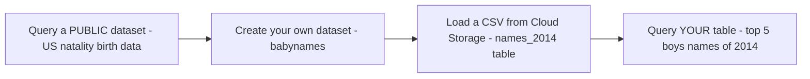
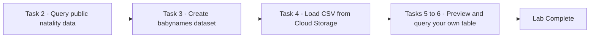

# BigQuery: Qwik Start - Console (GSP072)

> **A beginner-friendly, step-by-step guide** — written so that even someone with a non-technical background can understand *what* we are doing, *why* we are doing it, and *how* each SQL query works.

---

## 📋 Table of Contents

1. [Where This Lab Fits — Prerequisites & Learning Path](#1-where-this-lab-fits--prerequisites--learning-path)
2. [The Big Picture — What Is This Lab About?](#2-the-big-picture--what-is-this-lab-about)
3. [Tools & Services Used in This Lab](#3-tools--services-used-in-this-lab)
4. [Task 1 — Open BigQuery](#4-task-1--open-bigquery)
5. [Task 2 — Query a Public Dataset](#5-task-2--query-a-public-dataset)
6. [Task 3 — Create a New Dataset](#6-task-3--create-a-new-dataset)
7. [Task 4 — Load Data into a New Table](#7-task-4--load-data-into-a-new-table)
8. [Tasks 5–6 — Preview and Query Your Custom Table](#8-tasks-56--preview-and-query-your-custom-table)
9. [Quiz Answer](#9-quiz-answer)
10. [Quick Reference — All Steps in One Place](#10-quick-reference--all-steps-in-one-place)
11. [Command-Line Alternatives (Cloud Shell)](#11-command-line-alternatives-cloud-shell)

---

## 1. Where This Lab Fits — Prerequisites & Learning Path

This is **lab 2 of the "Derive Insights from BigQuery Data" skill badge** ([course 623](https://www.cloudskillsboost.google/course_templates/623)) — Week 2 of this study plan.

| # | Lab | What it teaches |
|---|---|---|
| 01 | [Introduction to SQL for BigQuery and Cloud SQL (GSP281)](../01-GSP281%20-%20Introduction%20to%20SQL%20for%20BigQuery%20and%20Cloud%20SQL/README.md) | SQL fundamentals, BigQuery + Cloud SQL |
| **02** | **BigQuery: Qwik Start - Console (GSP072)** | **The full BigQuery loop via the web UI: query public data → create dataset → load a file → query it** |
| 03 | [BigQuery: Qwik Start - Command Line (GSP071)](../03-GSP071%20-%20BigQuery%20Qwik%20Start%20-%20Command%20Line/README.md) | The same loop, done with the `bq` tool |
| 04 | Explore an Ecommerce Dataset with SQL in BigQuery (GSP407) | Real-world exploratory analysis |
| 05 | Troubleshooting Common SQL Errors with BigQuery (GSP408) | Debugging syntax and logic errors |
| 06 | Explore and Create Reports with Data Studio (GSP409) | Visualizing BigQuery data |
| 07 | Derive Insights from BigQuery Data: Challenge Lab (GSP787) | Everything combined, no hand-holding |

### Prerequisites

Just [lab 01](../01-GSP281%20-%20Introduction%20to%20SQL%20for%20BigQuery%20and%20Cloud%20SQL/README.md) — you already know `SELECT / FROM / WHERE / ORDER BY / LIMIT` and how datasets contain tables. This 15-minute lab cements the **console workflow**; lab 03 repeats the identical loop **on the command line**, which is a great compare-and-contrast pair.

---

## 2. The Big Picture — What Is This Lab About?

### The Scenario (in plain English)

Storing and querying massive datasets is slow and expensive without the right infrastructure. **BigQuery** solves this: an enterprise data warehouse where Google's infrastructure does the heavy lifting and you just write SQL. You control access to the project and the data based on business needs (e.g., letting others view or query your data).

You can talk to BigQuery three ways — the **Console (this lab)**, the **command-line tool (`bq`, next lab)**, or the **REST API** via client libraries (Java, .NET, Python) — plus third-party tools for visualization and loading.

This lab walks the smallest complete BigQuery loop:



**Think of it like a library:** first you read a book that's already on the public shelf (natality data), then you get your own shelf (dataset), put your own book on it (load the CSV), and read that one too (query it). Same reading skills both times — that's the point of Task 6: *querying your own table is identical to querying a public one.*

---

## 3. Tools & Services Used in This Lab

| Tool / Service | What it is (in one breath) | Learn more |
|---|---|---|
| **BigQuery** | Google's fully-managed enterprise **data warehouse** — super-fast SQL on massive datasets, no servers to manage, access-controlled per project and dataset. | [Docs](https://cloud.google.com/bigquery/docs) · [Quickstart (console)](https://cloud.google.com/bigquery/docs/quickstarts/query-public-dataset-console) |
| **Query Validator** | The green/red check in the editor: green = valid SQL *plus* an estimate of the data to be processed (your cost preview) **before** you run. | [Estimating costs](https://cloud.google.com/bigquery/docs/best-practices-costs) |
| **Cloud Storage** | Object storage where the lab's source file (`yob2014.txt`) lives; BigQuery loads data straight from a `gs://` path. | [Docs](https://cloud.google.com/storage/docs) |
| **Cloud Shell** | Free browser terminal with `gcloud` pre-installed — used at the start to check `gcloud auth list` / `gcloud config list project`. Persistent 5 GB home directory. | [Docs](https://cloud.google.com/shell/docs) |
| **BigQuery public datasets** | Google-hosted free datasets (here: `bigquery-public-data.samples.natality`, US birth data). Browse more via **+ Add → Public Datasets**. | [Public datasets](https://cloud.google.com/bigquery/public-data) |
| **BigQuery REST API / client libraries** | The third access path (not used hands-on here) — Java, .NET, Python, and more. | [API reference](https://cloud.google.com/bigquery/docs/reference/rest) |

---

## 4. Task 1 — Open BigQuery

**Navigation menu → BigQuery → Done** (dismissing the welcome box). You've done this in every lab so far — the Editor on the right, the Explorer pane on the left.

> Setup tip from the lab: activate **Cloud Shell** first and confirm your identity/project with `gcloud auth list` and `gcloud config list project` — a good habit before touching any resources.

---

## 5. Task 2 — Query a Public Dataset

### 🎯 What we must achieve

Run your first query against a Google-provided public table — no setup, no loading, it's just *there*.

```sql
#standardSQL
SELECT
  weight_pounds, state, year, gestation_weeks
FROM
  `bigquery-public-data.samples.natality`
ORDER BY weight_pounds DESC LIMIT 10;
```

| Piece | Meaning |
|---|---|
| `bigquery-public-data.samples.natality` | US **natality** (birth rate) data — a sample public table, addressed by its full `project.dataset.table` name. |
| `ORDER BY weight_pounds DESC LIMIT 10` | The 10 heaviest recorded birth weights. |
| The **green check** before running | The Query Validator: query is valid *and* here's how much data it will process — that's how you estimate cost **before** spending it. |

Click **Run** → 10 rows. ✅ **Check my progress.**

> 💡 Browse other public datasets: **+ Add → Public Datasets**, then search "bigquery public data" in the Marketplace.

---

## 6. Task 3 — Create a New Dataset

### 🎯 What we must achieve

To load *custom* data you first need a **dataset** — the folder that holds tables and controls access to them.

1. In the **Explorer** pane, next to your project ID click **View actions (⋮) → Create dataset**.
2. **Dataset ID** = `babynames`; leave everything else at defaults.
3. **Create dataset.**

✅ **Check my progress.**

---

## 7. Task 4 — Load Data into a New Table

### 🎯 What we must achieve

Create a table inside `babynames` filled from a file in Cloud Storage — ~7 MB of popular baby names from the **US Social Security Administration**.

**View actions (⋮)** on the `babynames` dataset → **Create table**, then:

| Field | Value |
|---|---|
| Create table from | **Google Cloud Storage** |
| Select file from GCS bucket | `spls/gsp072/baby-names/yob2014.txt` |
| File format | **CSV** |
| Table | `names_2014` |
| Schema → **Edit as text** (slide on) | `name:string,gender:string,count:integer` |

Click **Create table** — when the load job finishes, `names_2014` appears under `babynames`.

> 📝 Note the *compact* schema syntax: `column:type` pairs, comma-separated — a one-line alternative to the JSON schema you wrote in [Week 1's GSP416 lab](../../Week%201%20-%20Build%20a%20Data%20Warehouse%20with%20BigQuery/04-GSP416%20-%20Working%20with%20JSON,%20Arrays,%20and%20Structs%20in%20BigQuery/README.md). Also note the file is `.txt` but its *format* is CSV — BigQuery cares about the format setting, not the file extension.

✅ **Check my progress.**

---

## 8. Tasks 5–6 — Preview and Query Your Custom Table

### Task 5 — Preview

Click the `names_2014` table → **Preview** tab. First rows visible? Your table is ready.

### Task 6 — Query it (exactly like the public one)

```sql
#standardSQL
SELECT
  name, count
FROM
  `babynames.names_2014`
WHERE
  gender = 'M'
ORDER BY count DESC LIMIT 5;
```

| Piece | Meaning |
|---|---|
| `babynames.names_2014` | Your own table — no project prefix needed since it's in *your* project. |
| `WHERE gender = 'M'` | Boys only. |
| `ORDER BY count DESC LIMIT 5` | **The top 5 boys' names of 2014.** |

The key lesson: *querying custom data is identical to querying public data* — same SQL, same editor, different table name. ✅ **Check my progress.** 🏁 **Lab complete!**

---

## 9. Quiz Answer

| Question | Answer |
|---|---|
| BigQuery is a fully-managed enterprise data warehouse that enables super-fast SQL queries. | **True** |

---

## 10. Quick Reference — All Steps in One Place

```sql
-- Task 2: public dataset query (10 heaviest US birth weights)
#standardSQL
SELECT weight_pounds, state, year, gestation_weeks
FROM `bigquery-public-data.samples.natality`
ORDER BY weight_pounds DESC LIMIT 10;

-- Task 6: custom table query (top 5 boys' names of 2014)
#standardSQL
SELECT name, count
FROM `babynames.names_2014`
WHERE gender = 'M'
ORDER BY count DESC LIMIT 5;
```

**Console steps:** Task 3 — create dataset `babynames` (defaults). Task 4 — Create table from GCS `spls/gsp072/baby-names/yob2014.txt`, format CSV, name `names_2014`, schema-as-text `name:string,gender:string,count:integer`. Task 5 — Preview tab.

---

## 11. Command-Line Alternatives (Cloud Shell)

This entire lab has a CLI twin — in fact, **lab 03 (GSP071) *is* that twin**. Here's the full mapping as a preview:

### Universal setup commands (work in any lab)

```bash
gcloud auth list                      # who am I?
gcloud config list project            # which project?
gcloud config set project PROJECT_ID  # select a project
gcloud services enable bigquery.googleapis.com   # enable a service API
gcloud projects add-iam-policy-binding PROJECT_ID \
  --member="user:someone@example.com" --role="roles/bigquery.dataViewer"  # IAM grant
```

### UI step → CLI equivalent for this lab

| Console (UI) step | Cloud Shell command |
|---|---|
| Task 2: Run the natality query | `bq query --use_legacy_sql=false 'SELECT weight_pounds, state, year, gestation_weeks FROM \`bigquery-public-data.samples.natality\` ORDER BY weight_pounds DESC LIMIT 10'` |
| Query Validator (cost preview) | `bq query --use_legacy_sql=false --dry_run '...'` |
| Task 3: Create dataset `babynames` | `bq mk --dataset $GOOGLE_CLOUD_PROJECT:babynames` |
| Task 4: Create table + load CSV + schema-as-text | `bq load --source_format=CSV babynames.names_2014 gs://spls/gsp072/baby-names/yob2014.txt name:string,gender:string,count:integer` — note the schema string is *identical* to the console's "Edit as text" box |
| Task 5: Preview the table | `bq head -n 10 babynames.names_2014` |
| Task 6: Query the custom table | `bq query --use_legacy_sql=false 'SELECT name, count FROM babynames.names_2014 WHERE gender = "M" ORDER BY count DESC LIMIT 5'` |
| Confirm the load job / table exists | `bq ls babynames` and `bq show babynames.names_2014` |

> 💡 Do this lab in the console, then immediately redo it with the commands above — that's essentially lab 03, and doing both back-to-back makes the console/CLI relationship click.

---

### 🏁 Summary of the Journey



**Key lessons learned:**
1. BigQuery has **three access paths** — console, `bq` CLI, REST API — and this lab's loop works identically in all of them.
2. The **Query Validator** tells you how much data a query will process *before* you run it — check it, that's your cost.
3. Custom data needs a **dataset first** (datasets control access), then a table.
4. `bq`-style **compact schemas** (`name:string,gender:string,count:integer`) are the quick alternative to full JSON schema files.
5. File *extension* doesn't matter to BigQuery — the declared **file format** (CSV) does.
6. Querying your own table is **identical** to querying a public one — the skill transfers 1:1.
