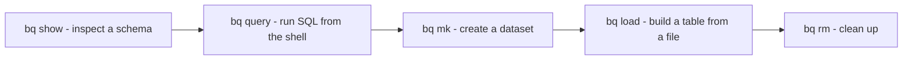
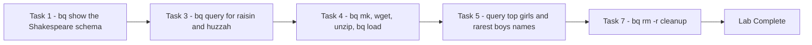

# BigQuery: Qwik Start - Command Line (GSP071)

> **A beginner-friendly, step-by-step guide** — written so that even someone with a non-technical background can understand *what* we are doing, *why* we are doing it, and *how* each command works.

---

## 📋 Table of Contents

1. [Where This Lab Fits — Prerequisites & Learning Path](#1-where-this-lab-fits--prerequisites--learning-path)
2. [The Big Picture — What Is This Lab About?](#2-the-big-picture--what-is-this-lab-about)
3. [Tools & Services Used in This Lab](#3-tools--services-used-in-this-lab)
4. [Key Concepts — The bq Command Anatomy](#4-key-concepts--the-bq-command-anatomy)
5. [Task 1 — Examine a Table](#5-task-1--examine-a-table)
6. [Task 2 — Run the Help Command](#6-task-2--run-the-help-command)
7. [Task 3 — Run a Query](#7-task-3--run-a-query)
8. [Task 4 — Create a New Table](#8-task-4--create-a-new-table)
9. [Task 5 — Run Queries](#9-task-5--run-queries)
10. [Task 7 — Clean Up](#10-task-7--clean-up)
11. [Quiz Answers — All in One Place](#11-quiz-answers--all-in-one-place)
12. [Quick Reference — All Commands in One Place](#12-quick-reference--all-commands-in-one-place)
13. [Console Equivalents (the Reverse Mapping)](#13-console-equivalents-the-reverse-mapping)

---

## 1. Where This Lab Fits — Prerequisites & Learning Path

This is **lab 3 of the "Derive Insights from BigQuery Data" skill badge** ([course 623](https://www.cloudskillsboost.google/course_templates/623)) — Week 2 of this study plan.

| # | Lab | What it teaches |
|---|---|---|
| 01 | [Introduction to SQL for BigQuery and Cloud SQL (GSP281)](../01-GSP281%20-%20Introduction%20to%20SQL%20for%20BigQuery%20and%20Cloud%20SQL/README.md) | SQL fundamentals, BigQuery + Cloud SQL |
| 02 | [BigQuery: Qwik Start - Console (GSP072)](../02-GSP072%20-%20BigQuery%20Qwik%20Start%20-%20Console/README.md) | The BigQuery loop via the web UI |
| **03** | **BigQuery: Qwik Start - Command Line (GSP071)** | **The same loop with the `bq` tool: show, query, mk, load, rm** |
| 04 | Explore an Ecommerce Dataset with SQL in BigQuery (GSP407) | Real-world exploratory analysis |
| 05 | Troubleshooting Common SQL Errors with BigQuery (GSP408) | Debugging syntax and logic errors |
| 06 | Explore and Create Reports with Data Studio (GSP409) | Visualizing BigQuery data |
| 07 | Derive Insights from BigQuery Data: Challenge Lab (GSP787) | Everything combined, no hand-holding |

### Prerequisites

[Lab 02](../02-GSP072%20-%20BigQuery%20Qwik%20Start%20-%20Console/README.md) is the perfect warm-up — **this lab is its command-line twin**. You did *query public data → create dataset → load file → query it* with clicks; now you do the identical loop with five `bq` commands. Doing both back-to-back is the fastest way to internalize how the console and CLI map to each other.

---

## 2. The Big Picture — What Is This Lab About?

### The Scenario (in plain English)

BigQuery is a **serverless, highly scalable [cloud data warehouse](https://cloud.google.com/solutions/bigquery-data-warehouse)** — and besides the console and [Web UI](https://console.cloud.google.com/bigquery), it has a **[command-line tool](https://cloud.google.com/bigquery/docs/cli_tool)** called **`bq`** (Python-based), plus [client libraries](https://cloud.google.com/bigquery/docs/reference/libraries) (Java, .NET, Python) and third-party [solution providers](https://cloud.google.com/bigquery/providers).

Why bother with the CLI when the console has buttons? Because commands can be **scripted, repeated, scheduled, and version-controlled** — the console is for exploring; the CLI is for automating. This lab teaches the five verbs you'll use constantly:



**The dataset cast:** Shakespeare's complete works (every word in every play — for querying) and the US baby names file (for loading). One quirky finding along the way: the word "raisin" never appears in Shakespeare… but "praising" and "dispraisingly" do. 🍇

---

## 3. Tools & Services Used in This Lab

| Tool / Service | What it is (in one breath) | Learn more |
|---|---|---|
| **`bq` CLI** | The Python-based **command-line tool for BigQuery** — every console action (show schema, query, make dataset, load, delete) as a one-line command. Pre-installed in Cloud Shell. | [bq CLI docs](https://cloud.google.com/bigquery/docs/cli_tool) · [bq reference](https://cloud.google.com/bigquery/docs/reference/bq-cli-reference) |
| **Cloud Shell** | The free browser terminal (a small VM with a persistent 5 GB home directory) where you run everything — `gcloud`, `bq`, `wget`, `unzip` all pre-installed. | [Docs](https://cloud.google.com/shell/docs) |
| **gcloud CLI** | Google Cloud's general command-line tool — used at setup to confirm identity (`gcloud auth list`) and project (`gcloud config list project`). | [gcloud overview](https://cloud.google.com/sdk/gcloud) |
| **BigQuery** | The serverless data warehouse itself — same engine as labs 01–02, new steering wheel. | [Docs](https://cloud.google.com/bigquery/docs) |
| **BigQuery sample tables** | Google-hosted demo tables including `samples.shakespeare` — an entry for **every word in every Shakespeare play**. | [Sample tables](https://cloud.google.com/bigquery/public-data#sample_tables) |
| **`wget` / `unzip`** | Standard Linux utilities used in Cloud Shell to download the SSA baby-names zip straight from the web and unpack it — no browser download needed. | [SSA names data](https://www.ssa.gov/OACT/babynames/) |

---

## 4. Key Concepts — The bq Command Anatomy

Every `bq` call follows the same grammar:

```
bq  <action>  <target>  [flags/arguments]
│      │         │
│      │         └── e.g. bigquery-public-data:samples.shakespeare
│      │              (project : dataset . table — note the COLON after project!)
│      └── show / query / ls / mk / load / rm / head / help
└── the BigQuery CLI
```

| Concept | Simple Explanation |
|---|---|
| `bq show` | Print a table's **schema and stats** (the CLI's "Schema + Details tabs"). |
| `bq help [command]` | Built-in manual — `bq help query` documents just the query command; bare `bq help` lists everything. |
| `bq query "SQL"` | Run a query from the shell. Quote the SQL; escape inner quotes with `\` **or** just use the *other* quote type inside (`'...WHERE word = "huzzah"...'`). |
| `--use_legacy_sql=false` | Switches to **standard SQL** (GoogleSQL). Without it, `bq query` defaults to BigQuery's older *legacy SQL* dialect — simple queries work in both, but standard SQL is what you should write. |
| `bq ls [project:]` | List datasets (yours by default; add `bigquery-public-data:` to peek at another project's). |
| `bq mk` | Make a dataset. Naming rules: up to 1,024 chars, `A-Z a-z 0-9 _`, can't *start* with a number/underscore, no spaces. |
| `bq load` | **Create/update a table and load data in one step** — dataset.table, source file, schema. Runs synchronously by default. |
| `bq rm -r` | Delete — `-r` (recursive) also deletes every table inside the dataset. |
| `-E` flag | Character-encoding override: BigQuery expects **UTF-8** by default; use `-E` to declare ISO-8859-1 (Latin-1) data. |

---

## 5. Task 1 — Examine a Table

```bash
bq show bigquery-public-data:samples.shakespeare
```

Breaking it down: `bq` invokes the tool, `show` is the action, and `bigquery-public-data:samples.shakespeare` is the target as `project:dataset.table`.

Output — the schema plus stats:

```
Schema                                Total Rows   Total Bytes
|- word: string (required)            164656       6432064
|- word_count: integer (required)
|- corpus: string (required)
|- corpus_date: integer (required)
```

So: 164,656 distinct (word, play) entries — `word_count` is how often that word appears in that `corpus` (play).

---

## 6. Task 2 — Run the Help Command

```bash
bq help query    # manual for the query command specifically
bq help          # list every bq command
```

Get in the habit — `bq help <command>` answers most "what flag was that?" questions faster than searching the docs.

---

## 7. Task 3 — Run a Query

### 🎯 What we must achieve

Count how many times the substring **"raisin"** appears across all of Shakespeare's works.

```bash
bq query --use_legacy_sql=false \
'SELECT
   word,
   SUM(word_count) AS count
 FROM
   `bigquery-public-data`.samples.shakespeare
 WHERE
   word LIKE "%raisin%"
 GROUP BY
   word'
```

| Piece | Meaning |
|---|---|
| `--use_legacy_sql=false` | Use standard SQL syntax. |
| single quotes outside, `"..."` inside | The quote-type trick — no escaping needed for `"%raisin%"`. |
| `LIKE "%raisin%"` | Any word *containing* the letters r-a-i-s-i-n. |

Output:

| word | count |
|---|---|
| praising | 8 |
| Praising | 4 |
| raising | 5 |
| dispraising | 2 |
| dispraisingly | 1 |
| raisins | 1 |

Fun result: the actual word *raisin* never appears — but its letters hide inside six other words. ✅ **Check my progress.**

And a word Shakespeare never wrote at all:

```bash
bq query --use_legacy_sql=false \
'SELECT
   word
 FROM
   `bigquery-public-data`.samples.shakespeare
 WHERE
   word = "huzzah"'
```

→ **No results.** (Huzzah? No huzzah.) ✅ **Check my progress.**

---

## 8. Task 4 — Create a New Table

### 🎯 What we must achieve

Create a dataset, download the baby-names data **inside Cloud Shell**, and load it into a table — the CLI version of lab 02's Tasks 3–4.

### Step 1 — Look around with bq ls

```bash
bq ls                        # your project: nothing yet
bq ls bigquery-public-data:  # another project's datasets (note the colon)
```

The second command lists dozens of public datasets (austin_311, baseball, bitcoin_blockchain, census_*, chicago_crime, …).

### Step 2 — Make the dataset

```bash
bq mk babynames
```

→ `Dataset 'PROJECT:babynames' successfully created.` Confirm with `bq ls`. ✅ **Check my progress.**

### Step 3 — Download and unzip the data (in Cloud Shell)

```bash
wget http://www.ssa.gov/OACT/babynames/names.zip   # download from the SSA
ls                                                  # names.zip is there
unzip names.zip                                     # unpack ~140 yobXXXX.txt files
ls                                                  # one file per year
```

> Different from lab 02! There the file was already in Cloud Storage; here you pull it from the public internet straight into your Cloud Shell home directory — `bq load` can read **local files** too.

### Step 4 — Load a year into a table

```bash
bq load babynames.names2010 yob2010.txt name:string,gender:string,count:integer
```

| Argument | Value |
|---|---|
| dataset.table | `babynames.names2010` |
| source | `yob2010.txt` (local file) |
| schema | `name:string,gender:string,count:integer` — same compact syntax as lab 02's "Edit as text" box |

`bq load` **creates the table and loads the data in a single step**, synchronously. ✅ **Check my progress.**

### Step 5 — Verify

```bash
bq ls babynames            # names2010   TABLE
bq show babynames.names2010
```

→ Schema (name, gender, count) with **34,073 rows** / 654,482 bytes.

> 📝 Encoding note: BigQuery expects **UTF-8** by default. Loading ISO-8859-1 (Latin-1) data? Declare it with the `-E` flag — see [Introduction to loading data](https://cloud.google.com/bigquery/docs/loading-data).

---

## 9. Task 5 — Run Queries

**Top 5 most popular girls' names of 2010:**

```bash
bq query "SELECT name,count FROM babynames.names2010 WHERE gender = 'F' ORDER BY count DESC LIMIT 5"
```

| name | count |
|---|---|
| Isabella | 22913 |
| Sophia | 20643 |
| Emma | 17345 |
| Olivia | 17028 |
| Ava | 15433 |

**Top 5 most *unusual* boys' names** (just flip to `ASC`):

```bash
bq query "SELECT name,count FROM babynames.names2010 WHERE gender = 'M' ORDER BY count ASC LIMIT 5"
```

→ Aaqib, Aaidan, Aadhavan, Aarian, Aamarion — all with count **5**, because the SSA source data *omits* names with fewer than 5 occurrences (privacy).

> Note these two use double quotes outside and `'F'`/`'M'` inside — the same quote-type trick, reversed. ✅ **Check my progress.**

---

## 10. Task 7 — Clean Up

```bash
bq rm -r babynames
```

Confirm with `Y`. The `-r` (recursive) flag deletes the dataset **and every table inside it** — without it, `bq rm` refuses to delete a non-empty dataset. ✅ **Check my progress.** 🏁 **Lab complete!**

> ⚠️ In real projects, treat `bq rm -r` with the same respect as `rm -rf` — there's no trash bin for datasets (only time-travel within 7 days for tables).

---

## 11. Quiz Answers — All in One Place

| # | Question | Answer |
|---|---|---|
| 1 | You can access BigQuery using: (multi-select) | **Command line tool ✓ Web UI ✓ BigQuery REST API ✓** (not GStreamer, not GLib) |
| 2 | Which CLI tool is used to interact with the BigQuery service? | **`bq`** (not compute, gsutil, or gcloud) |

**Key numbers:** shakespeare table = 164,656 rows · "praising" appears 8 times, "raisin" itself never · names2010 = 34,073 rows · #1 girls' name 2010 = Isabella (22,913) · minimum count in SSA data = 5.

---

## 12. Quick Reference — All Commands in One Place

```bash
# setup checks
gcloud auth list
gcloud config list project

# Task 1: inspect a schema
bq show bigquery-public-data:samples.shakespeare

# Task 2: help
bq help query
bq help

# Task 3: query public data
bq query --use_legacy_sql=false \
'SELECT word, SUM(word_count) AS count
 FROM `bigquery-public-data`.samples.shakespeare
 WHERE word LIKE "%raisin%"
 GROUP BY word'

bq query --use_legacy_sql=false \
'SELECT word FROM `bigquery-public-data`.samples.shakespeare WHERE word = "huzzah"'

# Task 4: dataset + data + table
bq ls
bq ls bigquery-public-data:
bq mk babynames
wget http://www.ssa.gov/OACT/babynames/names.zip
unzip names.zip
bq load babynames.names2010 yob2010.txt name:string,gender:string,count:integer
bq ls babynames
bq show babynames.names2010

# Task 5: query your table
bq query "SELECT name,count FROM babynames.names2010 WHERE gender = 'F' ORDER BY count DESC LIMIT 5"
bq query "SELECT name,count FROM babynames.names2010 WHERE gender = 'M' ORDER BY count ASC LIMIT 5"

# Task 7: clean up
bq rm -r babynames
```

---

## 13. Console Equivalents (the Reverse Mapping)

Other labs' guides map *UI steps → CLI*. This lab **is** the CLI — so here's the mirror, mapping each command back to the console buttons you used in [lab 02](../02-GSP072%20-%20BigQuery%20Qwik%20Start%20-%20Console/README.md):

| This lab's command | Console (UI) equivalent |
|---|---|
| `bq show project:dataset.table` | Click the table → **Schema** + **Details** tabs |
| `bq query '...'` | Paste in the **query Editor** → **Run** |
| `bq query --dry_run '...'` | The **Query Validator's** bytes estimate (bonus — not in this lab, but free to use) |
| `bq ls` / `bq ls project:` | Expanding projects/datasets in the **Explorer** pane |
| `bq mk babynames` | **View actions (⋮) → Create dataset** |
| `wget` + `bq load` from a local file | **Create table from → Upload** (console can't `wget`; you'd download to your laptop first) |
| `bq load` from `gs://...` | **Create table from → Google Cloud Storage** (lab 02's path) |
| `bq head -n 10 babynames.names2010` | The **Preview** tab (bonus command) |
| `bq rm -r babynames` | **View actions (⋮) → Delete** on the dataset |

### Universal setup commands (work in any lab)

```bash
gcloud config set project PROJECT_ID            # select a project
gcloud services enable bigquery.googleapis.com  # enable a service API
gcloud projects add-iam-policy-binding PROJECT_ID \
  --member="user:someone@example.com" --role="roles/bigquery.user"  # grant IAM role
```

---

### 🏁 Summary of the Journey



**Key lessons learned:**
1. The `bq` grammar — `bq <action> <target> [flags]` — covers the whole console with seven verbs: `show, help, query, ls, mk, load, rm`.
2. **`project:dataset.table`** — colon after the project, dots after that.
3. Prefer `--use_legacy_sql=false` (standard SQL); bare `bq query` defaults to legacy SQL.
4. **Quote juggling**: wrap SQL in one quote type, use the other inside — no escaping needed.
5. `bq load` creates the table *and* loads the data in one synchronous step — and it reads **local files**, not just `gs://` paths.
6. `bq rm -r` is powerful and permanent — the `-r` wipes every table in the dataset.
7. Everything you clicked in lab 02 has a one-line command — **and now you've done it both ways.**
