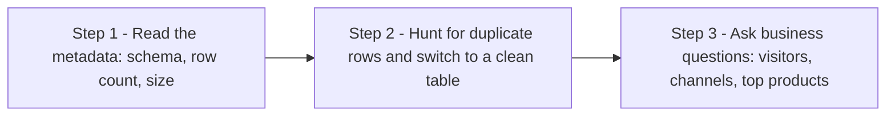

# Explore an Ecommerce Dataset with SQL in BigQuery (GSP407)

> **A beginner-friendly, step-by-step guide** — written so that even someone with a non-technical background can understand *what* we are doing, *why* we are doing it, and *how* each SQL query works.

---

## 📋 Table of Contents

1. [Where This Lab Fits — Prerequisites & Learning Path](#1-where-this-lab-fits--prerequisites--learning-path)
2. [The Big Picture — What Is This Lab About?](#2-the-big-picture--what-is-this-lab-about)
3. [Tools & Services Used in This Lab](#3-tools--services-used-in-this-lab)
4. [Key Concepts Explained Simply](#4-key-concepts-explained-simply)
5. [Task 1 — Pin the Lab Project in BigQuery](#5-task-1--pin-the-lab-project-in-bigquery)
6. [Task 2 — Explore the Data and Identify Duplicate Records](#6-task-2--explore-the-data-and-identify-duplicate-records)
7. [Task 3 — Write Basic SQL on Ecommerce Data](#7-task-3--write-basic-sql-on-ecommerce-data)
8. [Quiz Answers — All in One Place](#8-quiz-answers--all-in-one-place)
9. [Quick Reference — All Queries in One Place](#9-quick-reference--all-queries-in-one-place)
10. [Command-Line Alternatives (Cloud Shell)](#10-command-line-alternatives-cloud-shell)

---

## 1. Where This Lab Fits — Prerequisites & Learning Path

This is **lab 4 of the "Derive Insights from BigQuery Data" skill badge** ([course 623](https://www.cloudskillsboost.google/course_templates/623)) — Week 2 of this study plan.

| # | Lab | What it teaches |
|---|---|---|
| 01 | [Introduction to SQL for BigQuery and Cloud SQL (GSP281)](../01-GSP281%20-%20Introduction%20to%20SQL%20for%20BigQuery%20and%20Cloud%20SQL/README.md) | SQL fundamentals, BigQuery + Cloud SQL |
| 02 | [BigQuery: Qwik Start - Console (GSP072)](../02-GSP072%20-%20BigQuery%20Qwik%20Start%20-%20Console/README.md) | The BigQuery loop via the web UI |
| 03 | [BigQuery: Qwik Start - Command Line (GSP071)](../03-GSP071%20-%20BigQuery%20Qwik%20Start%20-%20Command%20Line/README.md) | The same loop with the `bq` tool |
| **04** | **Explore an Ecommerce Dataset with SQL in BigQuery (GSP407)** | **Real analyst workflow: metadata → dedup check → insight queries** |
| 05 | [Troubleshooting Common SQL Errors with BigQuery (GSP408)](../05-GSP408%20-%20Troubleshooting%20Common%20SQL%20Errors%20with%20BigQuery/README.md) | Debugging syntax and logic errors |
| 06 | [Explore and Create Reports with Data Studio (GSP409)](../06-GSP409%20-%20Explore%20and%20Create%20Reports%20with%20Data%20Studio/README.md) | Visualizing BigQuery data |
| 07 | Derive Insights from BigQuery Data: Challenge Lab (GSP787) | Everything combined, no hand-holding |

### Prerequisites

Labs 01–03 cover everything needed (`SELECT`, `WHERE`, `GROUP BY`, `COUNT`, `ORDER BY`, starring a project). Two things are *new* here: the **`HAVING`** clause and the **`WITH`** clause (CTE) — both explained below.

> 💡 **Déjà vu (in a good way):** this is the same `data-to-insights.ecommerce` data you joined in [Week 1's GSP413](../../Week%201%20-%20Build%20a%20Data%20Warehouse%20with%20BigQuery/01-GSP413%20-%20Creating%20a%20Data%20Warehouse%20Through%20Joins%20and%20Unions/README.md) and profiled in [GSP412](../../Week%201%20-%20Build%20a%20Data%20Warehouse%20with%20BigQuery/03-GSP412%20-%20Troubleshooting%20and%20Solving%20Data%20Join%20Pitfalls/README.md) — but now approached the way a working analyst would on day one: check the metadata, verify uniqueness, *then* ask business questions.

---

## 2. The Big Picture — What Is This Lab About?

### The Scenario (in plain English)

Your data analyst team exported the **Google Analytics logs** of an ecommerce website (the Google Merchandise Store — millions of records) into BigQuery as a raw table. Before anyone draws conclusions from raw log data, a professional does three things in order:



**Think of it like buying a used car:** you check the paperwork first (metadata), then inspect it for hidden damage (duplicates), and only *then* take it for a drive (analysis). Skipping step 2 is how analyses double-count revenue and nobody notices until the quarterly report.

The punchline of the analysis: the most-*viewed* product is **not** the most-*ordered* one, and the humble **22 oz YouTube Bottle Infuser** wins "most units per order" at **9.38** — people apparently buy them by the crate. 🍾

---

## 3. Tools & Services Used in This Lab

| Tool / Service | What it is (in one breath) | Learn more |
|---|---|---|
| **BigQuery** | Google's fully-managed, NoOps analytics database — terabyte-scale SQL with no infrastructure to manage, pay-as-you-go. | [Docs](https://cloud.google.com/bigquery/docs) |
| **Schema / Details / Preview tabs** | The three free ways to inspect a table: field types (**Schema**), metadata like row count & size (**Details**), sample rows (**Preview**) — no query cost for any of them. | [Getting table info](https://cloud.google.com/bigquery/docs/tables#get_information_about_tables) |
| **Query Validator** | The green/red check that validates syntax *and* estimates bytes to be processed before you run. | [Cost best practices](https://cloud.google.com/bigquery/docs/best-practices-costs) |
| **Google Analytics export schema** | The blueprint behind the dataset's fields (`fullVisitorId`, `visitId`, `eCommerceAction_type`…) — the lab links it as the source of truth for which fields should be unique. | [GA BigQuery export schema](https://support.google.com/analytics/answer/3437719) |
| **Google Merchandise Store** | The real shop that generated the analytics data. | [Store](https://shop.googlemerchandisestore.com/) |
| **GoogleSQL query syntax** | The reference the lab points to for experimenting further. | [Query syntax](https://cloud.google.com/bigquery/docs/reference/standard-sql/query-syntax) |

---

## 4. Key Concepts Explained Simply

| Concept | Simple Explanation |
|---|---|
| **Metadata** | Data *about* the data — row count, size, creation date. Read it from the **Details** tab before writing a single query. |
| **Duplicate rows** | The same record appearing more than once — the silent killer of accurate counts and sums. Raw log exports often contain them. |
| **The dedup-check pattern** | `GROUP BY` *every* column + `COUNT(*)` + `HAVING count > 1`: identical rows collapse into one group, and any group bigger than 1 is a duplicate. |
| **`HAVING`** | Like `WHERE`, but filters **after** aggregation — you can't say `WHERE COUNT(*) > 1`, but you *can* say `HAVING num_duplicate_rows > 1`. |
| **`GROUP BY 1,2,3`** | Grouping by **column position** instead of name — `1` means the first SELECTed column. Quick to type; see Pro Tips for the caveat. |
| **`COUNT(*)` vs `COUNT(column)` vs `COUNT(DISTINCT column)`** | All rows · rows where *column is not NULL* · unique values. The difference between them **is** this lab's orders-vs-views analysis. |
| **`WITH ... AS` (CTE)** | Names a sub-query so a complex question ("unique views per person, then totals") reads as two simple steps. |
| **Unique vs total views** | 100 views could be 100 people once each, or 1 superfan 100 times — `COUNT(DISTINCT fullVisitorId)` and the CTE pattern tell them apart. |
| **`type = 'PAGE'`** | GA logs many interaction types (page, event, transaction…); filtering to `PAGE` isolates actual product *page views*. |

---

## 5. Task 1 — Pin the Lab Project in BigQuery

Same move as previous labs: **Navigation menu → BigQuery → Done**, then **Explorer → + Add data → Star a project by name** → `data-to-insights` → **Star**.

The `data-to-insights` project appears in your Explorer — you're reading their public tables while jobs bill *your* lab project.

---

## 6. Task 2 — Explore the Data and Identify Duplicate Records

### 🎯 What we must achieve

Read the table's metadata, then prove the raw table contains duplicates — and that the clean table doesn't.

### Step 1 — The three inspection tabs

Expand **data-to-insights → ecommerce → all_sessions_raw** and visit:

- **Schema** — field names, **types**, modes, descriptions
- **Details** — metadata: the table is **5.63 GB** with **over 21 million rows**
- **Preview** — sample rows, free of charge

> **📝 Quiz:** Which UI tab shows the data types? → **Schema** · How many rows? → **Over 21 million**

### Step 2 — Hunt duplicates in the raw table

Scrolling the Preview shows *no single field* uniquely identifies a row — so the check must compare **entire rows**. The trick: `GROUP BY` every field; identical rows collapse into one group with `COUNT(*) > 1`:

```sql
#standardSQL
SELECT COUNT(*) as num_duplicate_rows, * FROM
`data-to-insights.ecommerce.all_sessions_raw`
GROUP BY
fullVisitorId, channelGrouping, time, country, city, totalTransactionRevenue, transactions, timeOnSite, pageviews, sessionQualityDim, date, visitId, type, productRefundAmount, productQuantity, productPrice, productRevenue, productSKU, v2ProductName, v2ProductCategory, productVariant, currencyCode, itemQuantity, itemRevenue, transactionRevenue, transactionId, pageTitle, searchKeyword, pagePathLevel1, eCommerceAction_type, eCommerceAction_step, eCommerceAction_option
HAVING num_duplicate_rows > 1;
```

| Piece | Meaning |
|---|---|
| `GROUP BY <all 32 fields>` | "Stack rows that are identical in **every** column into one group." |
| `COUNT(*) as num_duplicate_rows` | "How tall is each stack?" 1 = unique; >1 = duplicated. |
| `HAVING num_duplicate_rows > 1` | "Only show the stacks taller than 1" — `HAVING` filters *after* grouping (WHERE can't do this). |

→ **615 records have duplicates.** ✅ **Check my progress.**

> 📌 Even when your dataset *has* a unique key, confirm uniqueness with COUNT + GROUP BY + HAVING before analysis. Trust, but verify.

### Step 3 — Confirm the clean table really is clean

The team provides a deduplicated **`all_sessions`** table. Verify it — this time grouping only the fields the [GA schema](https://support.google.com/analytics/answer/3437719) says should be unique *together*:

```sql
#standardSQL
# schema: https://support.google.com/analytics/answer/3437719?hl=en
SELECT
fullVisitorId, # the unique visitor ID
visitId, # a visitor can have multiple visits
date, # session date stored as string YYYYMMDD
time, # time of the individual site hit (can be 0 to many per visitor session)
v2ProductName, # not unique since a product can have variants like Color
productSKU, # unique for each product
type, # a visitor can visit Pages and/or can trigger Events (even at the same time)
eCommerceAction_type, # maps to 'add to cart', 'completed checkout'
eCommerceAction_step,
eCommerceAction_option,
  transactionRevenue, # revenue of the order
  transactionId, # unique identifier for revenue bearing transaction
COUNT(*) as row_count
FROM
`data-to-insights.ecommerce.all_sessions`
GROUP BY 1,2,3 ,4, 5, 6, 7, 8, 9, 10,11,12
HAVING row_count > 1 # find duplicates
```

→ **Zero records** — clean. All remaining analysis uses `all_sessions`.

> 💡 Note the shorthand: `GROUP BY 1,2,3` groups by column *position* in the SELECT — same for `ORDER BY`.

---

## 7. Task 3 — Write Basic SQL on Ecommerce Data

### Query 1 — Total views vs unique visitors

```sql
#standardSQL
SELECT
  COUNT(*) AS product_views,
  COUNT(DISTINCT fullVisitorId) AS unique_visitors
FROM `data-to-insights.ecommerce.all_sessions`;
```

Two different questions in one query: *how many views happened* (all rows) vs *how many different people* (`DISTINCT fullVisitorId`).

### Query 2 — Unique visitors by marketing channel

```sql
#standardSQL
SELECT
  COUNT(DISTINCT fullVisitorId) AS unique_visitors,
  channelGrouping
FROM `data-to-insights.ecommerce.all_sessions`
GROUP BY channelGrouping
ORDER BY channelGrouping DESC;
```

`channelGrouping` = how the visitor arrived (Organic Search, Direct, Referral…). This is the classic *"which marketing channel brings the most people"* report.

### Query 3 — All unique product names, alphabetically

```sql
#standardSQL
SELECT
  (v2ProductName) AS ProductName
FROM `data-to-insights.ecommerce.all_sessions`
GROUP BY ProductName
ORDER BY ProductName
```

→ **633 products.** The **GROUP BY** is what deduplicates the names (same effect as `SELECT DISTINCT` here); `ORDER BY` defaults to ascending A→Z (add `DESC` to flip).

> **📝 Quiz:** Which part deduplicates? → **GROUP BY** · How many distinct product names? → **633**

### Query 4 — Top 5 most-viewed products

```sql
#standardSQL
SELECT
  COUNT(*) AS product_views,
  (v2ProductName) AS ProductName
FROM `data-to-insights.ecommerce.all_sessions`
WHERE type = 'PAGE'
GROUP BY v2ProductName
ORDER BY product_views DESC
LIMIT 5;
```

`WHERE type = 'PAGE'` keeps only real page views (GA also logs 'event', 'transaction', etc.).

### Query 5 (bonus) — Count each visitor only once per product

One superfan refreshing a product page 50 times shouldn't beat 40 genuinely interested people. Fix with a **WITH clause (CTE)** in two steps:

```sql
WITH unique_product_views_by_person AS (
-- find each unique product viewed by each visitor
SELECT
 fullVisitorId,
 (v2ProductName) AS ProductName
FROM `data-to-insights.ecommerce.all_sessions`
WHERE type = 'PAGE'
GROUP BY fullVisitorId, v2ProductName )

-- aggregate the top viewed products and sort them
SELECT
  COUNT(*) AS unique_view_count,
  ProductName
FROM unique_product_views_by_person
GROUP BY ProductName
ORDER BY unique_view_count DESC
LIMIT 5
```

| Piece | Meaning |
|---|---|
| Step 1 (the CTE) | One row per (visitor, product) pair — a visitor's 50 views of the same product collapse to 1. |
| Step 2 | Count those *unique* pairs per product — "how many different people viewed this?" |

### Query 6 — Add order counts and units ordered

```sql
#standardSQL
SELECT
  COUNT(*) AS product_views,
  COUNT(productQuantity) AS orders,
  SUM(productQuantity) AS quantity_product_ordered,
  v2ProductName
FROM `data-to-insights.ecommerce.all_sessions`
WHERE type = 'PAGE'
GROUP BY v2ProductName
ORDER BY product_views DESC
LIMIT 5;
```

The subtle star of this query: **`COUNT(productQuantity)` only counts rows where the field is not NULL** — i.e., rows where an order actually happened. So `orders` = number of orders, while `SUM(productQuantity)` = total items across them.

> **📝 Quiz:** The most-viewed product got the most orders → **False** · orders vs quantity_product_ordered? → **orders = number of orders; quantity_product_ordered = number of items ordered**

### Query 7 — Average units per order

```sql
#standardSQL
SELECT
  COUNT(*) AS product_views,
  COUNT(productQuantity) AS orders,
  SUM(productQuantity) AS quantity_product_ordered,
  SUM(productQuantity) / COUNT(productQuantity) AS avg_per_order,
  (v2ProductName) AS ProductName
FROM `data-to-insights.ecommerce.all_sessions`
WHERE type = 'PAGE'
GROUP BY v2ProductName
ORDER BY product_views DESC
LIMIT 5;
```

→ The **22 oz YouTube Bottle Infuser** wins with **9.38 units per order** — a bulk-buy product hiding inside ordinary view counts.

> **📝 Quiz:** Highest avg_per_order? → **YouTube Bottle Infuser**

✅ **Check my progress.** 🏁 **Lab complete!**

---

## 8. Quiz Answers — All in One Place

| # | Question | Answer |
|---|---|---|
| 1 | Which UI tab shows the data types? | **Schema** |
| 2 | How many rows are in the dataset? | **Over 21 million** |
| 3 | How many records have duplicates in all_sessions_raw? | **615** |
| 4 | Which part of the product-names query deduplicates the records? | **GROUP BY** |
| 5 | How many distinct product names were returned? | **633** |
| 6 | The product with the most views got the most orders. | **False** |
| 7 | Difference between orders and quantity_product_ordered? | **orders = number of orders; quantity_product_ordered = number of items ordered** |
| 8 | What product has the highest avg_per_order? | **YouTube Bottle Infuser** (9.38 units/order) |

---

## 9. Quick Reference — All Queries in One Place

```sql
-- dedup check on the RAW table (615 duplicated records)
SELECT COUNT(*) as num_duplicate_rows, *
FROM `data-to-insights.ecommerce.all_sessions_raw`
GROUP BY <all 32 fields>          -- see solutions.sql for the full list
HAVING num_duplicate_rows > 1;

-- dedup check on the CLEAN table (0 records) — GROUP BY by position
SELECT fullVisitorId, visitId, date, time, v2ProductName, productSKU, type,
       eCommerceAction_type, eCommerceAction_step, eCommerceAction_option,
       transactionRevenue, transactionId, COUNT(*) as row_count
FROM `data-to-insights.ecommerce.all_sessions`
GROUP BY 1,2,3,4,5,6,7,8,9,10,11,12
HAVING row_count > 1;

-- totals: views + unique visitors
SELECT COUNT(*) AS product_views, COUNT(DISTINCT fullVisitorId) AS unique_visitors
FROM `data-to-insights.ecommerce.all_sessions`;

-- unique visitors per channel
SELECT COUNT(DISTINCT fullVisitorId) AS unique_visitors, channelGrouping
FROM `data-to-insights.ecommerce.all_sessions`
GROUP BY channelGrouping ORDER BY channelGrouping DESC;

-- 633 unique product names, A->Z
SELECT (v2ProductName) AS ProductName
FROM `data-to-insights.ecommerce.all_sessions`
GROUP BY ProductName ORDER BY ProductName;

-- top 5 by raw views / by unique-person views (CTE) / with order stats + avg
-- (full versions in solutions.sql)
SELECT COUNT(*) AS product_views, COUNT(productQuantity) AS orders,
       SUM(productQuantity) AS quantity_product_ordered,
       SUM(productQuantity) / COUNT(productQuantity) AS avg_per_order,
       (v2ProductName) AS ProductName
FROM `data-to-insights.ecommerce.all_sessions`
WHERE type = 'PAGE'
GROUP BY v2ProductName ORDER BY product_views DESC LIMIT 5;
```

---

## 10. Command-Line Alternatives (Cloud Shell)

### Universal setup commands (work in any lab)

```bash
gcloud auth list                        # active account
gcloud config list project              # current project
gcloud config set project PROJECT_ID    # select / switch project
gcloud services enable bigquery.googleapis.com   # enable a service API
gcloud projects add-iam-policy-binding PROJECT_ID \
  --member="user:someone@example.com" --role="roles/bigquery.dataViewer"  # IAM grant
```

### UI step → CLI equivalent for this lab

| Console (UI) step | Cloud Shell command |
|---|---|
| Task 1: Star `data-to-insights` | UI-only bookmark — CLI just uses full names: `bq ls data-to-insights:ecommerce` |
| Details tab (rows / size metadata) | `bq show --format=prettyjson data-to-insights:ecommerce.all_sessions_raw` — look for `numRows` and `numBytes` |
| Schema tab (data types) | `bq show --schema --format=prettyjson data-to-insights:ecommerce.all_sessions_raw` |
| Preview tab (free sample rows) | `bq head -n 10 data-to-insights:ecommerce.all_sessions_raw` |
| Any analysis query | `bq query --use_legacy_sql=false 'SELECT ...'` |
| Query Validator (bytes estimate) | `bq query --use_legacy_sql=false --dry_run 'SELECT ...'` |

---

### 💎 Beyond the Lab — Pro Tips

Extra details the lab doesn't tell you, worth knowing for real work and the certification exam:

- **A slicker way to dedup-check *all* columns:** instead of typing 32 field names, `SELECT TO_JSON_STRING(t) AS row_json, COUNT(*) c FROM \`...all_sessions_raw\` t GROUP BY row_json HAVING c > 1` — serializes each whole row to one string and groups on that. Same 615 answer, one line of grouping.
- **Actually *removing* duplicates** (the lab only finds them): `CREATE OR REPLACE TABLE x AS SELECT DISTINCT * FROM raw` for exact-row dupes, or the window-function classic `QUALIFY ROW_NUMBER() OVER (PARTITION BY key ORDER BY time DESC) = 1` to keep the newest record per key.
- **`GROUP BY 1,2,3` is for ad-hoc work only.** Reorder the SELECT list and your grouping silently changes meaning — in saved/production queries, spell out column names.
- **`COUNT(column)` skipping NULLs is a feature, not a quirk** — it's how one query counted views *and* orders from the same rows. The generalized form is conditional aggregation: `COUNTIF(productQuantity IS NOT NULL)` reads even clearer.
- **Views-to-orders is a *conversion funnel*** — the ratio `orders / product_views` per product is the metric a real ecommerce analyst would compute next (one `SAFE_DIVIDE` away, using Week 1's trick).
- **Exam tip:** know the metadata tabs cold — **Schema** = types, **Details** = row count/size/expiry, **Preview** = free sample. Questions test both *which tab* and *that none of them cost query bytes*.

---

### 🏁 Summary of the Journey


**Key lessons learned:**
1. **Metadata first, queries second** — Schema/Details/Preview answer the basics for free before you scan a byte.
2. The **dedup-check pattern** (`GROUP BY` everything + `HAVING COUNT(*) > 1`) belongs at the start of every analysis — even when you *think* you have a unique key.
3. **`HAVING` filters groups; `WHERE` filters rows** — you need HAVING for any condition on an aggregate.
4. `COUNT(*)` vs `COUNT(col)` vs `COUNT(DISTINCT col)` are three different questions — this lab's whole analysis hinges on the difference.
5. **CTEs (`WITH`) turn hard questions into two easy ones** — unique-views-per-person was one dedup step plus one count step.
6. Views ≠ orders ≠ units: the most-viewed product wasn't the most-ordered, and the bulk-buy champion (Bottle Infuser, 9.38/order) was invisible until the right metric existed.
