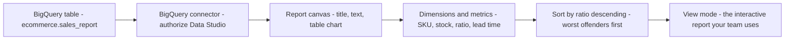
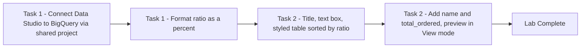

# Explore and Create Reports with Data Studio (GSP409)

> **A beginner-friendly, step-by-step guide** — written so that even someone with a non-technical background can understand *what* we are doing, *why* we are doing it, and *how* each step works.

---

## 📋 Table of Contents

1. [Where This Lab Fits — Prerequisites & Learning Path](#1-where-this-lab-fits--prerequisites--learning-path)
2. [The Big Picture — What Is This Lab About?](#2-the-big-picture--what-is-this-lab-about)
3. [Tools & Services Used in This Lab](#3-tools--services-used-in-this-lab)
4. [Key Concepts Explained Simply](#4-key-concepts-explained-simply)
5. [Task 1 — Launch Data Studio and Create a Blank Report](#5-task-1--launch-data-studio-and-create-a-blank-report)
6. [Task 2 — Customize a Report](#6-task-2--customize-a-report)
7. [Quick Reference — The Whole Click-Path](#7-quick-reference--the-whole-click-path)
8. [Command-Line Alternatives (Cloud Shell)](#8-command-line-alternatives-cloud-shell)

---

## 1. Where This Lab Fits — Prerequisites & Learning Path

This is **lab 6 of the "Derive Insights from BigQuery Data" skill badge** ([course 623](https://www.cloudskillsboost.google/course_templates/623)) — Week 2 of this study plan.

| # | Lab | What it teaches |
|---|---|---|
| 01 | [Introduction to SQL for BigQuery and Cloud SQL (GSP281)](../01-GSP281%20-%20Introduction%20to%20SQL%20for%20BigQuery%20and%20Cloud%20SQL/README.md) | SQL fundamentals, BigQuery + Cloud SQL |
| 02 | [BigQuery: Qwik Start - Console (GSP072)](../02-GSP072%20-%20BigQuery%20Qwik%20Start%20-%20Console/README.md) | The BigQuery loop via the web UI |
| 03 | [BigQuery: Qwik Start - Command Line (GSP071)](../03-GSP071%20-%20BigQuery%20Qwik%20Start%20-%20Command%20Line/README.md) | The same loop with the `bq` tool |
| 04 | [Explore an Ecommerce Dataset with SQL in BigQuery (GSP407)](../04-GSP407%20-%20Explore%20an%20Ecommerce%20Dataset%20with%20SQL%20in%20BigQuery/README.md) | Analyst workflow: metadata → dedup → insights |
| 05 | [Troubleshooting Common SQL Errors with BigQuery (GSP408)](../05-GSP408%20-%20Troubleshooting%20Common%20SQL%20Errors%20with%20BigQuery/README.md) | Debugging syntax and logic errors |
| **06** | **Explore and Create Reports with Data Studio (GSP409)** | **Turning BigQuery data into interactive dashboards — zero SQL** |
| 07 | [Derive Insights from BigQuery Data: Challenge Lab (GSP787)](../07-GSP787%20-%20Challenge%20Lab/README.md) | Everything combined, no hand-holding |

### Prerequisites

None technically — this lab has **no SQL at all**. But it lands better after labs 04–05: the `sales_report` table you visualize here is the *product* of exactly the kind of analysis queries you wrote there (it even has the `ratio` field you built by hand in [Week 1's GSP413](../../Week%201%20-%20Build%20a%20Data%20Warehouse%20with%20BigQuery/01-GSP413%20-%20Creating%20a%20Data%20Warehouse%20Through%20Joins%20and%20Unions/README.md) — `total_ordered / stockLevel`!).

> 📝 **Naming note:** Google renamed **Data Studio → Looker Studio** in 2022. The lab (and this guide) uses the old name; the product at [lookerstudio.google.com](https://lookerstudio.google.com/) is the same thing with a newer coat of paint.

---

## 2. The Big Picture — What Is This Lab About?

### The Scenario (in plain English)

You've spent five labs *querying* data — but the people who make decisions usually don't read SQL result grids. **Data Studio** turns your BigQuery tables into dashboards and reports that are easy to read, easy to share, and fully customizable — data storytelling for better business decisions.

You'll build a **Product Inventory Watchlist**: a report the operations team can open every morning to see which products are burning through stock fastest (highest `ratio` first), how many are left (`stockLevel`), and how long a refill takes (`restockingLeadTime`).



**Think of it like the last mile of a delivery:** the warehouse work (queries, joins, dedup) is done; this lab is putting the results in a clean storefront window where anyone can *see* the answer without asking you to run SQL.

---

## 3. Tools & Services Used in This Lab

| Tool / Service | What it is (in one breath) | Learn more |
|---|---|---|
| **Data Studio / Looker Studio** | Google's free **dashboarding & reporting tool** — drag-and-drop charts over live data sources, shareable like a Google Doc. | [Looker Studio](https://lookerstudio.google.com/) · [Docs](https://support.google.com/looker-studio) |
| **BigQuery connector** | The bridge between Data Studio and BigQuery — you **Authorize** it once, pick project → dataset → table, and charts then issue *live queries* on your behalf. | [BigQuery connector docs](https://support.google.com/looker-studio/answer/6370296) |
| **BigQuery** | The engine behind the curtain — every chart refresh runs a real query against `data-to-insights.ecommerce.sales_report`, billed to the project you connected through. | [Docs](https://cloud.google.com/bigquery/docs) |
| **Shared projects** | How you reach a table living in *another* project (`data-to-insights`) while billing your own lab project — the connector's "Shared project name" field. | [Public datasets](https://cloud.google.com/bigquery/public-data) |
| **Report canvas & chart panel** | The editor: **Setup tab** = what data a chart shows (dimensions/metrics/sort); **Style tab** = how it looks (wrap text, fonts, colors). | [Table chart reference](https://support.google.com/looker-studio/answer/7189044) |

---

## 4. Key Concepts Explained Simply

| Concept | Simple Explanation |
|---|---|
| **Report** | The document/canvas you build — like a Google Slides deck powered by live data. |
| **Data source** | A configured connection to one table (here `ecommerce.sales_report`) — reports can have several. |
| **Dimension** (green) | A **category** to group by — text-ish fields like `name` or `productSKU`. Rows of your table chart. |
| **Metric** (blue) | A **number** to aggregate — `stockLevel`, `ratio`, `restockingLeadTime`, `total_ordered`. Columns of figures. |
| **Dimension vs Metric rule of thumb** | "Group *by* it" → dimension. "Do math *on* it" → metric. The green/blue chip colors in the UI reinforce it. |
| **Data type → Percent** | Formatting `ratio` (0.0–1.0) as a percentage — display-only, the underlying value is untouched. |
| **Sort (descending by ratio)** | What makes this a *watchlist*: products closest to selling out float to the top automatically. |
| **Style → Wrap text** | Lets long product names break across lines instead of truncating. |
| **Edit vs View mode** | Edit = you, building. **View** = your audience's read-only interactive experience — always preview in View before sharing. |
| **Interactive filter** | Extra dimensions/metrics (like `name`, `total_ordered`) that let viewers slice the report themselves — self-service analytics. |

---

## 5. Task 1 — Launch Data Studio and Create a Blank Report

### 🎯 What we must achieve

Open Data Studio, wire it to the BigQuery table, and format one field properly.

### Step 1 — First-run setup

1. Open **[Data Studio](https://datastudio.google.com/)** in a new tab (signed in with your **lab credentials**, not a personal account).
2. Click the **Blank report** template.
3. Click through the prompts: select **Country**, enter a **Company name**, tick the terms checkbox → **Continue**; answer **No** to all email opt-ins → **Continue**.
4. Click **Blank report** again — an untitled report opens on the **Connect to data** tab.

### Step 2 — Connect BigQuery

1. In **Google Connectors**, select **BigQuery**.
2. Click **Authorize** — this grants Data Studio access to your Google Cloud project (a real OAuth grant; see Pro Tips).
3. Define the source:

| Field | Value |
|---|---|
| Project path | **Shared projects → your Project ID** (begins with `qwiklabs-`) |
| Shared project name | `data-to-insights` |
| Dataset | `ecommerce` |
| Table | `sales_report` |

4. Click **Add** (bottom right) → **Add to report**.

> 📌 Read that configuration carefully — it's the same pattern as starring a project in BigQuery: *your* project provides the billing/identity, the **shared** `data-to-insights` project provides the data.

### Step 3 — Format `ratio` as a percent

1. **Add a chart → Table chart**.
2. Drag **`ratio`** from Data Fields into **Dimension**.
3. Click the number icon next to it to edit → **Data type → Numeric → Percent**.

The ratio column now displays as percentages (0.85 → 85%).

4. **Delete this practice table** — Task 2 builds the real one from scratch.

✅ **Check my progress.**

---

## 6. Task 2 — Customize a Report

### 🎯 What we must achieve

Build the actual watchlist: title, styled data table sorted by sell-through ratio, and extra fields for interactivity.

### Step 1 — Report title and page title

1. Click **"Untitled Report"** (top-left) → rename to **`Ecommerce Product Operations Report`**.
2. Click the **text icon** (boxed **A**) in the toolbar → click a blank canvas area → type **`Product Inventory Watchlist`**.
3. Select the text → in **Text Properties**, set font size to **32px** (resize the box to fit).

### Step 2 — The data table

1. **Insert → Table**, click to place it; resize as needed.
2. In the chart's **Setup** tab:

| Slot | Configuration |
|---|---|
| Dimension | `productSKU` (drag it in if not already present) |
| Metrics | remove `Record count` (click its ✕), then add **`stockLevel`**, **`ratio`**, **`restockingLeadTime`** |
| Sort | change from `productSKU` to **`ratio`**, **Descending** |

3. Switch to the **Style** tab → under Table style, tick **Wrap text**.
4. Drag column borders to adjust widths until it reads cleanly.

> 🔎 **Why this exact configuration?** One row per SKU (dimension), the three numbers an ops person needs (metrics), and descending ratio so the products that have sold the largest share of their stock — the ones needing reorder *now* — sit at the top. It's Week 1's `ORDER BY ratio DESC` query, reborn as a living dashboard.

### Step 3 — Add interactivity

1. Back on the **Setup** tab: drag **`name`** into **Dimension**, *above* `productSKU` — human-readable product names now lead each row.
2. Drag **`total_ordered`** into Metrics, below `restockingLeadTime`.
3. Click **View** (upper-right) to switch to the read-only preview your stakeholders would see — sortable columns and all.

🏁 **Lab complete!** (This short lab has no quiz questions.)

---

## 7. Quick Reference — The Whole Click-Path

```text
datastudio.google.com (lab account!)
└─ Blank report → country/company → agree → No to emails → Blank report
   └─ Connect to data → BigQuery → Authorize
      └─ Shared projects → <your qwiklabs project> 
         shared project: data-to-insights │ dataset: ecommerce │ table: sales_report
         → Add → Add to report
├─ Practice: Add chart → Table → ratio as Dimension → type Numeric > Percent → delete table
├─ Rename report: "Ecommerce Product Operations Report"
├─ Text box (A icon): "Product Inventory Watchlist" @ 32px
├─ Insert → Table:
│    Dimension: name, productSKU
│    Metrics  : stockLevel, ratio, restockingLeadTime, total_ordered
│    Sort     : ratio, Descending
│    Style    : Wrap text; adjust column widths
└─ View button → preview the interactive report
```

---

## 8. Command-Line Alternatives (Cloud Shell)

Data Studio itself is UI-only — there's no CLI that builds reports. But everything *around* it has one:

### Universal setup commands (work in any lab)

```bash
gcloud auth list                        # active account
gcloud config set project PROJECT_ID    # select / switch project
gcloud services enable bigquery.googleapis.com   # the API Data Studio queries through
gcloud projects add-iam-policy-binding PROJECT_ID \
  --member="user:analyst@example.com" --role="roles/bigquery.jobUser"  # let a report author run queries
```

### UI step → closest CLI equivalent

| Data Studio (UI) step | Cloud Shell command |
|---|---|
| Browse the table before charting it | `bq head -n 10 data-to-insights:ecommerce.sales_report` and `bq show --schema --format=prettyjson data-to-insights:ecommerce.sales_report` |
| What the table chart *actually runs* | roughly: `bq query --use_legacy_sql=false 'SELECT name, productSKU, SUM(stockLevel), SUM(ratio), SUM(restockingLeadTime), SUM(total_ordered) FROM \`data-to-insights.ecommerce.sales_report\` GROUP BY name, productSKU ORDER BY 4 DESC'` |
| See the queries your report generated | `bq ls -j --max_results=10` — each chart refresh appears as a query job in the connected project |
| The Authorize button's effect | It's an OAuth grant, not IAM — but the *report author* still needs BigQuery permissions, granted as above |

> 💡 For automation-minded folks: reports can be created/duplicated programmatically via the [Looker Studio Linking API](https://developers.google.com/looker-studio/integrate/linking-api), which encodes a report's data source in a URL.

---

### 💎 Beyond the Lab — Pro Tips

Extra details the lab doesn't tell you, worth knowing for real work and the certification exam:

- **Every chart is a live query.** Each viewer opening the report and each filter click can trigger BigQuery jobs — *billed to the connected project*. For dashboards with many viewers, this adds up; check `bq ls -j` after playing with your report and you'll see the trail.
- **Two ways to tame dashboard cost/speed:** **BI Engine** (in-memory acceleration you reserve per project) and the **Extract data** connector (snapshots up to 100 MB into Data Studio itself — charts then hit the cache, not BigQuery).
- **Credentials matter when sharing:** a data source runs as the **owner's** credentials by default — meaning viewers see data *you* can see, even if they couldn't query the table themselves. Switching to **viewer's credentials** flips that. Know this before sharing anything sensitive.
- **`ratio` came pre-computed** in `sales_report`, but Data Studio can also build **calculated fields** itself (e.g. `total_ordered / stockLevel`) — handy when you can't modify the source table.
- **Green vs blue is load-bearing:** dimension chips are green, metric chips are blue, everywhere in the product. Reading chip colors is the fastest way to debug a chart that "looks wrong".
- **Exam tip:** for visualization questions, the decision tree is roughly — **Looker Studio** = free, shareable dashboards on BigQuery; **Looker** = enterprise BI platform with modeling layer; **BigQuery BI Engine** = the speed layer under either. Know which is which.

---

### 🏁 Summary of the Journey



**Key lessons learned:**
1. Data Studio (now **Looker Studio**) is the free last-mile tool that turns BigQuery tables into shareable, interactive reports — no SQL required of your audience.
2. The connector pattern mirrors BigQuery's own: **your project** authorizes and pays, the **shared project** supplies the data.
3. **Dimensions group, metrics measure** — get those two slots right and most charts build themselves.
4. Formatting (percent types, wrap text, column widths) is what separates a *usable* report from a data dump.
5. Sorting by the business-critical field (`ratio DESC`) is what turns a table into a **watchlist**.
6. Always check **View mode** before sharing — it's what your audience actually experiences.
