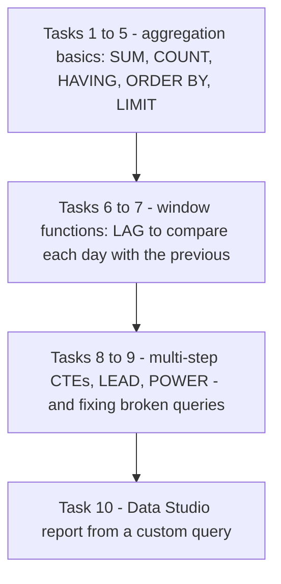
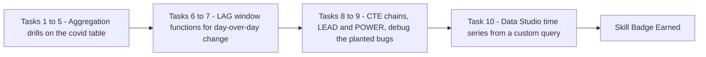

# Derive Insights from BigQuery Data: Challenge Lab (GSP787)

> **A beginner-friendly, step-by-step guide** — written so that even someone with a non-technical background can understand *what* we are doing, *why* we are doing it, and *how* each SQL query works.

> 🧭 **Learning path** (Derive Insights from BigQuery Data skill badge):
> [01 · GSP281](../01-GSP281%20-%20Introduction%20to%20SQL%20for%20BigQuery%20and%20Cloud%20SQL/README.md) → [02 · GSP072](../02-GSP072%20-%20BigQuery%20Qwik%20Start%20-%20Console/README.md) → [03 · GSP071](../03-GSP071%20-%20BigQuery%20Qwik%20Start%20-%20Command%20Line/README.md) → [04 · GSP407](../04-GSP407%20-%20Explore%20an%20Ecommerce%20Dataset%20with%20SQL%20in%20BigQuery/README.md) → [05 · GSP408](../05-GSP408%20-%20Troubleshooting%20Common%20SQL%20Errors%20with%20BigQuery/README.md) → [06 · GSP409](../06-GSP409%20-%20Explore%20and%20Create%20Reports%20with%20Data%20Studio/README.md) → **07 · GSP787 — this Challenge Lab**
>
> **Prerequisites:** all six labs above. This challenge gives *no step-by-step instructions* — it tests aggregations + `HAVING` (lab 04), fixing broken queries (lab 05), and Data Studio reports (lab 06), and stretches you with **window functions** (`LAG`, `LEAD`) that no earlier lab taught directly.

---

## ⚠️ READ FIRST — Your Values Will Differ!

This challenge lab **parameterizes its numbers per session**: the `Date`, `Death Count`, `Confirmed Cases`, `Month`, `Limit Value`, and date ranges in *your* lab instructions are generated for *your* attempt. Every query below marks them like `<DATE>` or `<DEATH_COUNT>` — **substitute the values from your own lab page**, not from anyone's guide. A correct query with someone else's numbers scores zero.

---

## 📋 Table of Contents

1. [The Big Picture — What Is This Lab About?](#1-the-big-picture--what-is-this-lab-about)
2. [Key Concepts Explained Simply](#2-key-concepts-explained-simply)
3. [Task 1 — Total Confirmed Cases](#3-task-1--total-confirmed-cases)
4. [Task 2 — Worst Affected Areas](#4-task-2--worst-affected-areas)
5. [Task 3 — Identify Hotspots](#5-task-3--identify-hotspots)
6. [Task 4 — Fatality Ratio](#6-task-4--fatality-ratio)
7. [Task 5 — Identify a Specific Day](#7-task-5--identify-a-specific-day)
8. [Task 6 — Find Days with Zero Net New Cases](#8-task-6--find-days-with-zero-net-new-cases)
9. [Task 7 — Doubling Rate](#9-task-7--doubling-rate)
10. [Task 8 — Recovery Rate](#10-task-8--recovery-rate)
11. [Task 9 — CDGR (Fix the Broken Query)](#11-task-9--cdgr-fix-the-broken-query)
12. [Task 10 — Create a Data Studio Report](#12-task-10--create-a-data-studio-report)
13. [Common Errors & How to Fix Them](#13-common-errors--how-to-fix-them)
14. [Quick Reference — All Queries in One Place](#14-quick-reference--all-queries-in-one-place)
15. [Command-Line Alternatives (Cloud Shell)](#15-command-line-alternatives-cloud-shell)

---

## 1. The Big Picture — What Is This Lab About?

### The Scenario (in plain English)

You work for a **public health organization** answering COVID-19 questions to focus healthcare efforts and awareness programs. One public table holds everything: **`bigquery-public-data.covid19_open_data.covid19_open_data`** — country-level daily time-series covering demographics, economy, epidemiology, geography, health, hospitalizations, mobility, government response, and weather.

Ten tasks, no instructions, an automated grader, and a clock. The tasks climb in difficulty:



**Think of it like a driving test after driving lessons:** every maneuver was practised in labs 01–06 (aggregation in 04, debugging in 05, dashboards in 06) — but now the instructor is silent, the route is yours to find, and two of the cars (Tasks 6 & 9) arrive with something broken under the hood.

---

## 2. Key Concepts Explained Simply

| Concept | Simple Explanation |
|---|---|
| **`cumulative_confirmed` / `cumulative_deceased` / `cumulative_recovered`** | **Running totals** as of each date — not daily new numbers. That's why "cases on date X" is a simple filter, and "new cases" needs *subtracting yesterday* (window functions). |
| **`subregion1_name`** | The state/province column. NULL on country-level rows — which is why state questions say *exclude NULLs*. |
| **`country_name` vs `country_code`** | Full name (`"United States of America"`, `"Italy"`) vs ISO code (`"US"`). Tasks specify which one to filter on — read carefully. |
| **`LAG(x) OVER(ORDER BY date)`** | "The value of x on the **previous** row" — puts yesterday's number on today's row so you can subtract them. |
| **`LEAD(x) OVER(ORDER BY date)`** | The mirror image: the **next** row's value. **Both require the `OVER(...)` clause** — forgetting it is Task 9's planted bug. |
| **Window function vs aggregate** | `SUM()` collapses many rows into one; `LAG()/LEAD()` add a column *while keeping every row*. |
| **`POWER(x, y)`** | x raised to the y-th power — needed for the growth-rate formula. `SQRT(x)` takes *one* argument (square root only); using it with two is Task 9's second bug. |
| **`DATE_DIFF(d1, d2, DAY)`** | Number of days between two dates. |
| **Case-fatality ratio** | `(total deaths / total confirmed) * 100` — deaths as a percentage of known cases. |
| **CDGR** | Cumulative Daily Growth Rate: `(last/first)^(1/days) - 1` — the steady daily growth % that would connect day 1 to day N. |
| **Chained CTEs** | `WITH a AS (...), b AS (...) SELECT ...` — each step reads the previous one; Tasks 6–9 all use this ladder shape. |

---

## 3. Task 1 — Total Confirmed Cases

### 🎯 The question

*"What was the total count of confirmed cases on `<DATE>`?"* — one row, one column named `total_cases_worldwide`.

```sql
SELECT
  SUM(cumulative_confirmed) AS total_cases_worldwide
FROM
  `bigquery-public-data.covid19_open_data.covid19_open_data`
WHERE
  date = '<DATE>'          -- e.g. '2020-06-15' — YOUR lab's date!
```

| Piece | Meaning |
|---|---|
| `SUM(cumulative_confirmed)` | Add up the running totals of every location on that day. |
| `WHERE date = '<DATE>'` | One snapshot day; the column is already a running total, so no date range needed. |
| exact alias `total_cases_worldwide` | The grader checks **column names** — copy them precisely. |

✅ **Check my progress.**

---

## 4. Task 2 — Worst Affected Areas

### 🎯 The question

*"How many states in the US had more than `<DEATH_COUNT>` deaths on `<DATE>`?"* — output field `count_of_states`, exclude NULLs.

```sql
WITH deaths_by_states AS (
  SELECT
    subregion1_name AS state,
    SUM(cumulative_deceased) AS death_count
  FROM
    `bigquery-public-data.covid19_open_data.covid19_open_data`
  WHERE
    country_name = "United States of America"
    AND subregion1_name IS NOT NULL     -- drop country-level rows
    AND date = '<DATE>'
  GROUP BY subregion1_name
)
SELECT
  COUNT(*) AS count_of_states
FROM deaths_by_states
WHERE death_count > <DEATH_COUNT>       -- e.g. 300
```

| Piece | Meaning |
|---|---|
| CTE step 1 | One row per state with its death total on that date. |
| `subregion1_name IS NOT NULL` | Country-level rows have no state — including them would corrupt the count. |
| Outer `COUNT(*)` | "How many of those state rows exceed the threshold?" — filtering an aggregate *then counting* is cleanest as two steps. |

✅ **Check my progress.**

---

## 5. Task 3 — Identify Hotspots
### 🎯 The question


*"List all US states with more than `<CONFIRMED_CASES>` confirmed cases on `<DATE>`"* — fields `state` and `total_confirmed_cases`, descending. Note: this task filters on **`country_code`**!

```sql
SELECT
  subregion1_name AS state,
  SUM(cumulative_confirmed) AS total_confirmed_cases
FROM
  `bigquery-public-data.covid19_open_data.covid19_open_data`
WHERE
  country_code = "US"
  AND subregion1_name IS NOT NULL
  AND date = '<DATE>'
GROUP BY subregion1_name
HAVING total_confirmed_cases > <CONFIRMED_CASES>   -- e.g. 250000
ORDER BY total_confirmed_cases DESC
```

The `HAVING` (not `WHERE`!) filters the aggregated totals — exactly the trap lab 05 drilled. ✅ **Check my progress.**

---

## 6. Task 4 — Fatality Ratio

### 🎯 The question

*"What was the case-fatality ratio in Italy for `<MONTH>` 2020?"* — fields `total_confirmed_cases`, `total_deaths`, `case_fatality_ratio` where ratio = (deaths / confirmed) × 100.

```sql
SELECT
  SUM(cumulative_confirmed) AS total_confirmed_cases,
  SUM(cumulative_deceased) AS total_deaths,
  (SUM(cumulative_deceased) / SUM(cumulative_confirmed)) * 100 AS case_fatality_ratio
FROM
  `bigquery-public-data.covid19_open_data.covid19_open_data`
WHERE
  country_name = "Italy"
  AND date BETWEEN '<MONTH_START>' AND '<MONTH_END>'
  -- e.g. May 2020: BETWEEN '2020-05-01' AND '2020-05-31'
  -- watch month lengths: April/June end on 30, May ends on 31!
```

✅ **Check my progress.**

---

## 7. Task 5 — Identify a Specific Day
### 🎯 The question


*"On what day did total deaths cross `<DEATH_COUNT>` in Italy?"* — return the date as yyyy-mm-dd.

```sql
SELECT date
FROM
  `bigquery-public-data.covid19_open_data.covid19_open_data`
WHERE
  country_name = "Italy"
  AND cumulative_deceased > <DEATH_COUNT>   -- e.g. 10000
GROUP BY date
ORDER BY date ASC
LIMIT 1
```

| Piece | Meaning |
|---|---|
| `cumulative_deceased > N` | Every date *after* the crossing also qualifies (running total never decreases)… |
| `ORDER BY date ASC LIMIT 1` | …so the **earliest** qualifying date is the day it *crossed*. A classic "first time X happened" idiom. |

✅ **Check my progress.**

---

## 8. Task 6 — Find Days with Zero Net New Cases

### 🎯 The task

The provided query for India between `<START_DATE>` and `<CLOSE_DATE>` is **incomplete**: the dates are blank, and the whole thing has **no final SELECT** — it's two CTEs with nothing reading them.

### The fixed query

```sql
WITH india_cases_by_date AS (
  SELECT
    date,
    SUM(cumulative_confirmed) AS cases
  FROM
    `bigquery-public-data.covid19_open_data.covid19_open_data`
  WHERE
    country_name = "India"
    AND date BETWEEN '<START_DATE>' AND '<CLOSE_DATE>'
    -- e.g. BETWEEN '2020-02-21' AND '2020-03-15' — YOUR lab's dates!
  GROUP BY date
  ORDER BY date ASC
)

, india_previous_day_comparison AS (
  SELECT
    date,
    cases,
    LAG(cases) OVER(ORDER BY date) AS previous_day,
    cases - LAG(cases) OVER(ORDER BY date) AS net_new_cases
  FROM india_cases_by_date
)

SELECT
  COUNT(date) AS count_of_days_with_zero_net_new_cases
FROM india_previous_day_comparison
WHERE net_new_cases = 0
```

| Fix | Why |
|---|---|
| Fill the two dates | `BETWEEN '' AND ''` matches nothing. |
| Add the final SELECT | CTEs alone aren't a query — something must read them. |
| `WHERE net_new_cases = 0` | `LAG` put yesterday's total next to today's; equal totals = a zero-new-cases day; count those days. |

✅ **Check my progress.**

---

## 9. Task 7 — Doubling Rate

### 🎯 The question

Using Task 6 as a template: US dates between **2020-03-22 and 2020-04-20** where confirmed cases grew more than `<LIMIT_VALUE>`% over the previous day. Exact output names: `Date`, `Confirmed_Cases_On_Day`, `Confirmed_Cases_Previous_Day`, `Percentage_Increase_In_Cases`.

```sql
WITH us_cases_by_date AS (
  SELECT
    date,
    SUM(cumulative_confirmed) AS cases
  FROM
    `bigquery-public-data.covid19_open_data.covid19_open_data`
  WHERE
    country_name = "United States of America"
    AND date BETWEEN '2020-03-22' AND '2020-04-20'
  GROUP BY date
  ORDER BY date ASC
)

, us_previous_day_comparison AS (
  SELECT
    date,
    cases,
    LAG(cases) OVER(ORDER BY date) AS previous_day,
    cases - LAG(cases) OVER(ORDER BY date) AS net_new_cases,
    (cases - LAG(cases) OVER(ORDER BY date)) * 100 / LAG(cases) OVER(ORDER BY date) AS percentage_increase
  FROM us_cases_by_date
)

SELECT
  date AS Date,
  cases AS Confirmed_Cases_On_Day,
  previous_day AS Confirmed_Cases_Previous_Day,
  percentage_increase AS Percentage_Increase_In_Cases
FROM us_previous_day_comparison
WHERE percentage_increase > <LIMIT_VALUE>    -- e.g. 10
```

Same LAG skeleton as Task 6, plus one more derived column: **percentage growth** = (today − yesterday) × 100 / yesterday. A >10%/day pace ≈ doubling every ~7 days. ✅ **Check my progress.**

---

## 10. Task 8 — Recovery Rate

### 🎯 The question

Recovery rates on **2020-05-10**, descending, limited to `<LIMIT_VALUE>` rows, only countries with **> 50K confirmed cases**. Fields: `country`, `recovered_cases`, `confirmed_cases`, `recovery_rate`.

```sql
WITH cases_by_country AS (
  SELECT
    country_name AS country,
    SUM(cumulative_confirmed) AS cases,
    SUM(cumulative_recovered) AS recovered_cases
  FROM
    `bigquery-public-data.covid19_open_data.covid19_open_data`
  WHERE
    date = '2020-05-10'
  GROUP BY country_name
)

, recovered_rate AS (
  SELECT
    country,
    cases,
    recovered_cases,
    (recovered_cases * 100) / cases AS recovery_rate
  FROM cases_by_country
)

SELECT
  country,
  recovered_cases,
  cases AS confirmed_cases,
  recovery_rate
FROM recovered_rate
WHERE cases > 50000
ORDER BY recovery_rate DESC
LIMIT <LIMIT_VALUE>       -- e.g. 10
```

✅ **Check my progress.**

---

## 11. Task 9 — CDGR (Fix the Broken Query)

### 🎯 The task

The France growth-rate query has **three planted bugs**. Diagnosis first:

| # | Bug | Symptom | Fix |
|---|---|---|---|
| 1 | `date IN ('2020-01-24', '')` | Second date is blank — only one row survives | Fill in `'2020-05-10'` (or *your* lab's end date) |
| 2 | `LEAD(total_cases)` with **no OVER clause** | Window functions *require* `OVER(...)` — error | `LEAD(total_cases) OVER(ORDER BY date)` |
| 3 | `SQRT(x, y)` | SQRT takes **one** argument; the formula needs *x to the power y* | `POWER(x, y)` |

### The fixed query

```sql
WITH
  france_cases AS (
  SELECT
    date,
    SUM(cumulative_confirmed) AS total_cases
  FROM
    `bigquery-public-data.covid19_open_data.covid19_open_data`
  WHERE
    country_name = "France"
    AND date IN ('2020-01-24', '2020-05-10')
  GROUP BY date
  ORDER BY date
)

, summary AS (
  SELECT
    total_cases AS first_day_cases,
    LEAD(total_cases) OVER(ORDER BY date) AS last_day_cases,
    DATE_DIFF(LEAD(date) OVER(ORDER BY date), date, day) AS days_diff
  FROM france_cases
  LIMIT 1
)

SELECT
  first_day_cases,
  last_day_cases,
  days_diff,
  POWER((last_day_cases / first_day_cases), (1 / days_diff)) - 1 AS cdgr
FROM summary
```

**How it works:** the CTE keeps exactly two dates (first case day + measurement day); `LEAD` folds the *second* row's values onto the first row, so one row holds `first_day_cases`, `last_day_cases`, and `days_diff`; then the CDGR formula `(last/first)^(1/days) − 1` computes the steady daily growth rate. ✅ **Check my progress.**

---

## 12. Task 10 — Create a Data Studio Report

### 🎯 The task

Plot **confirmed cases and deaths over time for the United States** across your lab's `<DATE_RANGE>` — everything you practised in [lab 06](../06-GSP409%20-%20Explore%20and%20Create%20Reports%20with%20Data%20Studio/README.md), plus one new trick: a **Custom Query** data source.

### Steps

1. Open [Data Studio](https://datastudio.google.com/) (lab credentials!) → **Blank report** → complete first-run prompts if shown.
2. **Connect to data → BigQuery → Authorize**.
3. Choose **Custom Query** → select your `qwiklabs-` project → paste:

```sql
SELECT
  date,
  SUM(cumulative_confirmed) AS country_cases,
  SUM(cumulative_deceased) AS country_deaths
FROM
  `bigquery-public-data.covid19_open_data.covid19_open_data`
WHERE
  date BETWEEN '<RANGE_START>' AND '<RANGE_END>'
  -- e.g. BETWEEN '2020-03-15' AND '2020-04-30' — YOUR lab's range!
  AND country_name = "United States of America"
GROUP BY date
```

4. Click **Add → Add to report**.
5. **Add a chart → Time series chart**: Dimension `date`, Metrics `country_cases` **and** `country_deaths`.
6. ✅ **Check my progress.** 🏁 **Skill badge earned!**

---

## 13. Common Errors & How to Fix Them

### ❌ Progress check fails but the query "worked"
- **Wrong parameter values** — the #1 cause. Re-read *your* lab page; every date/threshold/limit is session-specific.
- **Wrong column aliases** — the grader matches names exactly: `total_cases_worldwide`, `count_of_states`, `state`, `case_fatality_ratio`, `Percentage_Increase_In_Cases`… copy them letter-for-letter.

### ❌ `Window function requires an OVER clause`
You wrote `LAG(x)` or `LEAD(x)` bare (Task 9's planted bug). Always: `LAG(x) OVER(ORDER BY date)`.

### ❌ `No matching signature for function SQRT`
`SQRT` takes one argument. For x^y use `POWER(x, y)` (Task 9, bug 3).

### ❌ Query returns NULL for the first row's net_new_cases / percentage
Normal! `LAG` has no previous row on day one — NULL comparisons simply drop out of `WHERE net_new_cases = 0` / `> N` filters, which is what you want.

### ❌ State counts look inflated
You forgot `subregion1_name IS NOT NULL` — country-level rows (NULL state) sneak into state aggregations.

### ❌ Fatality/recovery ratio slightly "off"
Check the month's last day (April = 30, May = 31) and confirm you're filtering the right column (`country_name` vs `country_code` differs across tasks by design).

---

## 14. Quick Reference — All Queries in One Place

> 🔁 Replace every `<PLACEHOLDER>` with **your** session's values. Full commented versions in [solutions.sql](solutions.sql).

| Task | Core pattern |
|---|---|
| 1 | `SELECT SUM(cumulative_confirmed) AS total_cases_worldwide ... WHERE date='<DATE>'` |
| 2 | CTE of per-state `SUM(cumulative_deceased)` → `COUNT(*) WHERE death_count > <N>` |
| 3 | per-state SUM + `HAVING total_confirmed_cases > <N>` + `ORDER BY ... DESC` (uses `country_code="US"`) |
| 4 | Italy, `BETWEEN` month bounds, `(SUM(deceased)/SUM(confirmed))*100` |
| 5 | `WHERE cumulative_deceased > <N> GROUP BY date ORDER BY date ASC LIMIT 1` |
| 6 | fill dates + add `SELECT COUNT(date) ... WHERE net_new_cases = 0` |
| 7 | Task 6 skeleton + `(today-yesterday)*100/yesterday` + `WHERE percentage_increase > <N>` |
| 8 | two CTEs → `WHERE cases > 50000 ORDER BY recovery_rate DESC LIMIT <N>` |
| 9 | fix: second date, `LEAD ... OVER(ORDER BY date)`, `POWER` instead of `SQRT` |
| 10 | Data Studio → BigQuery → **Custom Query** → time-series chart of cases + deaths |

---

## 15. Command-Line Alternatives (Cloud Shell)

### Universal setup commands (work in any lab)

```bash
gcloud auth list                        # active account
gcloud config set project PROJECT_ID    # select / switch project
gcloud services enable bigquery.googleapis.com   # enable a service API
gcloud projects add-iam-policy-binding PROJECT_ID \
  --member="user:someone@example.com" --role="roles/bigquery.jobUser"  # IAM grant
```

### This lab on the CLI

| Console (UI) step | Cloud Shell command |
|---|---|
| Explore the covid table first | `bq show --schema --format=prettyjson bigquery-public-data:covid19_open_data.covid19_open_data \| head -50` and `bq head -n 5 bigquery-public-data:covid19_open_data.covid19_open_data` |
| Run any task query | `bq query --use_legacy_sql=false '<query>'` — Tasks 1–9 run unchanged |
| Sanity-check before the grader | `--dry_run` first; then eyeball results with `--format=prettyjson` |
| Task 10 | UI-only (Data Studio has no CLI) — but you can validate the custom query itself via `bq query` before pasting it into the connector |

---

### 💎 Beyond the Lab — Pro Tips

Challenge-lab strategy (this format is the finale of *every* skill badge):

- **Copy your parameter values out first.** Before writing any SQL, list your session's `<DATE>`, thresholds, and limits in a scratch note — hunting for them mid-query wastes clock time.
- **Aliases are half the grade.** The checker matches output column names exactly (including the odd capitalized ones like `Date` and `Percentage_Increase_In_Cases` in Task 7). When a check fails on a working query, check names before logic.
- **The LAG/LEAD skeleton is reusable.** Tasks 6, 7, and 9 are all the same three-layer shape: *aggregate by date → window function compares neighboring rows → final SELECT filters*. Recognize it once, solve three tasks.
- **`cumulative_*` columns never decrease** — that's why "first day X crossed N" is just `ORDER BY date ASC LIMIT 1`, and why daily *new* numbers always need LAG.
- **NULL rows from LAG's first day are harmless** in these filters, but if you ever need them, `LAG(x, 1, 0)` supplies a default value (0) instead of NULL.
- **Don't over-engineer:** the grader accepts the straightforward `SUM(...) WHERE date=...` approach. Resist the urge to handle aggregation-level subtleties the tasks don't ask about.
- **Time budget for 30 minutes:** Tasks 1–5 should take ~90 seconds each (pure lab-04 skills). Bank that time for 6–9 (window functions) and 10 (Data Studio's slow first-run prompts).

---

### 🏁 Summary of the Journey



**Key lessons learned:**
1. **Running totals vs daily deltas** is the dataset's central distinction — filters handle the former, `LAG` manufactures the latter.
2. **Window functions always need `OVER(...)`** — and `LAG`/`LEAD` + `ORDER BY date` is the time-series workhorse pattern.
3. `POWER(x, y)` for exponents; `SQRT` is single-argument — know your math functions before the exam does.
4. **Exact aliases and exact parameter values** matter as much as correct logic when a robot is grading.
5. The three-layer CTE ladder (*aggregate → window → filter*) solved four of ten tasks — patterns beat memorization.
6. Full circle: the badge ends where lab 06 pointed — insights are only useful once they're **visible** to the people who act on them.
