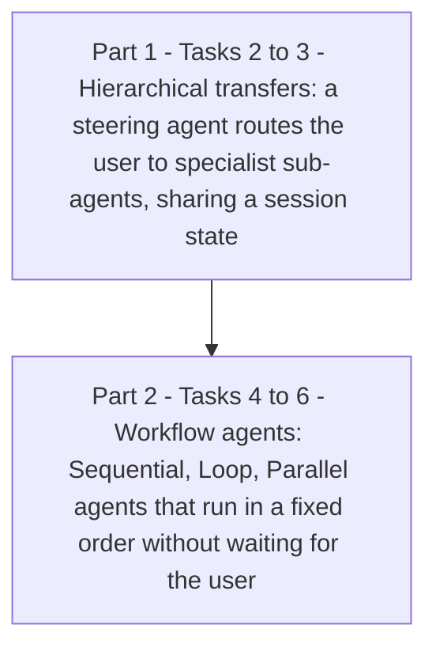
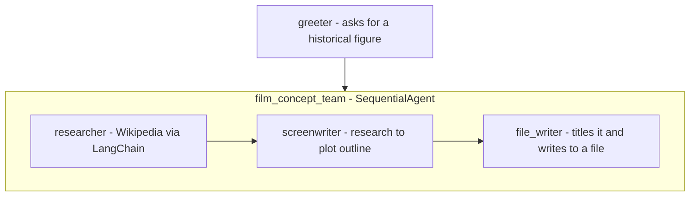
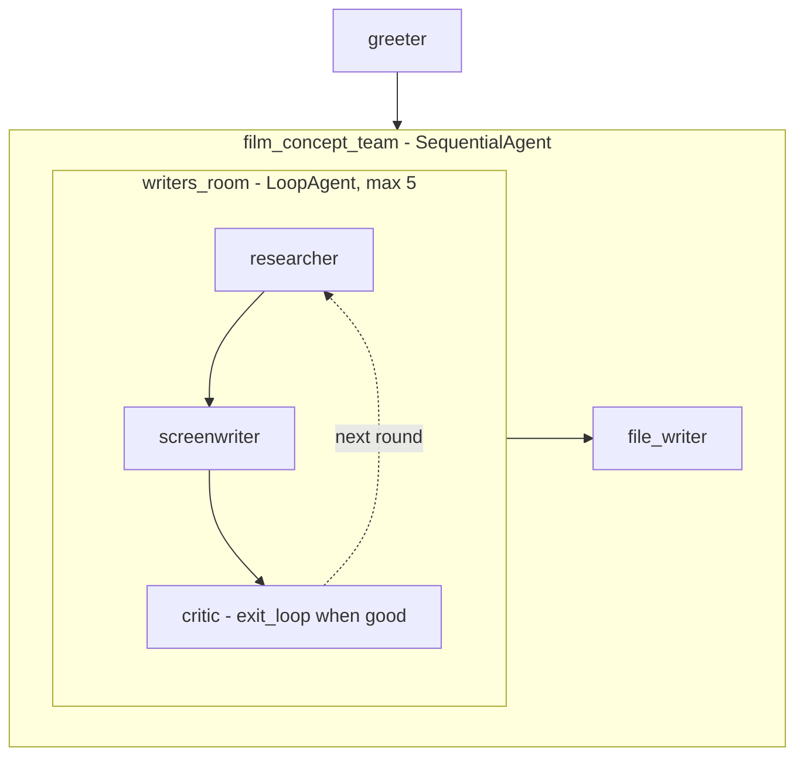
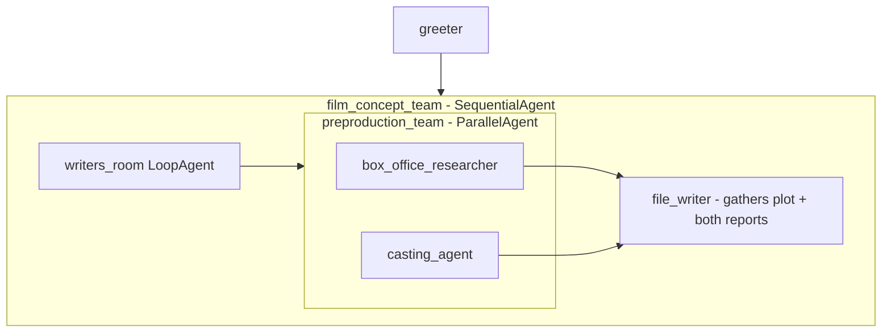
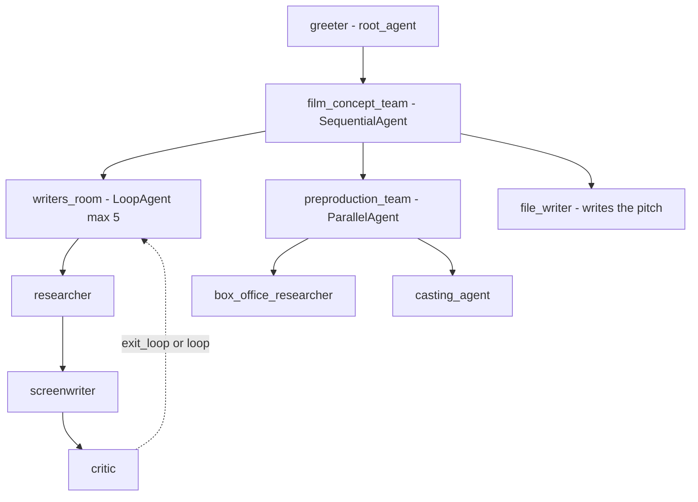
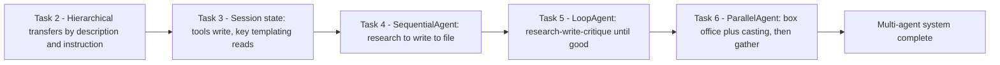

# Build Multi-Agent Systems with ADK (GENAI106)

> **A beginner-friendly, step-by-step guide** — written so that even someone with a non-technical background can understand *what* we are doing, *why* we are doing it, and *how* each piece of code works.

---

## 📋 Table of Contents

1. [Where This Lab Fits — Prerequisites & Learning Path](#1-where-this-lab-fits--prerequisites--learning-path)
2. [The Big Picture — What Is This Lab About?](#2-the-big-picture--what-is-this-lab-about)
3. [Tools & Services Used in This Lab](#3-tools--services-used-in-this-lab)
4. [Key Concepts Explained Simply](#4-key-concepts-explained-simply)
5. [Task 1 — Install ADK & Set Up Your Environment](#5-task-1--install-adk--set-up-your-environment)
6. [Task 2 — Transfers Between Parent, Sub-Agent & Peer Agents](#6-task-2--transfers-between-parent-sub-agent--peer-agents)
7. [Task 3 — Use Session State to Store & Retrieve Information](#7-task-3--use-session-state-to-store--retrieve-information)
8. [Task 4 — Build a Multi-Agent System with a SequentialAgent](#8-task-4--build-a-multi-agent-system-with-a-sequentialagent)
9. [Task 5 — Add a LoopAgent for Iterative Work](#9-task-5--add-a-loopagent-for-iterative-work)
10. [Task 6 — Fan Out & Gather with a ParallelAgent](#10-task-6--fan-out--gather-with-a-parallelagent)
11. [Quick Reference — The Whole Movie-Pitch System](#11-quick-reference--the-whole-movie-pitch-system)
12. [Command-Line & Dev-UI Reference](#12-command-line--dev-ui-reference)

---

## 1. Where This Lab Fits — Prerequisites & Learning Path

This is **lab 1 of the "Deploy an Agent with ADK" skill badge** — one of Week 3's two badges (the other is [Streaming Analytics into BigQuery](../../Week%203%20-%20Streaming%20Analytics%20into%20BigQuery/01-GSP096%20-%20Pub%20Sub%20Qwik%20Start%20-%20Console/README.md)).

| # | Lab | What it teaches |
|---|---|---|
| **01** | **Build Multi-Agent Systems with ADK (GENAI106)** | **Orchestrating multiple agents: hierarchy, state, workflow agents** |
| 02 | Connect to Remote Agents with ADK and the A2A SDK | Agent-to-Agent protocol for remote agents |
| 03 | Use Model Context Protocol (MCP) Tools with ADK Agents | ADK agents as MCP clients + a custom MCP server |
| 04 | Deploy an Agent with ADK: Challenge Lab | Author & deploy agents to Agent Engine |

### Prerequisites

The lab **assumes you've done two earlier ADK labs** (not in this badge):
- *Get started with Google Agent Development Kit (ADK)* — what an agent, model, and instruction are.
- *Empower ADK agents with tools* — how agents call Python functions (tools), incl. the LangChain Wikipedia tool this lab reuses.

If you haven't, this guide's [Key Concepts](#4-key-concepts-explained-simply) section fills the gaps — but expect this to be an **Advanced, ~90-minute** lab. It's Python, not SQL, and a very different world from Weeks 1–2.

> 🌐 **Totally new domain:** Weeks 1–2 were data warehousing. This badge is about **generative-AI agents** — programs that use an LLM (Gemini) to reason, call tools, and hand work to *other* agents. No BigQuery here.

---

## 2. The Big Picture — What Is This Lab About?

### The Scenario (in plain English)

Instead of writing one giant, fragile prompt that tries to do everything, **multi-agent systems** split a hard job across several small, specialized agents that collaborate — each with one clear responsibility. It's the software-engineering principle of "small, single-purpose components" applied to AI.

**Why bother?** The lab lists the payoffs: easier to design (think in terms of agents with jobs), more reliable (specialists beat generalists), organized, maintainable (fix one agent without breaking others), and modular (reuse an agent in another workflow).

You'll practice two ways agents collaborate, then build a real system:



**The capstone:** a **movie-pitch generator**. Give it a historical figure (or even a vague idea like "a mapmaker"), and a team of agents researches them, writes a plot outline through a critique loop, then simultaneously drafts a box-office forecast and casting ideas — writing the whole pitch to a file.

**Think of it like a film studio:** a receptionist (greeter) takes your idea, a writers' room (researcher + screenwriter + critic) drafts and revises the script in rounds, and then two departments (box office + casting) work in parallel before it's all typed up into a pitch document.

---

## 3. Tools & Services Used in This Lab

| Tool / Service | What it is (in one breath) | Learn more |
|---|---|---|
| **Google Agent Development Kit (ADK)** | An open-source framework for building AI agents — define agents in Python, give them models, instructions, tools, and sub-agents, and ADK handles the orchestration. | [ADK docs](https://google.github.io/adk-docs/) · [GitHub](https://github.com/google/adk-python) |
| **Vertex AI + Gemini** | The LLM engine behind the agents. The `.env` sets `GOOGLE_GENAI_USE_VERTEXAI=TRUE` so agents call Gemini (e.g. `gemini-3.5-flash`) through Vertex AI. | [Vertex AI](https://cloud.google.com/vertex-ai/docs) · [Gemini API](https://ai.google.dev/gemini-api/docs) |
| **Agent Engine / Agent Platform** | Google's managed runtime for deploying ADK agents (the API enabled for you here; used fully in the challenge lab). | [Agent Engine docs](https://cloud.google.com/vertex-ai/generative-ai/docs/agent-engine/overview) |
| **ADK Dev UI (`adk web`)** | A local web interface to chat with your agents *and* inspect events, the agent tree, requests/responses, and — crucially — the **session State** tab. | [ADK docs](https://google.github.io/adk-docs/) |
| **ADK CLI (`adk run`)** | A terminal chat interface for quick agent testing. | [ADK docs](https://google.github.io/adk-docs/) |
| **Cloud Shell Editor** | The browser IDE where you edit `agent.py` files and view the generated movie pitches. | [Docs](https://cloud.google.com/shell/docs/editor-overview) |
| **LangChain Wikipedia tool** | A pre-built tool the `researcher` agent uses to look up historical figures. | [LangChain tools](https://python.langchain.com/docs/integrations/tools/) |

---

## 4. Key Concepts Explained Simply

| Concept | Simple Explanation |
|---|---|
| **Agent** | An LLM + a `name`, a `description` (how *others* decide to hand it work), an `instruction` (its own guidance), and optional `tools`/`sub_agents`. |
| **`root_agent`** | The entry point — every conversation starts here. It may route to sub-agents. |
| **Sub-agent** | A child agent. You wire the tree by listing `sub_agents=[...]` on the **parent** — you never set a `parent` on the child. |
| **Hierarchical agent tree** | Agents arranged parent→child. Limiting who can transfer to whom makes the system predictable and debuggable. |
| **Transfer** | Handing control of the conversation to another agent. A parent transfers to a sub-agent based on the sub-agent's `description`; sub-agents can also transfer to **peers** (siblings) by default. |
| **`disallow_transfer_to_peers`** | Set `True` to stop an agent handing off to its siblings. |
| **Session** | One conversation. All its agents share the **history** and a **state** dictionary. |
| **Session state** | A `dict` (`tool_context.state`) agents read/write to pass info between turns and between agents — e.g. a running list of attractions. |
| **`ToolContext`** | The object ADK passes into a tool function giving it access to `state`, `events`, etc. Just add a `tool_context` parameter to receive it. |
| **Key templating `{ attractions? }`** | Inside an instruction, injects a state value by key. The `?` means "don't error if it's missing yet". |
| **`output_key`** | Set on an agent to auto-save its *entire* text response into state under that key. |
| **Workflow agent** | An agent that runs its sub-agents in a guaranteed pattern **without waiting for user input** between them. Three built-ins: 👇 |
| **`SequentialAgent`** | Runs sub-agents one after another, in order (output of one feeds the next). |
| **`LoopAgent`** | Repeats its sub-agents in a cycle until `max_iterations` or a sub-agent calls the `exit_loop` tool. |
| **`ParallelAgent`** | Runs sub-agents concurrently in independent branches — "fan out". |
| **`exit_loop` tool** | A built-in tool an agent calls to break out of a `LoopAgent`. |
| **`append_to_state` tool** | A helper tool to add content to a list-valued state key (great for agents that act many times, e.g. in a loop). |

---

## 5. Task 1 — Install ADK & Set Up Your Environment

### 🎯 What we must achieve

Open the Cloud Shell Editor, pull the lab's code samples, and install ADK.

### Steps

1. Open **Cloud Shell** (press `G` then `S`, or the `>_` icon) → **Continue** → **Authorize**.
2. **Open in new window**, then click the **Open Editor** (pencil) icon → **Explorer** → **Open Folder** → OK (your home folder). This is now your IDE.
3. In the Terminal, copy the lab files and install ADK:

```bash
# copy the lab's code from its Cloud Storage bucket
gcloud storage cp -r gs://<LAB_BUCKET>/* .

# put pip-installed tools on PATH, then install ADK + lab requirements
export PATH=$PATH:"/home/${USER}/.local/bin"
python3 -m pip install google-adk[otel-gcp]==1.30.0 -r adk_multiagent_systems/requirements.txt
```

> 📌 `<LAB_BUCKET>` is your session's bucket name from the lab (looks like `qwiklabs-gcp-…-bucket`). The `google-adk[otel-gcp]` extra adds OpenTelemetry tracing to Google Cloud.

---

## 6. Task 2 — Transfers Between Parent, Sub-Agent & Peer Agents

### 🎯 What we must achieve

See how a parent agent routes the conversation to the right specialist — first by `description` alone, then guided by explicit `instruction`.

### Step 1 — Authenticate the agents

```bash
cd ~/adk_multiagent_systems
cat << EOF > parent_and_subagents/.env
GOOGLE_GENAI_USE_VERTEXAI=TRUE
GOOGLE_CLOUD_PROJECT=<PROJECT_ID>
GOOGLE_CLOUD_LOCATION=global
MODEL=gemini-3.5-flash
EOF
cp parent_and_subagents/.env workflow_agents/.env
```

This `.env` tells ADK to run agents on **Gemini via Vertex AI** in your project. (Copying it to `workflow_agents/` sets up the later tasks.)

### Step 2 — Read the tree (bottom-up!)

Open `parent_and_subagents/agent.py`. Three agents:
- **`steering`** — the `root_agent`. Asks if the user knows where to travel, then routes.
- **`travel_brainstormer`** — helps users who *don't* know where to go.
- **`attractions_planner`** — helps users who *do* know their country.

> 💡 **Read agent.py from the bottom up.** Python requires sub-agents be *defined before* they're referenced, so the file is written child-first. Reading bottom-to-top follows the conversation's logic.

### Step 3 — Wire the sub-agents to the root

Add to the `root_agent` (`steering`) definition:

```python
sub_agents=[travel_brainstormer, attractions_planner]
```

> ⚠️ Note there's **no `parent=` on the children** — the tree is defined *only* by the parent's `sub_agents` list.

### Step 4 — Chat via the CLI

```bash
cd ~/adk_multiagent_systems
adk run parent_and_subagents
```

Say `hello`, then `I could use some help deciding.` → you get transferred to `[travel_brainstormer]` — **based on its `description` alone**, even though `steering`'s instruction never mentions it. Type `exit`.

### Step 5 — Guide transfers explicitly

Add to `steering`'s `instruction`:

```text
If they need help deciding, send them to
'travel_brainstormer'.
If they know what country they'd like to visit,
send them to the 'attractions_planner'.
```

Re-run `adk run parent_and_subagents`. Now `I would like to go to Japan.` routes to `[attractions_planner]`. Then `Actually I don't know what country to visit.` transfers you to `[travel_brainstormer]` — a **peer** of `attractions_planner`. Peer transfers are allowed by default (disable with `disallow_transfer_to_peers=True`). Type `exit`.

> 🔑 **Two routing signals:** an agent's **`description`** (how the *parent* picks it) and the parent's **`instruction`** (explicit rules). Names in instructions refer to the agent's `name` value, not its Python variable name.

✅ **Check my progress.**

---

## 7. Task 3 — Use Session State to Store & Retrieve Information

### 🎯 What we must achieve

Give `attractions_planner` a **tool** that saves chosen attractions into the session **state**, then read them back with **key templating**.

### Step 1 — Add the tool function

In `parent_and_subagents/agent.py`, under `# Tools`:

```python
def save_attractions_to_state(
    tool_context: ToolContext,
    attractions: List[str]
) -> dict[str, str]:
    """Saves the list of attractions to state["attractions"].

    Args:
        attractions [str]: a list of strings to add to the list of attractions

    Returns:
        None
    """
    existing_attractions = tool_context.state.get("attractions", [])
    tool_context.state["attractions"] = existing_attractions + attractions
    return {"status": "success"}
```

| Piece | Meaning |
|---|---|
| `tool_context: ToolContext` | Just declaring this parameter gives the tool access to the session — its `.state` dict and `.events` history. |
| `.state.get("attractions", [])` | Read the current list, defaulting to empty if it's the first save. |
| assigning `.state["attractions"]` | ADK records this change as an **event** and updates the session state after the tool runs. |
| return `{"status": "success"}` | Best practice — tools should return a small status dict. |

### Step 2 — Attach the tool and update the instruction

Add to the `attractions_planner` agent:

```python
tools=[save_attractions_to_state]
```

Add to its `instruction`:

```text
- When they reply, use your tool to save their selected attraction
and then provide more possible attractions.
- If they ask to view the list, provide a bulleted list of
{ attractions? } and then suggest some more.
```

`{ attractions? }` is **key templating** — it injects the `attractions` state value into the prompt; the `?` avoids an error before the key exists.

### Step 3 — Run the Dev UI and watch state change

```bash
adk web --allow_origins "regex:https://.*\.cloudshell\.dev"
```

Open the `http://127.0.0.1:8000` link → select **parent_and_subagents** → chat: `hello` → `I'd like to go to Egypt.` → pick an attraction like `I'll go to the Sphinx`.

- Click the tool-response box (✓) to see the **event** — its `actions.state_delta` shows the state change.
- Open the **State** tab in the sidebar to see your `attractions` array grow.
- Ask `What is on my list?` → it renders your bulleted list from state.

Close the tab and `CTRL+C` the server when done.

> 💡 **Bonus tip:** to store an agent's *entire* response (not just a tool's small update), set **`output_key="some_key"`** on the agent — its whole output lands in `state["some_key"]`. You'll use this heavily in Task 6.

✅ **Check my progress.**

---

## 8. Task 4 — Build a Multi-Agent System with a SequentialAgent

### 🎯 What we must achieve

Switch to the movie-pitch project (`workflow_agents/`) and run the first version: a `SequentialAgent` that runs three agents in order.



- A **`SequentialAgent`** runs its `sub_agents` strictly in order, each one's output feeding the next.
- The `researcher` may call its Wikipedia tool multiple times in a row if it needs more info.
- The `append_to_state` tool (already in the file) lets agents accumulate output across multiple passes.

### Try it

```bash
cd ~/adk_multiagent_systems
adk web --allow_origins "regex:https://.*\.cloudshell\.dev" --reload_agents
```

(`--reload_agents` hot-reloads your code edits. If port 8000 is busy from before, add `--port 8001`.)

Open the UI → select **workflow_agents** → `hello` → enter a historical figure (e.g. `Ada Lovelace`, `Marcus Aurelius`, `Zhang Zhongjing`). The agents run in sequence and write a plot outline to `~/adk_multiagent_systems/movie_pitches/`.

Inspect a turn: click an agent icon to see the **event view** (the tree of agents/tools), plus the **Request** and **Response** tabs. View the generated file in the Editor (enable **View → Word Wrap**).

> 📝 The lab notes the instructions are deliberately brief for teaching — a production system would add far more detailed instructions and examples per agent.

✅ **Check my progress.**

---

## 9. Task 5 — Add a LoopAgent for Iterative Work

### 🎯 What we must achieve

Wrap the research+writing in a **`LoopAgent`** so a `critic` can drive rounds of revision until the outline is good enough.



### Step 1 — Import the tools

In `workflow_agents/agent.py`:

```python
from google.adk.tools import exit_loop
from google.adk.models import Gemini
```

### Step 2 — Add the `critic` agent

Under `# Agents` (don't overwrite existing ones):

```python
critic = Agent(
    name="critic",
    model=Gemini(model=model_name, retry_options=RETRY_OPTIONS),
    description="Reviews the outline so that it can be improved.",
    instruction="""
    INSTRUCTIONS:
    Consider these questions about the PLOT_OUTLINE:
    - Does it meet a satisfying three-act cinematic structure?
    - Do the characters' struggles seem engaging?
    - Does it feel grounded in a real time period in history?
    - Does it sufficiently incorporate historical details from the RESEARCH?

    If the PLOT_OUTLINE does a good job with these questions, exit the writing loop with your 'exit_loop' tool.
    If significant improvements can be made, use the 'append_to_state' tool to add your feedback to the field 'CRITICAL_FEEDBACK'.
    Explain your decision and briefly summarize the feedback you have provided.

    PLOT_OUTLINE:
    { PLOT_OUTLINE? }

    RESEARCH:
    { research? }
    """,
    before_model_callback=log_query_to_model,
    after_model_callback=log_model_response,
    tools=[append_to_state, exit_loop]
)
```

The critic reads the current outline + research (via key templating), and **either** calls `exit_loop` (good enough) **or** appends feedback for the next round.

### Step 3 — Create the `writers_room` LoopAgent

Above the existing `film_concept_team`:

```python
writers_room = LoopAgent(
    name="writers_room",
    description="Iterates through research and writing to improve a movie plot outline.",
    sub_agents=[
        researcher,
        screenwriter,
        critic
    ],
    max_iterations=5,
)
```

> ⚠️ **Always set `max_iterations`** as a safety cap — even when you expect `exit_loop` to end things earlier, it prevents runaway (and costly) loops.

### Step 4 — Slot the loop into the sequence

```python
film_concept_team = SequentialAgent(
    name="film_concept_team",
    description="Write a film plot outline and save it as a text file.",
    sub_agents=[
        writers_room,
        file_writer
    ],
)
```

When the loop exits, it **escalates** control back to the `SequentialAgent`, which moves on to `file_writer`.

### Try it

In the Dev UI: **+ New Session** → `hello` → a *vague* idea now works (e.g. `a cartographer (a map maker)`, `an industrial designer who made products for the masses`). The loop iterates research→write→critique, then writes the file. Review it in the Editor.

✅ **Check my progress.**

---

## 10. Task 6 — Fan Out & Gather with a ParallelAgent

### 🎯 What we must achieve

Add a **`ParallelAgent`** that runs two independent reports *at the same time* — box office and casting — then have the `file_writer` gather everything.



### Step 1 — Add the two agents and the ParallelAgent

Under `# Agents`:

```python
box_office_researcher = Agent(
    name="box_office_researcher",
    model=Gemini(model=model_name, retry_options=RETRY_OPTIONS),
    description="Considers the box office potential of this film",
    instruction="""
    PLOT_OUTLINE:
    { PLOT_OUTLINE? }

    INSTRUCTIONS:
    Write a report on the box office potential of a movie like that described in PLOT_OUTLINE based on the reported box office performance of other recent films.
    """,
    output_key="box_office_report"
)

casting_agent = Agent(
    name="casting_agent",
    model=Gemini(model=model_name, retry_options=RETRY_OPTIONS),
    description="Generates casting ideas for this film",
    instruction="""
    PLOT_OUTLINE:
    { PLOT_OUTLINE? }

    INSTRUCTIONS:
    Generate ideas for casting for the characters described in PLOT_OUTLINE
    by suggesting actors who have received positive feedback from critics and/or
    fans when they have played similar roles.
    """,
    output_key="casting_report"
)

preproduction_team = ParallelAgent(
    name="preproduction_team",
    sub_agents=[
        box_office_researcher,
        casting_agent
    ]
)
```

Each report agent uses **`output_key`** to drop its whole response into state (`box_office_report`, `casting_report`) — the clean way to collect parallel results.

### Step 2 — Insert the parallel team into the sequence

```python
film_concept_team = SequentialAgent(
    name="film_concept_team",
    description="Write a film plot outline and save it as a text file.",
    sub_agents=[
        writers_room,
        preproduction_team,
        file_writer
    ],
)
```

### Step 3 — Update `file_writer` to gather everything

```text
INSTRUCTIONS:
- Create a marketable, contemporary movie title suggestion for the movie described in the PLOT_OUTLINE. If a title has been suggested in PLOT_OUTLINE, you can use it, or replace it with a better one.
- Use your 'write_file' tool to create a new txt file with the following arguments:
    - for a filename, use the movie title
    - Write to the 'movie_pitches' directory.
    - For the 'content' to write, include:
        - The PLOT_OUTLINE
        - The BOX_OFFICE_REPORT
        - The CASTING_REPORT

PLOT_OUTLINE:
{ PLOT_OUTLINE? }

BOX_OFFICE_REPORT:
{ box_office_report? }

CASTING_REPORT:
{ casting_report? }
```

### Try it

**+ New Session** → `hello` → a fun idea (e.g. `that actress who invented the technology for wifi`, `an exciting chef`). The system researches+writes in a loop, fans out box-office and casting **in parallel**, then writes a complete pitch to `movie_pitches/`. Inspect the file.

> 🔑 **The fan-out-and-gather pattern:** independent sub-tasks run concurrently (saving time), each writing to its own `output_key`; a final agent reads all those keys and assembles the result. Because parallel branches *don't* share state with each other mid-run, `output_key` + a gathering step is the standard way to combine their work.

🏁 **Lab complete** — you built a four-layer multi-agent system (routing → sequence → loop → parallel).

---

## 11. Quick Reference — The Whole Movie-Pitch System

Final architecture:



| Building block | Runs its sub-agents… | Ends when… |
|---|---|---|
| `SequentialAgent` | one after another, in order | the last sub-agent finishes |
| `LoopAgent` | in a repeating cycle | `max_iterations` hit **or** `exit_loop` called |
| `ParallelAgent` | all at once, independently | all branches finish |
| Parent + `sub_agents` | via LLM-decided **transfers** | the user ends the chat |

**State cheat-sheet:** write with a tool (`tool_context.state["k"] = v`) or `output_key="k"`; read in an instruction with `{ k? }`.

---

## 12. Command-Line & Dev-UI Reference

```bash
# --- setup ---
gcloud storage cp -r gs://<LAB_BUCKET>/* .
export PATH=$PATH:"/home/${USER}/.local/bin"
python3 -m pip install google-adk[otel-gcp]==1.30.0 -r adk_multiagent_systems/requirements.txt

# --- create the .env (Gemini via Vertex AI) ---
cd ~/adk_multiagent_systems
cat << EOF > parent_and_subagents/.env
GOOGLE_GENAI_USE_VERTEXAI=TRUE
GOOGLE_CLOUD_PROJECT=<PROJECT_ID>
GOOGLE_CLOUD_LOCATION=global
MODEL=gemini-3.5-flash
EOF
cp parent_and_subagents/.env workflow_agents/.env

# --- chat in the terminal ---
adk run parent_and_subagents          # type 'exit' to quit a session

# --- launch the Dev UI (chat + event/state inspector) ---
adk web --allow_origins "regex:https://.*\.cloudshell\.dev"                 # port 8000
adk web --allow_origins "regex:https://.*\.cloudshell\.dev" --reload_agents # hot-reload edits
adk web --port 8001                                                        # if 8000 is busy
```

Universal setup commands (any Google Cloud lab):

```bash
gcloud auth list                        # active account
gcloud config set project PROJECT_ID    # select / switch project
gcloud services enable aiplatform.googleapis.com   # Vertex AI (Agent Engine) API
```

---

### 💎 Beyond the Lab — Pro Tips

Extra details worth knowing for real work and the certification/skill-badge exams:

- **Transfers vs workflow agents — the core design choice.** Use **parent→sub-agent transfers** when a *human* should interact with each specialist and the LLM decides routing; use **workflow agents** (Sequential/Loop/Parallel) when agents should act **automatically, in a guaranteed order**, without waiting for the user. Picking the wrong one is the most common multi-agent design mistake.
- **`description` is for others, `instruction` is for self.** A parent routes using each sub-agent's **`description`**, so write descriptions as "when to pick me" blurbs. The **`instruction`** is the agent's private how-to. Vague descriptions cause mis-routing — the #1 debugging issue.
- **Always cap loops.** `max_iterations` is a hard stop that protects you from an LLM that never decides to `exit_loop` — each iteration is real model calls and real money.
- **Parallel branches are isolated.** `ParallelAgent` sub-agents *don't* see each other's state mid-run — that's why each writes to its own `output_key` and a later agent gathers them. Don't expect one parallel branch to read another's in-progress work.
- **Read agent files bottom-up.** Python's define-before-use rule means the entry `root_agent` sits at the *bottom* of `agent.py`. This trips up everyone at first.
- **`output_key` vs a tool.** Use `output_key` to capture an agent's *entire* response; use a state-writing tool (`tool_context.state[...]`) for *granular* updates (a list item, a single field). The critic uses a tool (append feedback); the report agents use `output_key` (whole report).
- **The Dev UI's State + Events tabs are your debugger.** When an agent behaves oddly, the `state_delta` on each event and the live State tab tell you exactly what every tool wrote — far faster than re-reading prompts.
- **Callbacks for observability.** `before_model_callback` / `after_model_callback` (the `log_query_to_model` / `log_model_response` in the critic) let you log or modify every model request/response — the hook point for tracing, guardrails, and cost tracking.

---

### 🏁 Summary of the Journey



**Key lessons learned:**
1. **Divide and specialize:** many small single-purpose agents beat one giant prompt — easier to design, more reliable, maintainable, modular.
2. The tree is defined by the **parent's `sub_agents`** list; routing uses a sub-agent's **`description`** plus the parent's **`instruction`**.
3. **Session state** (`tool_context.state` + `{ key? }` templating + `output_key`) is how agents share information across turns and hand-offs.
4. Three **workflow agents** cover the essential patterns: **Sequential** (ordered pipeline), **Loop** (iterate until good, capped by `max_iterations`/`exit_loop`), **Parallel** (fan out independent work).
5. The **fan-out-and-gather** pattern — parallel agents writing to `output_key`s, a final agent assembling them — is how you build complex documents fast.
6. Real reliability comes from **detailed instructions + examples per agent** — the lab's brevity is for teaching, not production.
