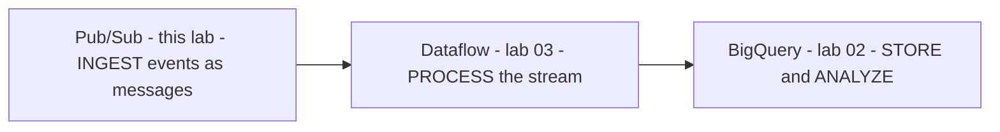
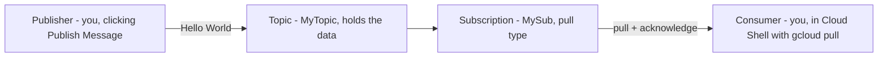
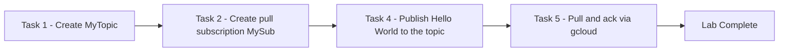

# Pub/Sub: Qwik Start - Console (GSP096)

> **A beginner-friendly, step-by-step guide** — written so that even someone with a non-technical background can understand *what* we are doing, *why* we are doing it, and *how* each step works.

---

## 📋 Table of Contents

1. [Where This Lab Fits — Prerequisites & Learning Path](#1-where-this-lab-fits--prerequisites--learning-path)
2. [The Big Picture — What Is This Lab About?](#2-the-big-picture--what-is-this-lab-about)
3. [Tools & Services Used in This Lab](#3-tools--services-used-in-this-lab)
4. [Key Concepts Explained Simply](#4-key-concepts-explained-simply)
5. [Task 1 — Set Up Pub/Sub (Create a Topic)](#5-task-1--set-up-pubsub-create-a-topic)
6. [Task 2 — Add a Subscription](#6-task-2--add-a-subscription)
7. [Tasks 4–5 — Publish a Message and Pull It](#7-tasks-45--publish-a-message-and-pull-it)
8. [Quiz Answers — All in One Place](#8-quiz-answers--all-in-one-place)
9. [Quick Reference — All Steps in One Place](#9-quick-reference--all-steps-in-one-place)
10. [Command-Line Alternatives (Cloud Shell)](#10-command-line-alternatives-cloud-shell)

---

## 1. Where This Lab Fits — Prerequisites & Learning Path

This is **lab 1 of the "Streaming Analytics into BigQuery" skill badge** ([course 752](https://www.cloudskillsboost.google/course_templates/752)) — one of Week 3's two badges.

| # | Lab | What it teaches |
|---|---|---|
| **01** | **Pub/Sub: Qwik Start - Console (GSP096)** | **Messaging: topics, subscriptions, publish & pull** |
| 02 | BigQuery: Qwik Start - Console (GSP072) | ✅ Already done — see the [Week 2 guide](../../Week%202%20-%20Derive%20Insights%20from%20BigQuery%20Data/02-GSP072%20-%20BigQuery%20Qwik%20Start%20-%20Console/README.md) |
| 03 | Dataflow: Qwik Start - Templates (GSP192) | Streaming pipelines from templates |
| 04 | Streaming Analytics into BigQuery: Challenge Lab (GSP903) | Everything combined, no hand-holding |

### Prerequisites

None for the lab itself — but knowing the Cloud Shell basics from [Week 2's GSP071](../../Week%202%20-%20Derive%20Insights%20from%20BigQuery%20Data/03-GSP071%20-%20BigQuery%20Qwik%20Start%20-%20Command%20Line/README.md) helps (activate `>_`, Authorize, `gcloud auth list`, `gcloud config list project`).

### Why this badge's lab order matters

The three services form the **classic streaming pipeline** — each lab is one stage:



By the challenge lab you'll wire all three together: events flow into a Pub/Sub topic, a Dataflow template moves them, and BigQuery makes them queryable.

---

## 2. The Big Picture — What Is This Lab About?

### The Scenario (in plain English)

**Pub/Sub is a messaging service for exchanging event data among applications and services.** Instead of app A calling app B directly (and breaking when B is down or slow), A drops messages into a **topic** and walks away. Any number of consumers **subscribe** to that topic and process the messages at their own pace. Every subscriber must **acknowledge** each message within a configurable time window — otherwise Pub/Sub re-delivers it.

This 10-minute lab walks the smallest complete loop:



**Think of it like a post-office box:** the publisher drops letters into the box (topic); the box doesn't care who reads them or when. A subscription is *your named collection point* for that box's mail, and pulling with acknowledgment is signing for the letter — until you sign, the post office assumes it wasn't delivered and will offer it again.

**Why "decoupling" matters:** the publisher never waits for, knows about, or breaks because of the consumer — that independence is what makes event-driven systems reliable and scalable, and it's why Pub/Sub sits at the front of virtually every real-time pipeline on Google Cloud.

---

## 3. Tools & Services Used in This Lab

| Tool / Service | What it is (in one breath) | Learn more |
|---|---|---|
| **Pub/Sub** | Google's fully-managed, **asynchronous messaging service** — global, highly reliable, scales from zero to millions of messages/second with no servers to run. | [Docs](https://cloud.google.com/pubsub/docs) · [What is Pub/Sub?](https://cloud.google.com/pubsub/docs/overview) |
| **Topic** | The named channel publishers send to (this lab: `MyTopic`). | [Create & manage topics](https://cloud.google.com/pubsub/docs/create-topic) |
| **Subscription** | A named attachment to a topic that receives its messages (this lab: `MySub`, **Pull** type). Each subscription gets its own copy of every message. | [Subscriptions overview](https://cloud.google.com/pubsub/docs/subscription-overview) |
| **Cloud Shell + gcloud** | The browser terminal used to *consume* the message: `gcloud pubsub subscriptions pull`. | [Cloud Shell docs](https://cloud.google.com/shell/docs) · [gcloud pubsub reference](https://cloud.google.com/sdk/gcloud/reference/pubsub) |

---

## 4. Key Concepts Explained Simply

| Concept | Simple Explanation |
|---|---|
| **Publisher (producer)** | Any app that creates and sends messages **to a topic**. |
| **Subscriber (consumer)** | Any app that creates a **subscription to a topic** and receives its messages. |
| **Topic** | The mailbox — a named channel that *holds* published data. |
| **Subscription** | Your registered claim on a topic's messages. Many subscriptions can attach to one topic; each receives **all** messages independently. |
| **Pull delivery** | The subscriber *asks* for messages when it's ready (`gcloud pubsub subscriptions pull`) — you control the pace. |
| **Push delivery** | The reverse: Pub/Sub POSTs each message to a **webhook URL** you configure — Pub/Sub controls the pace. |
| **Acknowledgment (ack)** | "Got it, don't send it again." Every subscriber must ack each message **within a configurable window** — unacked messages get re-delivered. `--auto-ack` acks in the same step as pulling. |
| **Asynchronous messaging** | The publisher doesn't wait for consumers — it fires and moves on. This *decoupling* is Pub/Sub's whole reason for existing. |
| **Event data** | The kind of payload Pub/Sub carries: "something happened" records — a click, a sale, a sensor reading, a `Hello World`. |

---

## 5. Task 1 — Set Up Pub/Sub (Create a Topic)

### 🎯 What we must achieve

Create the channel that will hold the data.

### Steps

1. **Navigation menu → View All Products → Analytics → Pub/Sub → Topics.**
2. Click **Create topic**.
3. In the dialog: **Topic ID** = `MyTopic` (topic names must be unique within the project); leave everything else at defaults.
4. Click **Create**.

✅ **Check my progress.**

---

## 6. Task 2 — Add a Subscription

### 🎯 What we must achieve

Register a collection point so messages published to `MyTopic` can be received.

### Steps

1. **Topics** page → click the **⋮ (three dots)** next to `MyTopic` → **Create subscription**.
2. In the dialog:

| Field | Value |
|---|---|
| Subscription ID | `MySub` |
| Topic name | `projects/<PROJECT_ID>/topics/MyTopic` (confirm it points at your topic) |
| Delivery Type | **Pull** |
| Everything else | defaults |

3. Click **Create** — `MySub` appears in the Subscriptions list.

> 📌 **Pull** means *you* fetch messages when ready (perfect for batch workers and this lab's Cloud Shell demo). **Push** would instead have Pub/Sub call a webhook endpoint of yours the moment a message arrives.

✅ **Check my progress.**

---

## 7. Tasks 4–5 — Publish a Message and Pull It

### Task 4 — Publish (the producer side)

1. **Pub/Sub → Topics → MyTopic**.
2. **Messages** tab → **Publish Message**.
3. Message body: `Hello World` → **Publish**.

The message now sits in the topic, waiting for `MySub`'s consumer.

### Task 5 — Pull (the consumer side)

In **Cloud Shell**:

```bash
gcloud pubsub subscriptions pull --auto-ack MySub
```

| Piece | Meaning |
|---|---|
| `subscriptions pull` | "Give me pending messages from this subscription." Note you pull from the **subscription**, never the topic. |
| `--auto-ack` | Acknowledge in the same step — without it, the message stays "outstanding" and would be re-delivered after the ack deadline. |
| Output | `Hello World` appears in the **DATA** field, alongside a MESSAGE_ID. |

🏁 **Full loop complete:** topic created → published to the topic → subscription created → data pulled through the subscription.

---

## 8. Quiz Answers — All in One Place

| # | Question | Answer |
|---|---|---|
| 1 | A publisher application creates and sends messages to a ____. Subscriber applications create a ____ to a topic to receive messages from it. | **topic, subscription** |
| 2 | Cloud Pub/Sub is an asynchronous messaging service designed to be highly reliable and scalable. | **True** |

---

## 9. Quick Reference — All Steps in One Place

**Console path:** Navigation menu → View All Products → Analytics → **Pub/Sub**

1. **Topics → Create topic** → ID `MyTopic` → Create ✅
2. `MyTopic` **⋮ → Create subscription** → ID `MySub`, Delivery = **Pull** → Create ✅
3. **MyTopic → Messages tab → Publish Message** → `Hello World` → Publish
4. Cloud Shell:

```bash
gcloud pubsub subscriptions pull --auto-ack MySub    # Hello World in the DATA field
```

---

## 10. Command-Line Alternatives (Cloud Shell)

The entire lab is four `gcloud` commands — a preview of how you'll script it in the challenge lab:

### Universal setup commands (work in any lab)

```bash
gcloud auth list                        # active account
gcloud config list project              # current project
gcloud config set project PROJECT_ID    # select / switch project
gcloud services enable pubsub.googleapis.com     # enable the Pub/Sub API
gcloud projects add-iam-policy-binding PROJECT_ID \
  --member="user:someone@example.com" --role="roles/pubsub.editor"  # IAM grant
```

### UI step → CLI equivalent for this lab

| Console (UI) step | Cloud Shell command |
|---|---|
| Task 1: Create topic `MyTopic` | `gcloud pubsub topics create MyTopic` |
| Task 2: Create pull subscription `MySub` | `gcloud pubsub subscriptions create MySub --topic=MyTopic` (pull is the default type) |
| Task 4: Publish `Hello World` | `gcloud pubsub topics publish MyTopic --message="Hello World"` |
| Task 5: Pull + acknowledge | `gcloud pubsub subscriptions pull --auto-ack MySub` (already CLI in the lab) |
| Verify what exists | `gcloud pubsub topics list` · `gcloud pubsub subscriptions list` |
| Clean up (own account) | `gcloud pubsub subscriptions delete MySub` · `gcloud pubsub topics delete MyTopic` |

> 💡 Note the now-familiar grammar from [GSP281](../../Week%202%20-%20Derive%20Insights%20from%20BigQuery%20Data/01-GSP281%20-%20Introduction%20to%20SQL%20for%20BigQuery%20and%20Cloud%20SQL/README.md): `gcloud <service> <thing> <verb>` — `gcloud pubsub topics create`, `gcloud pubsub subscriptions pull`.

---

### 💎 Beyond the Lab — Pro Tips

Extra details the lab doesn't tell you, worth knowing for real work and the certification exam:

- **Delivery is *at-least-once*, not exactly-once.** Pub/Sub may occasionally deliver a message twice (e.g., ack lost in transit) — consumers must be **idempotent** (processing the same message twice must be harmless). This is the #1 Pub/Sub exam fact.
- **The ack deadline is configurable:** default **10 seconds**, extendable up to 600. If your processing takes longer than the deadline, the message re-delivers mid-work — another reason idempotency matters.
- **Unpulled messages don't wait forever:** default retention is **7 days** per subscription. And a message published *before* a subscription exists is **never seen by it** — subscriptions only receive messages published after their creation (why the lab creates `MySub` before publishing!).
- **Pull vs push decision rule:** pull for high-throughput batch consumers and anything behind a firewall; push for low-traffic, latency-sensitive webhook-style integrations.
- **Replay exists:** subscriptions support **seek** (rewind to a timestamp or snapshot) and **dead-letter topics** (park messages that repeatedly fail) — the two features that turn "messaging" into a reliable pipeline.
- **Fan-out is free architecture:** attach multiple subscriptions to one topic and every consumer gets its own full copy of the stream — one order-event topic can feed billing, analytics, and inventory systems simultaneously without any of them knowing about the others.
- **Exam tip — the pipeline trio:** questions about "streaming data into BigQuery" almost always want **Pub/Sub (ingest) → Dataflow (process) → BigQuery (analyze)** — exactly this badge's three labs.

---

### 🏁 Summary of the Journey



**Key lessons learned:**
1. **Publishers send to topics; subscribers receive through subscriptions** — you never pull from a topic directly.
2. Pub/Sub is **asynchronous**: producers and consumers are fully decoupled in time, pace, and knowledge of each other.
3. Every message must be **acknowledged** within the deadline or it re-delivers — `--auto-ack` handles it for quick demos.
4. **Create the subscription before publishing** — messages published earlier are invisible to it.
5. Pull = you fetch on your schedule; Push = Pub/Sub calls your webhook.
6. This is stage one of the badge's pipeline: **Pub/Sub → Dataflow → BigQuery**.
