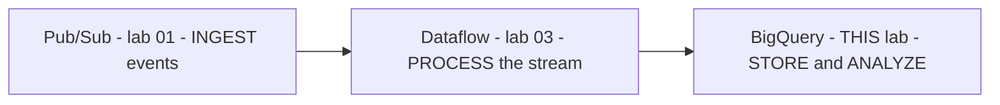

# BigQuery: Qwik Start - Console (GSP072) — Repeat Lab

> ✅ **You've already completed this lab** — it appeared as **lab 02 of Week 2** (Derive Insights from BigQuery Data), and the skill badges share it. The full guide lives there:
>
> ### 👉 [Week 2 — 02-GSP072 - BigQuery Qwik Start - Console](../../Week%202%20-%20Derive%20Insights%20from%20BigQuery%20Data/02-GSP072%20-%20BigQuery%20Qwik%20Start%20-%20Console/README.md)
>
> (Full walkthrough, tools table, quiz answer, CLI alternatives, and pro tips — all there. This page is just the re-run recap and this badge's context.)

---

## Why is this lab in the Streaming Analytics badge too?

Because BigQuery is the **final stage of the streaming pipeline** this badge builds:



In [lab 01 (GSP096)](../01-GSP096%20-%20Pub%20Sub%20Qwik%20Start%20-%20Console/README.md) you published messages into Pub/Sub; in lab 03 a Dataflow template will move a stream into a BigQuery table; the challenge lab (GSP903) wires it all together. This lab re-confirms you can create the **dataset + table** that a streaming pipeline needs as its destination — in the challenge lab you'll do exactly that *before* pointing Dataflow at it.

## 90-second re-run checklist

The lab content is unchanged from Week 2 — if re-running it, this is the whole thing:

1. **Task 2** — query the public natality table (10 heaviest birth weights):
   ```sql
   #standardSQL
   SELECT weight_pounds, state, year, gestation_weeks
   FROM `bigquery-public-data.samples.natality`
   ORDER BY weight_pounds DESC LIMIT 10;
   ```
2. **Task 3** — create dataset `babynames` (defaults). ✅
3. **Task 4** — Create table from GCS `spls/gsp072/baby-names/yob2014.txt`, format **CSV**, name `names_2014`, schema-as-text `name:string,gender:string,count:integer`. ✅
4. **Task 5** — Preview tab.
5. **Task 6** — top 5 boys' names:
   ```sql
   #standardSQL
   SELECT name, count
   FROM `babynames.names_2014`
   WHERE gender = 'M'
   ORDER BY count DESC LIMIT 5;
   ```

Or the pure-CLI speed-run (from the Week 2 guide's CLI section):

```bash
bq mk --dataset $GOOGLE_CLOUD_PROJECT:babynames
bq load --source_format=CSV babynames.names_2014 \
  gs://spls/gsp072/baby-names/yob2014.txt \
  name:string,gender:string,count:integer
bq query --use_legacy_sql=false \
  'SELECT name, count FROM babynames.names_2014 WHERE gender = "M" ORDER BY count DESC LIMIT 5'
```

## 💎 One extra tip for the streaming context

When BigQuery is a **streaming destination** (as in this badge's challenge lab), the table's schema must match the incoming messages — Dataflow's Pub/Sub→BigQuery template expects the topic's JSON fields to map onto the table's columns. The schema-as-text skill from Task 4 (`name:string,gender:string,count:integer`) is exactly how you'll define that destination table quickly.
