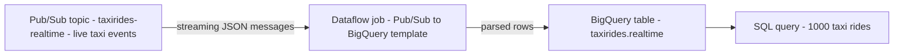
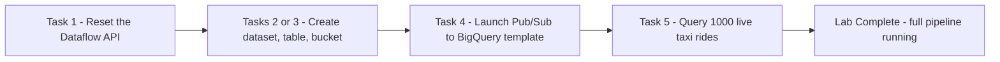

# Dataflow: Qwik Start - Templates (GSP192)

> **A beginner-friendly, step-by-step guide** — written so that even someone with a non-technical background can understand *what* we are doing, *why* we are doing it, and *how* each step works.

---

## 📋 Table of Contents

1. [Where This Lab Fits — Prerequisites & Learning Path](#1-where-this-lab-fits--prerequisites--learning-path)
2. [The Big Picture — What Is This Lab About?](#2-the-big-picture--what-is-this-lab-about)
3. [Tools & Services Used in This Lab](#3-tools--services-used-in-this-lab)
4. [Key Concepts Explained Simply](#4-key-concepts-explained-simply)
5. [Task 1 — Re-enable the Dataflow API](#5-task-1--re-enable-the-dataflow-api)
6. [Task 2 — Create Dataset, Table & Bucket (CLI Method)](#6-task-2--create-dataset-table--bucket-cli-method)
7. [Task 3 — Same Setup via the Console (Alternative)](#7-task-3--same-setup-via-the-console-alternative)
8. [Task 4 — Run the Pipeline](#8-task-4--run-the-pipeline)
9. [Task 5 — Submit a Query](#9-task-5--submit-a-query)
10. [Quiz Answers — All in One Place](#10-quiz-answers--all-in-one-place)
11. [Quick Reference — All Commands in One Place](#11-quick-reference--all-commands-in-one-place)

---

## 1. Where This Lab Fits — Prerequisites & Learning Path

This is **lab 3 of the "Streaming Analytics into BigQuery" skill badge** ([course 752](https://www.cloudskillsboost.google/course_templates/752)) — one of Week 3's two badges.

| # | Lab | What it teaches |
|---|---|---|
| 01 | [Pub/Sub: Qwik Start - Console (GSP096)](../01-GSP096%20-%20Pub%20Sub%20Qwik%20Start%20-%20Console/README.md) | Messaging: topics, subscriptions, publish & pull |
| 02 | [BigQuery: Qwik Start - Console (GSP072)](../02-GSP072%20-%20BigQuery%20Qwik%20Start%20-%20Console/README.md) | Datasets, tables, loading & querying |
| **03** | **Dataflow: Qwik Start - Templates (GSP192)** | **Wiring it together — a streaming Pub/Sub → BigQuery pipeline** |
| 04 | Streaming Analytics into BigQuery: Challenge Lab (GSP903) | Everything combined, no hand-holding |

### Prerequisites

Labs 01 and 02 — this is the lab where **the two previous services connect**. You'll recognize every piece: a Pub/Sub topic feeds the pipeline (lab 01), and a BigQuery dataset+table receives the results (lab 02). Dataflow is the new middle piece that moves data between them, and this lab uses a **pre-built template** so you don't write a line of pipeline code.

### 🎉 This is the "aha" lab of the badge



Everything the first two labs taught in isolation now runs as **one continuous streaming pipeline**. A public firehose of live taxi-ride events flows through Dataflow into a table you can query in real time.

---

## 2. The Big Picture — What Is This Lab About?

### The Scenario (in plain English)

You want live event data (taxi rides streaming in as JSON messages on a Pub/Sub topic) to land in BigQuery so you can query it. Writing that data-moving program yourself would mean learning Apache Beam, handling parsing, retries, scaling… a lot.

**Dataflow templates** skip all of it. Google provides ready-made pipelines for common jobs; you just pick one, point it at your source and destination, and click go. This lab uses the **Pub/Sub to BigQuery** template: it reads JSON messages from a Pub/Sub topic and writes them into a BigQuery table, continuously, scaling workers up and down on its own.

**Think of it like hiring a moving company with a standard package:** you don't design the truck or train the movers (that's Apache Beam). You say "move everything from address A (Pub/Sub) to address B (BigQuery)," hand over the keys, and they handle the trucks, the traffic, and the heavy lifting — adding more trucks automatically if there's a lot to move.

### The three-step setup

1. **Prepare the destination** — a BigQuery `taxirides` dataset with a `realtime` table whose schema matches the incoming taxi-ride JSON (Task 2 or 3).
2. **Prepare a staging area** — a Cloud Storage bucket where Dataflow keeps temporary files while it works.
3. **Launch the template** — one `gcloud dataflow jobs run` command wires the public Pub/Sub topic to your table (Task 4).

Then you just **query the data as it streams in** (Task 5).

---

## 3. Tools & Services Used in This Lab

| Tool / Service | What it is (in one breath) | Learn more |
|---|---|---|
| **Dataflow** | Google's fully-managed service for **running data-processing pipelines** (built on Apache Beam) — handles both *streaming* (continuous) and *batch* (bounded) data, auto-scaling workers for you. | [Docs](https://cloud.google.com/dataflow/docs) · [Overview](https://cloud.google.com/dataflow/docs/overview) |
| **Dataflow templates** | **Pre-built, parameterized pipelines** Google ships so you don't write code — pick one, fill in source/destination, run. | [Provided templates](https://cloud.google.com/dataflow/docs/templates/provided-templates) |
| **Pub/Sub to BigQuery template** | The specific template here — reads JSON messages from a topic, writes them to a BigQuery table. | [Template docs](https://cloud.google.com/dataflow/docs/templates/provided-templates#cloudpubsubtobigquery) |
| **Pub/Sub** | The **source**: the public `pubsub-public-data:taxirides-realtime` topic streams live NYC taxi-ride events as JSON (from [lab 01](../01-GSP096%20-%20Pub%20Sub%20Qwik%20Start%20-%20Console/README.md)). | [Docs](https://cloud.google.com/pubsub/docs) |
| **BigQuery** | The **destination & analysis engine**: the `taxirides.realtime` table receives the stream (from [lab 02](../02-GSP072%20-%20BigQuery%20Qwik%20Start%20-%20Console/README.md)). | [Docs](https://cloud.google.com/bigquery/docs) |
| **Cloud Storage** | The **staging area**: a bucket where Dataflow parks temporary/working files during the job. | [Docs](https://cloud.google.com/storage/docs) |
| **`bq` / `gsutil` / `gcloud`** | The CLIs used in the Cloud Shell path: `bq` builds the dataset/table, `gsutil` makes the bucket, `gcloud dataflow` launches the pipeline. | [gcloud dataflow](https://cloud.google.com/sdk/gcloud/reference/dataflow) |

---

## 4. Key Concepts Explained Simply

| Concept | Simple Explanation |
|---|---|
| **Pipeline** | A defined path data flows through: read → transform → write. Here: read Pub/Sub → (parse JSON) → write BigQuery. |
| **Streaming vs batch** | **Streaming** = unbounded, never-ending data processed as it arrives (this lab). **Batch** = a fixed, finite dataset processed once. Dataflow does **both**. |
| **Template** | A pre-packaged pipeline with blanks to fill in (input topic, output table, staging location). No code, no Apache Beam knowledge needed. |
| **Apache Beam** | The open-source SDK Dataflow runs under the hood. Templates hide it from you — but it's why Dataflow can run the same pipeline on other engines too. |
| **Worker (machine type)** | The VMs Dataflow spins up to do the work (`e2-medium` here). It adds/removes them automatically based on load — that's **autoscaling**. |
| **Staging location** | A `gs://bucket/temp` path where Dataflow stashes temporary files. Every job needs one. |
| **Schema must match** | The table's columns (`ride_id`, `latitude`, `timestamp`…) must line up with the JSON fields in the messages, or rows won't land. |
| **Time-partitioned table** | The `realtime` table is partitioned on `timestamp` (the [GSP414](../../Week%201%20-%20Build%20a%20Data%20Warehouse%20with%20BigQuery/02-GSP414%20-%20Creating%20Date-Partitioned%20Tables%20in%20BigQuery/README.md) trick again) — smart for time-series streaming data. |
| **Job** | One running instance of a pipeline. You watch it in the Dataflow → Jobs console, and it keeps running (and billing) until you stop it. |

---

## 5. Task 1 — Re-enable the Dataflow API

### 🎯 What we must achieve

A lab-environment quirk: the Dataflow API sometimes needs a **kick** to work reliably. Disable it, then re-enable it.

```bash
gcloud services disable dataflow.googleapis.com --project <PROJECT_ID> --force
gcloud services enable dataflow.googleapis.com --project <PROJECT_ID>
```

| Piece | Meaning |
|---|---|
| `gcloud services disable/enable` | Turn a Google Cloud API off/on for your project — the general command for API management. |
| `--force` | Disable even if other things depend on it (needed here). |
| Why do this? | It resets the API connection so the Dataflow job in Task 4 launches cleanly. Purely a lab housekeeping step. |

✅ **Check my progress.**

> 💡 In everyday work you rarely disable-then-enable — you just `gcloud services enable dataflow.googleapis.com` once. This lab's disable-first dance is only to reset a flaky provisioning state.

---

## 6. Task 2 — Create Dataset, Table & Bucket (CLI Method)

> ⚠️ **Pick ONE path:** Task 2 (CLI, below) **or** Task 3 (console). Don't do both — they create the same resources. This guide recommends the CLI: it's faster and it's what the challenge lab expects.

### Step 1 — Create the dataset

```bash
bq mk taxirides
```

→ `Dataset '<project>:taxirides' successfully created`. ✅ **Check my progress.**

### Step 2 — Create the table with a schema

```bash
bq mk \
--time_partitioning_field timestamp \
--schema ride_id:string,point_idx:integer,latitude:float,longitude:float,\
timestamp:timestamp,meter_reading:float,meter_increment:float,ride_status:string,\
passenger_count:integer -t taxirides.realtime
```

| Piece | Meaning |
|---|---|
| `--time_partitioning_field timestamp` | Partition the table by the `timestamp` column — ideal for time-series streaming data. |
| `--schema ride_id:string,...` | A comma-separated `field:type` list — the same compact schema syntax from [lab 02](../02-GSP072%20-%20BigQuery%20Qwik%20Start%20-%20Console/README.md). These nine fields **must match** the taxi-ride JSON. |
| `-t taxirides.realtime` | `-t` = create a **table** named `realtime` inside the `taxirides` dataset. |
| trailing `\` | Line-continuation — it's one command split across lines for readability. |

→ `Table '<project>:taxirides.realtime' successfully created`. ✅ **Check my progress.**

### Step 3 — Create the staging bucket

```bash
export BUCKET_NAME="<PROJECT_ID>"       # Project ID = a guaranteed-unique bucket name
gsutil mb gs://$BUCKET_NAME/
```

| Piece | Meaning |
|---|---|
| `export BUCKET_NAME=...` | Save the name in a shell variable so later commands can reuse `$BUCKET_NAME`. |
| `gsutil mb` | **m**ake **b**ucket. (Modern equivalent: `gcloud storage buckets create`.) |
| Why the Project ID? | Bucket names are globally unique across *all* of Google Cloud; your Project ID is already unique, so it's a safe choice. |

✅ **Check my progress.** → Skip to [Task 4](#8-task-4--run-the-pipeline).

---

## 7. Task 3 — Same Setup via the Console (Alternative)

> ⛔ **Skip this if you did Task 2.** Same resources, clicked instead of typed.

1. **Navigation menu → BigQuery → Done.**
2. **⋮ next to your project → Create dataset**: ID `taxirides`, **Data location = us (multiple regions)** → Create dataset.
3. **⋮ next to `taxirides` → Open → Create table** (right side).
4. **Destination → Table** = `realtime`.
5. **Schema → Edit as text** (toggle on), paste:
   ```text
   ride_id:string,point_idx:integer,latitude:float,longitude:float,timestamp:timestamp,
   meter_reading:float,meter_increment:float,ride_status:string,passenger_count:integer
   ```
6. **Create table.**
7. **Cloud Storage → Buckets → Create bucket**: name = your **Project ID**, defaults → Create.

✅ Progress checks fire the same as Task 2.

---

## 8. Task 4 — Run the Pipeline

### 🎯 What we must achieve

Launch the Dataflow template that connects the public taxi topic to your table.

```bash
gcloud dataflow jobs run iotflow \
    --gcs-location gs://dataflow-templates-<REGION>/latest/PubSub_to_BigQuery \
    --region <REGION> \
    --worker-machine-type e2-medium \
    --staging-location gs://<BUCKET_NAME>/temp \
    --parameters inputTopic=projects/pubsub-public-data/topics/taxirides-realtime,outputTableSpec=<PROJECT_ID>:taxirides.realtime
```

| Piece | Meaning |
|---|---|
| `dataflow jobs run iotflow` | Start a new Dataflow job named `iotflow`. |
| `--gcs-location .../PubSub_to_BigQuery` | **Which template** to run — the Pub/Sub → BigQuery one, stored in a Google bucket per region. |
| `--region <REGION>` | Where to run (use *your* lab's region, e.g. `us-central1` — it appears twice, in the URL and the flag). |
| `--worker-machine-type e2-medium` | The VM size for workers (a small, cheap default). |
| `--staging-location gs://<BUCKET>/temp` | The temp workspace — your Task 2/3 bucket. |
| `--parameters inputTopic=...,outputTableSpec=...` | **The two blanks the template needs:** the source topic (`pubsub-public-data:taxirides-realtime`) and the destination table (`<PROJECT_ID>:taxirides.realtime`). |

Watch it launch: **Navigation menu → View all products → Analytics → Dataflow → Jobs** — your `iotflow` job appears and builds its workers. ✅ **Check my progress** (wait a minute for tracking to catch up).

> ⚠️ **Substitute your real values** for `<REGION>`, `<BUCKET_NAME>`, and `<PROJECT_ID>` — the outputTableSpec uses `PROJECT_ID:dataset.table` format (a colon after the project, like `bq`).

---

## 9. Task 5 — Submit a Query

Give the pipeline a minute to spin up and start writing, then query the live data:

```sql
SELECT * FROM `<PROJECT_ID>.taxirides.realtime` LIMIT 1000
```

→ 1000 taxi-ride rows that flowed **Pub/Sub → Dataflow → BigQuery** moments ago. If it errors or returns nothing, wait and re-run — the pipeline takes a minute to warm up.

🏁 **You just built an end-to-end streaming pipeline with zero pipeline code.**

> 📌 Remember the Dataflow job **keeps running** (and billing) until stopped. In the lab it's torn down automatically; on your own account, stop it from the Dataflow → Jobs page.

---

## 10. Quiz Answers — All in One Place

| # | Question | Answer |
|---|---|---|
| 1 | Google Cloud Dataflow supports batch processing. | **True** (it does *both* batch and streaming) |
| 2 | Which Dataflow Template was used to run the pipeline? | **Pub/Sub to BigQuery** |

---

## 11. Quick Reference — All Commands in One Place

```bash
# Task 1 — reset the Dataflow API
gcloud services disable dataflow.googleapis.com --project <PROJECT_ID> --force
gcloud services enable dataflow.googleapis.com --project <PROJECT_ID>

# Task 2 — dataset, partitioned table, staging bucket
bq mk taxirides

bq mk \
--time_partitioning_field timestamp \
--schema ride_id:string,point_idx:integer,latitude:float,longitude:float,\
timestamp:timestamp,meter_reading:float,meter_increment:float,ride_status:string,\
passenger_count:integer -t taxirides.realtime

export BUCKET_NAME="<PROJECT_ID>"
gsutil mb gs://$BUCKET_NAME/

# Task 4 — launch the template pipeline
gcloud dataflow jobs run iotflow \
    --gcs-location gs://dataflow-templates-<REGION>/latest/PubSub_to_BigQuery \
    --region <REGION> \
    --worker-machine-type e2-medium \
    --staging-location gs://<BUCKET_NAME>/temp \
    --parameters inputTopic=projects/pubsub-public-data/topics/taxirides-realtime,outputTableSpec=<PROJECT_ID>:taxirides.realtime

# Task 5 — query the streaming data
bq query --use_legacy_sql=false 'SELECT * FROM `<PROJECT_ID>.taxirides.realtime` LIMIT 1000'
```

---

### 💎 Beyond the Lab — Pro Tips

Extra details the lab doesn't tell you, worth knowing for real work and the certification exam:

- **Two flavors of templates — know the difference:** **Classic** templates (this lab, launched via a `gs://` staging location) are frozen at build time; **Flex** templates package the pipeline as a container image and are the modern, more flexible default. Exam questions distinguish them.
- **Streaming jobs never "finish" — they cost money until you stop them.** Unlike a batch job that completes and releases its workers, a streaming job holds VMs 24/7. **Always cancel or drain** an unused streaming job. **Drain** = stop accepting new data but finish in-flight work (clean); **Cancel** = stop immediately (may lose in-flight data).
- **Dataflow = the "process" in the reference architecture.** The canonical Google streaming pattern is **Pub/Sub (ingest) → Dataflow (process/transform) → BigQuery (analyze)** — this badge *is* that architecture, and it's the single most-tested streaming design on the Data Engineer and Architect exams.
- **The failure escape hatch:** the Pub/Sub→BigQuery template auto-creates a **dead-letter table** (`<table>_error_records`) for messages that don't match the schema. If rows go missing, check there — malformed JSON lands in the error table, not the main one.
- **Autoscaling & Streaming Engine:** Dataflow adds/removes workers based on backlog; enabling **Streaming Engine** moves state off the workers so scaling is faster and cheaper. Worth knowing exists.
- **Why a template instead of code?** Templates let a non-developer (ops, analyst) launch a production pipeline from a single command or the console — separation of "who builds pipelines" from "who runs them." That operational story is the point of the whole lab.
- **`gsutil` is legacy-ish:** `gcloud storage` is the newer unified CLI for Cloud Storage. `gsutil mb` still works everywhere, but `gcloud storage buckets create` is what new docs prefer.

---

### 🏁 Summary of the Journey



**Key lessons learned:**
1. **Dataflow templates** run production pipelines with zero code — pick a template, fill in source + destination + staging, launch.
2. Dataflow does **both streaming and batch** — this lab's pipeline is streaming (unbounded, continuous).
3. The reference streaming architecture is **Pub/Sub → Dataflow → BigQuery**, and you just built it end-to-end.
4. A streaming destination table needs a **schema that matches the incoming JSON**, and partitioning by `timestamp` suits time-series data.
5. Every Dataflow job needs a **Cloud Storage staging location** for temp files.
6. **Streaming jobs run (and bill) forever until stopped** — drain or cancel when done.
